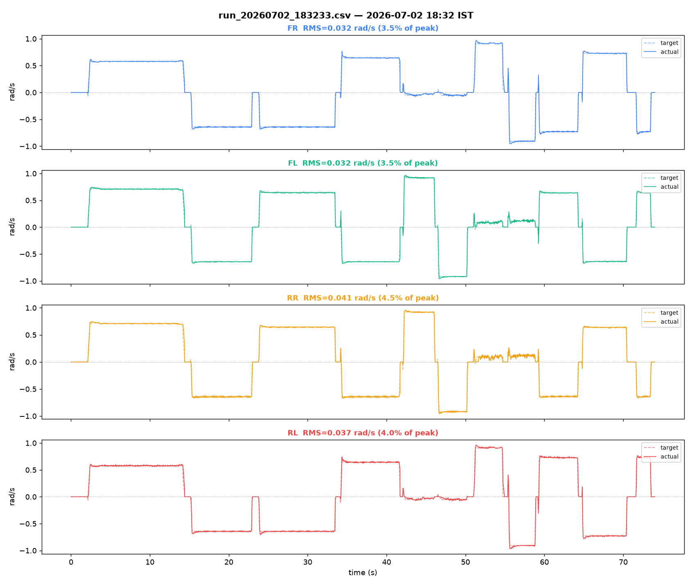
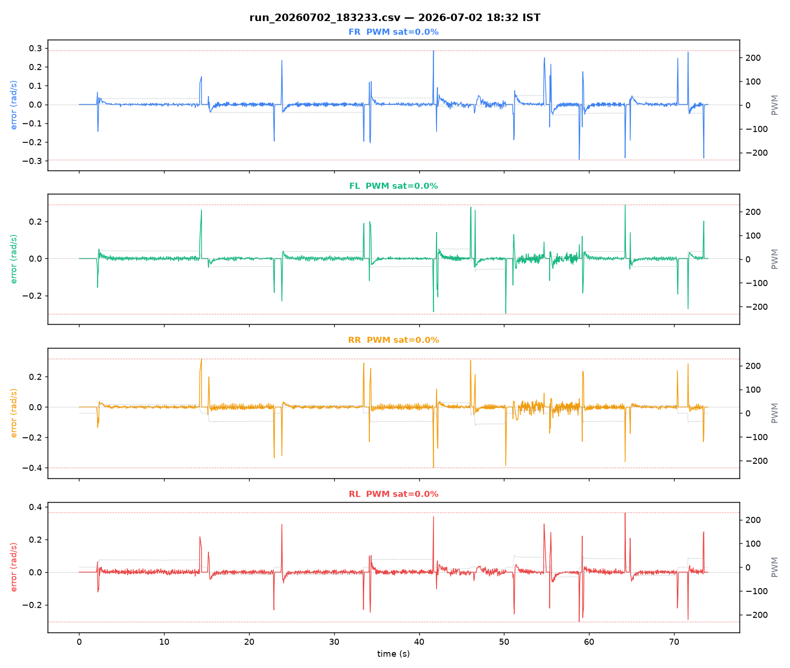

# Bench log analysis — `run_20260702_183233.csv`

Source: [`../run_20260702_183233.csv`](run_20260702_183233.csv)

## Capture

- Samples: 1481
- Duration: 74.00 s
- Sample rate: 20.0 Hz
- Embedded timestamp: `2026-07-02 18:32:33 UTC+05:30`
- Filename timestamp check: matches filename
- No gaps > 0.3 s (continuous capture)

## Per-motor tracking

| Motor | RMS error (rad/s) | % of peak | PWM sat % | PWM peak | Sign mismatches |
|---|---|---|---|---|---|
| FR | 0.032 | 3.5% | 0.0% | 44/255 | 0 |
| FL | 0.032 | 3.5% | 0.0% | 55/255 | 0 |
| RR | 0.041 | 4.5% | 0.0% | 54/255 | 0 |
| RL | 0.037 | 4.0% | 0.0% | 53/255 | 0 |

## Diagonal-pair deviation (rotation-excluded)

Computed only over samples where both wheels of the pair are commanded the same sign (excludes rotation, where FR/RL and FL/RR are *supposed* to be opposite-sign — see Research_Journal.md Part XVI §16.2 for why this exclusion matters).

- FR−RL RMS: 0.024 rad/s  (1229 samples used, 252 excluded as rotation)
- FL−RR RMS: 0.027 rad/s  (1228 samples used, 253 excluded as rotation)

## Plots

## Notes

- Firmware at record time: v2.0, single shared ENCODER_CPR=93132 (predates the 4 Aug per-motor CPR fix).
- Live drive session (phone joystick), not an isolated-step test — cannot be used to fit Kff/Ki/tau.
- Diagonal-deviation RMS looked alarming (~0.6 rad/s) before rotation-exclusion; with it applied, tracking is tight. See Research_Journal.md Part XVI §16.2.
