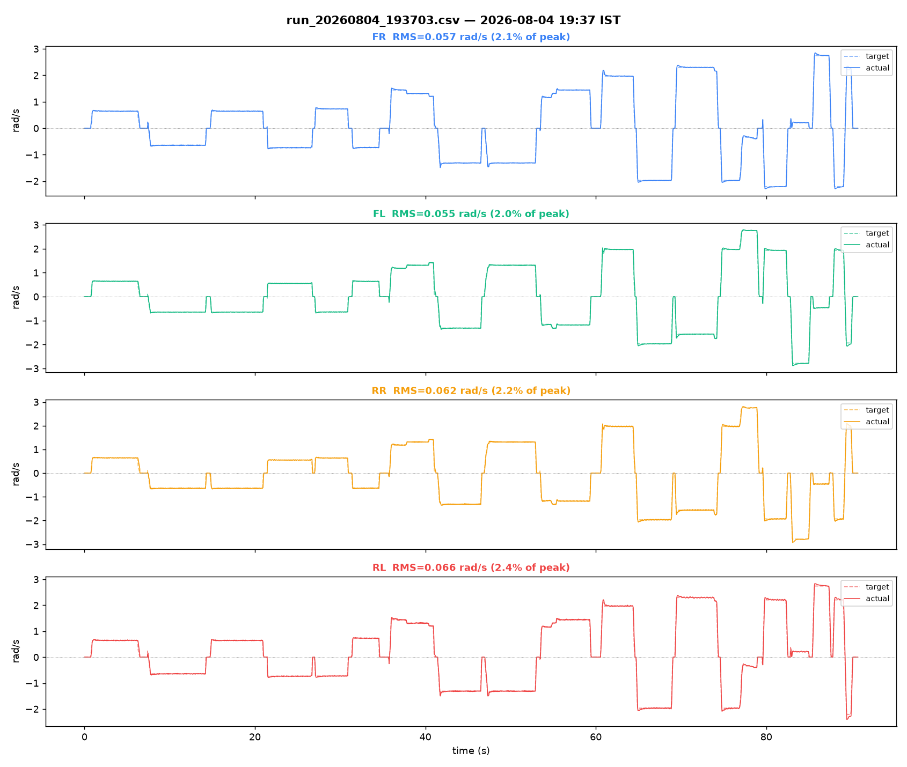
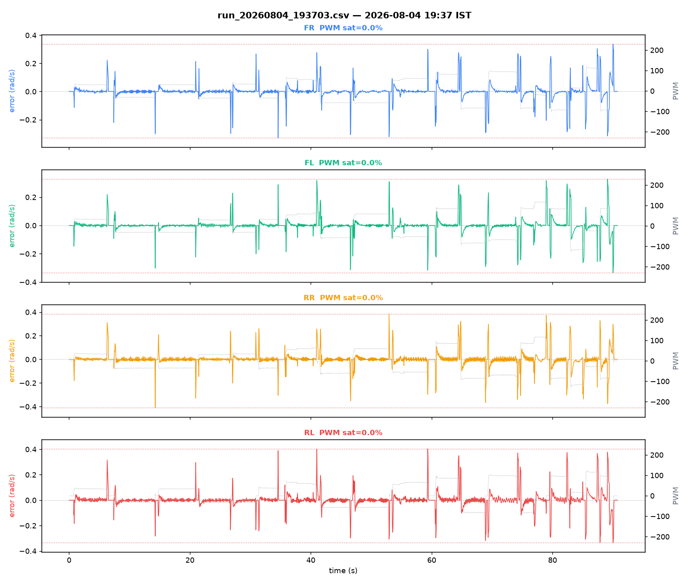

# Bench log analysis — `run_20260804_193703.csv`

Source: [`../run_20260804_193703.csv`](run_20260804_193703.csv)

## Capture

- Samples: 1816
- Duration: 90.75 s
- Sample rate: 20.0 Hz
- Embedded timestamp: `2026-08-04 19:37:03 UTC+05:30`
- Filename timestamp check: matches filename
- No gaps > 0.3 s (continuous capture)

## Per-motor tracking

| Motor | RMS error (rad/s) | % of peak | PWM sat % | PWM peak | Sign mismatches |
|---|---|---|---|---|---|
| FR | 0.057 | 2.1% | 0.0% | 119/255 | 0 |
| FL | 0.055 | 2.0% | 0.0% | 124/255 | 0 |
| RR | 0.062 | 2.2% | 0.0% | 131/255 | 0 |
| RL | 0.066 | 2.4% | 0.0% | 122/255 | 0 |

## Diagonal-pair deviation (rotation-excluded)

Computed only over samples where both wheels of the pair are commanded the same sign (excludes rotation, where FR/RL and FL/RR are *supposed* to be opposite-sign — see Research_Journal.md Part XVI §16.2 for why this exclusion matters).

- FR−RL RMS: 0.023 rad/s  (1566 samples used, 250 excluded as rotation)
- FL−RR RMS: 0.023 rad/s  (1568 samples used, 248 excluded as rotation)

## Plots

## Notes

- First run after the 4 Aug encoder/CPR fix — still on v2.0 firmware gains (Ki=30), wheels in air.
- Live drive session, not isolated steps — confirms loop health, not usable to fit gains.
