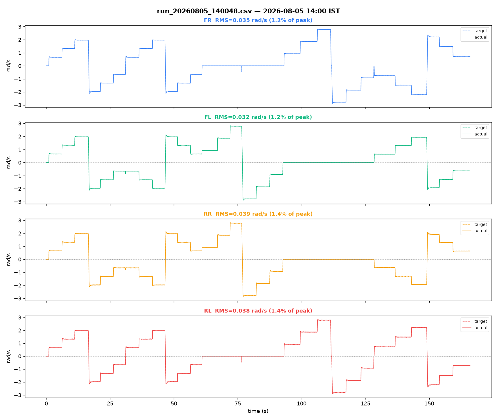
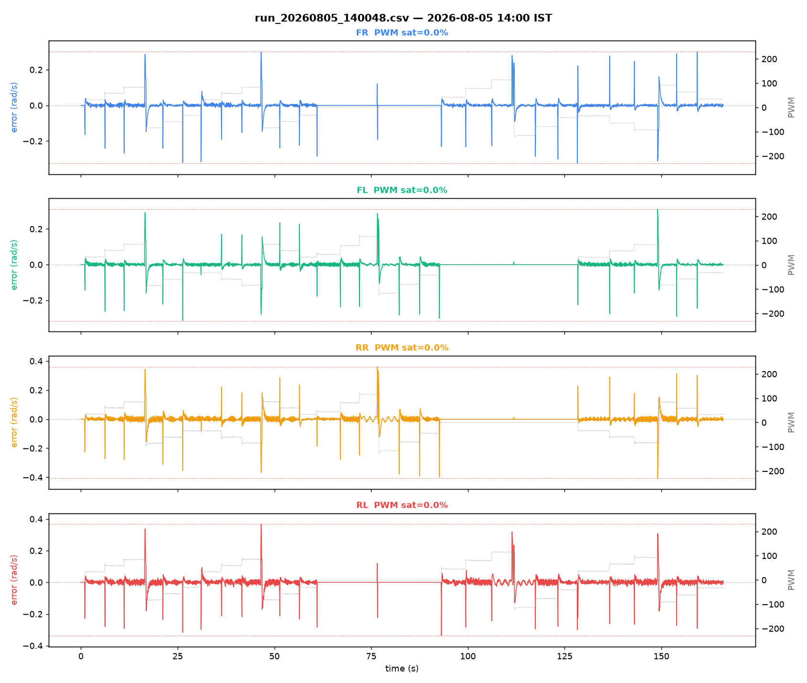

# Bench log analysis — `run_20260805_140048.csv`

Source: [`../run_20260805_140048.csv`](run_20260805_140048.csv)

## Capture

- Samples: 3320
- Duration: 165.99 s
- Sample rate: 20.0 Hz
- Embedded timestamp: `2026-08-05 14:00:48 UTC+05:30`
- Filename timestamp check: matches filename
- No gaps > 0.3 s (continuous capture)

## Per-motor tracking

| Motor | RMS error (rad/s) | % of peak | PWM sat % | PWM peak | Sign mismatches |
|---|---|---|---|---|---|
| FR | 0.035 | 1.2% | 0.0% | 122/255 | 0 |
| FL | 0.032 | 1.2% | 0.0% | 125/255 | 0 |
| RR | 0.039 | 1.4% | 0.0% | 128/255 | 0 |
| RL | 0.038 | 1.4% | 0.0% | 122/255 | 0 |

## Diagonal-pair deviation (matched-target samples only)

Computed only over samples where both wheels of the pair are commanded to *approximately the same target velocity* (|Δtarget| < 0.1 rad/s) — same-sign alone isn't tight enough, since blended joystick input (forward+strafe+turn together) can put a same-sign pair at genuinely different targets, and the resulting actual-velocity gap is then correct tracking, not a fault. See Research_Journal.md Part XVI §16.2 for why this check needs care.

- FR−RL RMS: 0.011 rad/s  (2566 matched-target samples, 754 excluded as differently-commanded)
- FL−RR RMS: 0.013 rad/s  (2567 matched-target samples, 753 excluded as differently-commanded)

## Plots

## Notes

- Confirmation run on firmware v3.0 (recalibrated Kp/Ki/Kd, two-term feedforward, per-motor CPR), wheels in air on blocks.
- Run before starting the Block 1 plant/staircase/steps calibration sequence.
