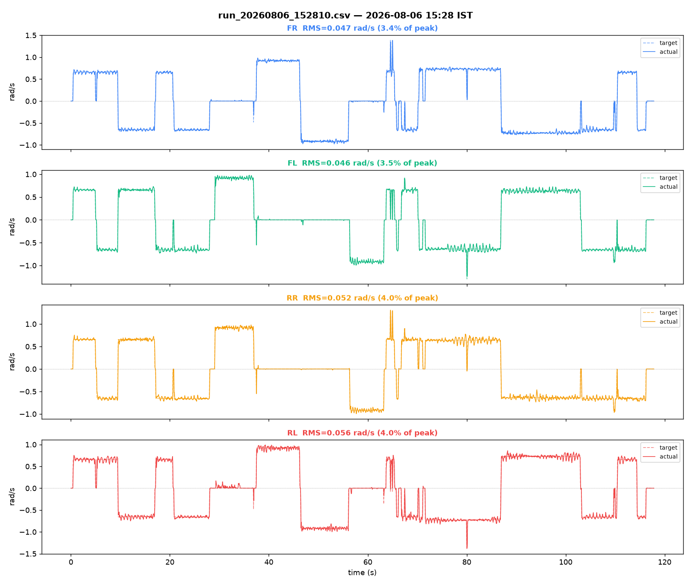
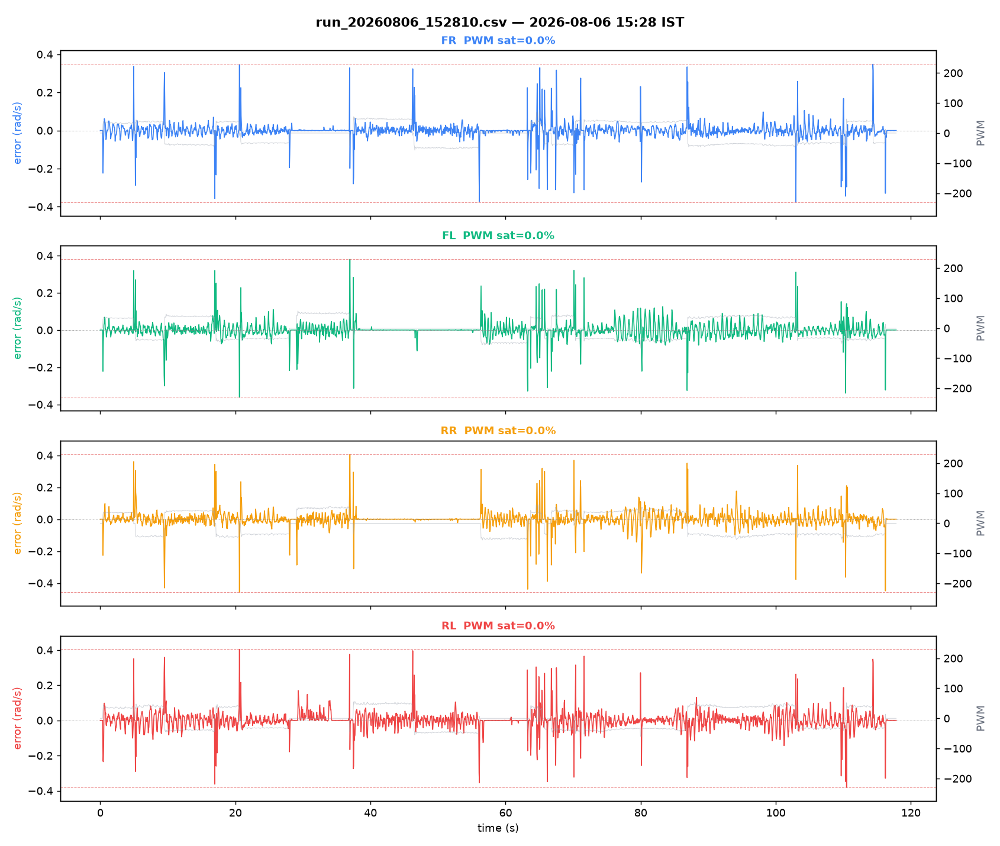
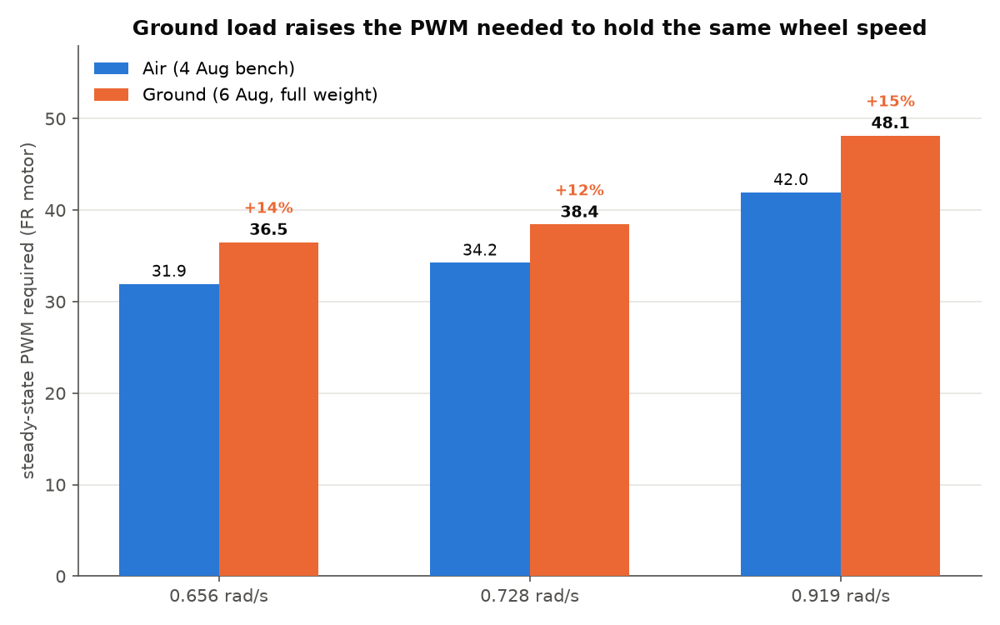

# Bench log analysis — `run_20260806_152810.csv`

Source: [`../run_20260806_152810.csv`](run_20260806_152810.csv)

## Capture

- Samples: 2357
- Duration: 117.83 s
- Sample rate: 20.0 Hz
- Embedded timestamp: `2026-08-06 15:28:10 UTC+05:30`
- Filename timestamp check: matches filename
- No gaps > 0.3 s (continuous capture)

## Per-motor tracking

| Motor | RMS error (rad/s) | % of peak | PWM sat % | PWM peak | Sign mismatches |
|---|---|---|---|---|---|
| FR | 0.047 | 3.4% | 0.0% | 77/255 | 0 |
| FL | 0.046 | 3.5% | 0.0% | 69/255 | 0 |
| RR | 0.052 | 4.0% | 0.0% | 62/255 | 0 |
| RL | 0.056 | 4.0% | 0.0% | 61/255 | 0 |

## Diagonal-pair deviation (matched-target samples only)

Computed only over samples where both wheels of the pair are commanded to *approximately the same target velocity* (|Δtarget| < 0.1 rad/s) — same-sign alone isn't tight enough, since blended joystick input (forward+strafe+turn together) can put a same-sign pair at genuinely different targets, and the resulting actual-velocity gap is then correct tracking, not a fault. See Research_Journal.md Part XVI §16.2 for why this check needs care.

- FR−RL RMS: 0.036 rad/s  (1698 matched-target samples, 659 excluded as differently-commanded)
- FL−RR RMS: 0.035 rad/s  (1700 matched-target samples, 657 excluded as differently-commanded)

## Plots

## Notes

- First real ground test: robot on the floor, full weight, all subsystems assembled.
- Firmware: v3.0, gains as-shipped (Kp=45, Ki=250, Kd=0.5, Kff={37.3,38.4,38.3,38.0}, Kstat=8 for all four -- air-calibrated, ground recalibration not yet applied).
- Compare against data/bench_logs/bench/run_20260805_140048.csv (last air run, same firmware) to quantify the ground-load correction.
## Deep analysis — matched-amplitude comparison against the last air run

This drive session happened to command the same three velocity levels
(0.656, 0.728, 0.919 rad/s) as the 5 Aug air run, holding each for several
seconds multiple times. That makes a direct, apples-to-apples comparison
possible without waiting for the structured `staircase`/`plant` tests.

**Method:** for each matched target level in both files, took all held
plateaus ≥1.5s, dropped the first 0.5s (transient), and averaged steady-state
PWM and velocity across the remaining samples. FR shown; FL/RR/RL track
within a few percent of the same pattern.

| Target (rad/s) | Air PWM | Ground PWM | Increase |
|---|---|---|---|
| 0.656 | 31.9 | 36.5 | **+14%** |
| 0.728 | 34.2 | 38.4 | **+12%** |
| 0.919 | 42.0 | 48.1 | **+15%** |

**Ground load raises the effective feedforward gain by ~12–15% at these
speeds** — consistent with, and near the low end of, the 10–30% predicted in
`docs/PID_Calibration.md` §7. This is a real, quantified number from actual
driving, not the prediction alone — though it's a secant estimate (Kff and
Kstat still conflated, same limitation `test_plant()` has), not a proper
two-term fit. The ground `staircase` test remains what actually separates
them.

### A second finding, not predicted in advance: steady-state ripple

Velocity std-dev *within* held plateaus (not tracking error — this is noise
on top of correct tracking):

| | Air (std, rad/s) | Ground (std, rad/s) | Ratio |
|---|---|---|---|
| Typical plateau | 0.004–0.008 | 0.010–0.030 | **~3–5×** |

Visible directly in the error/PWM plot as a persistent wave riding on every
held segment — absent from every air run so far. Checked one candidate
explanation: mecanum wheels have discrete rollers (10–12 per wheel per
`Master_Reference.md` §2.4), which should produce a velocity ripple at the
roller-passing frequency. FFT of a clean 12.5s plateau (FL, target 0.638
rad/s) found a dominant peak at **1.52 Hz** (harmonic at ~3.04 Hz); the
roller-count prediction for that wheel speed is **1.02–1.22 Hz** for
10–12 rollers. **Doesn't cleanly match** — about 30–50% higher than
predicted. Not confirmed as roller-induced; also not ruled out (could be a
roller count above nominal spec, floor surface texture, or something
control-loop-related). Flagged as open rather than asserted either way.

**Practical implication regardless of cause:** this ripple is exactly the
kind of thing a friction-only two-term feedforward model doesn't capture,
and it's also exactly the kind of disturbance the derivative term is
supposed to help reject — worth watching whether it changes once ground
Kff/Kstat are properly fitted, or whether it persists and needs a different
explanation.

### What this run is, and isn't

**Is:** strong evidence the v3.0 loop is stable on real ground — zero PWM
saturation even during the aggressive direction-reversal segment around
t=63–72s, zero direction-sign faults, tracking error 3.4–4.0% of peak
(up from 1.2–1.4% in air, an expected and modest degradation, not a red
flag). A usable rough estimate of the ground Kff gap.

**Isn't:** a substitute for the `staircase`/`plant` tests. This is still a
continuous drive session, not isolated PWM steps from rest, so it cannot
separate Kff from Kstat, and it says nothing about τ. `Kstat=8` — already
flagged as the least-trustworthy number in the firmware — is completely
unvalidated by this run.
