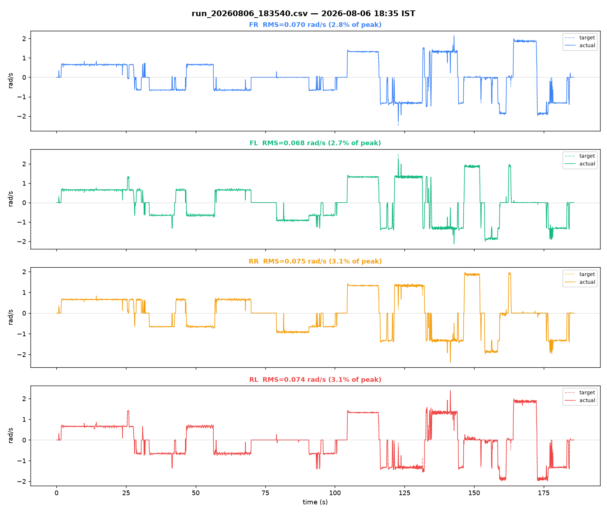
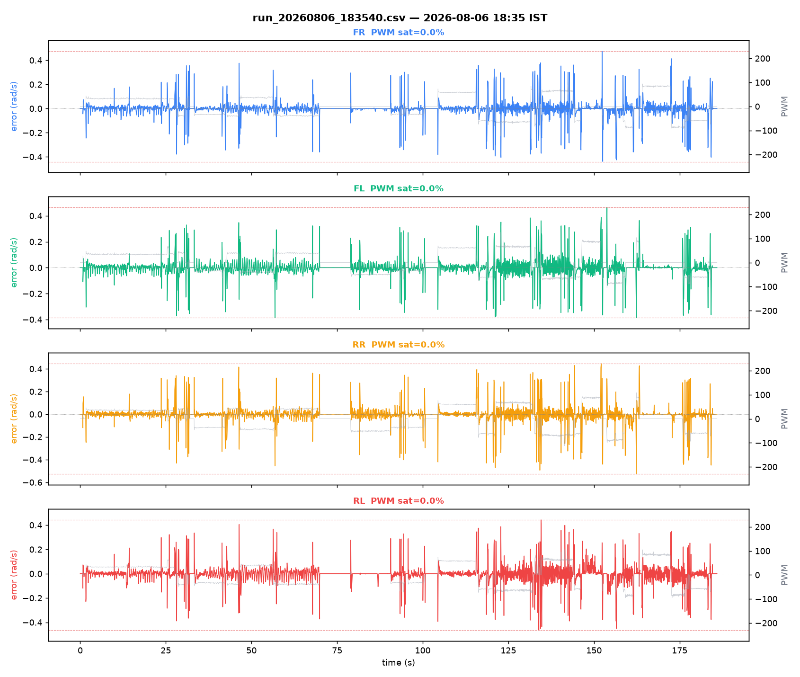

# Bench log analysis — `run_20260806_183540.csv`

Source: [`../run_20260806_183540.csv`](run_20260806_183540.csv)

## Capture

- Samples: 3718
- Duration: 185.92 s
- Sample rate: 20.0 Hz
- Embedded timestamp: `2026-08-06 18:35:41 UTC+05:30`
- Filename timestamp check: matches filename
- No gaps > 0.3 s (continuous capture)

## Per-motor tracking

| Motor | RMS error (rad/s) | % of peak | PWM sat % | PWM peak | Sign mismatches |
|---|---|---|---|---|---|
| FR | 0.070 | 2.8% | 0.0% | 122/255 | 0 |
| FL | 0.068 | 2.7% | 0.0% | 126/255 | 0 |
| RR | 0.075 | 3.1% | 0.0% | 113/255 | 0 |
| RL | 0.074 | 3.1% | 0.0% | 106/255 | 0 |

## Diagonal-pair deviation (matched-target samples only)

Computed only over samples where both wheels of the pair are commanded to *approximately the same target velocity* (|Δtarget| < 0.1 rad/s) — same-sign alone isn't tight enough, since blended joystick input (forward+strafe+turn together) can put a same-sign pair at genuinely different targets, and the resulting actual-velocity gap is then correct tracking, not a fault. See Research_Journal.md Part XVI §16.2 for why this check needs care.

- FR−RL RMS: 0.044 rad/s  (3613 matched-target samples, 105 excluded as differently-commanded)
- FL−RR RMS: 0.044 rad/s  (3617 matched-target samples, 101 excluded as differently-commanded)

## Plots

## Notes

- Ground test, same session as run_20260806_152810 (later same day).
- Firmware: v3.0, gains still air-calibrated (ground recalibration not yet applied).
