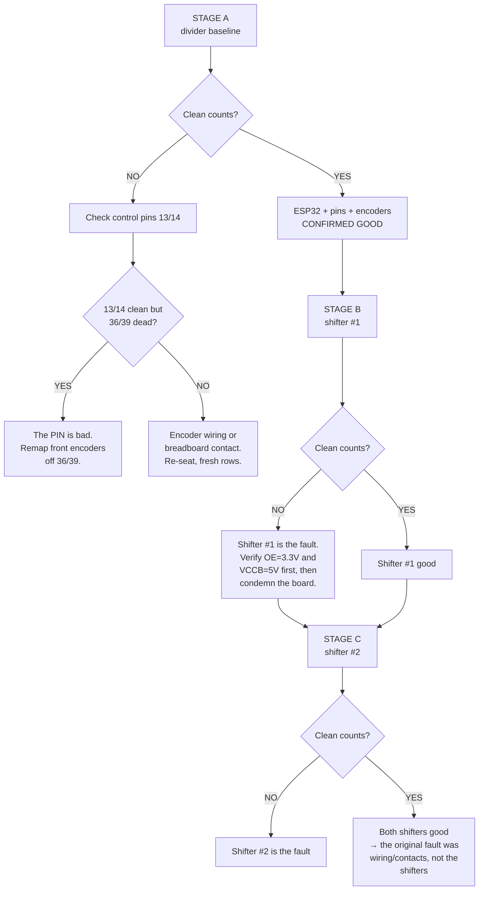

# Breadboard Bench Test — The Map

ESP32 on a breadboard. Two encoders. No motor drivers. Goal: find out, once and
for all, whether the TXS0108E level shifters are the problem.

---

## The one thing to understand first

**You cannot wire a 5 V encoder straight into an ESP32 pin.** The ESP32 is not
5 V tolerant (3.3 V max, absolute max ~3.6 V). The GTK08 outputs ~4.7 V
push-pull. That is why the level shifter exists at all.

This is the difference from the Mega tests — on the Mega you could just plug the
encoder in directly and get a clean baseline. On the ESP32 you cannot. So we
build the baseline a different way: with a **resistor divider**, which is dumb,
cheap, and has nothing in it that can fail.

That gives us three stages, in this exact order:

| Stage | What's in the signal path | What it proves |
|---|---|---|
| **A** | Resistor divider | ESP32 pins + encoders + wiring are good |
| **B** | Level shifter #1 | Whether shifter #1 works |
| **C** | Level shifter #2 | Whether shifter #2 works |

**Do not skip Stage A.** If you go straight to the shifter and it fails, you
still won't know whether the shifter or the ESP32 pin is at fault — which is
exactly the ambiguity that has cost this whole session.

---

## Common to every stage — ground

One ground rail on the breadboard. Everything lands on it:

```
   ESP32 GND ──┐
   Buck  GND ──┼──── breadboard GND rail
  Encoder GND ─┤
  Shifter GND ─┘     (Stage B/C only)
```

Wire it deliberately. Do not rely on whatever hidden path has been quietly
doing the job in the Mega tests.

---

## STAGE A — Divider baseline (no shifter)

Build this for **each of the 4 signal lines** (Enc1-A, Enc1-B, Enc2-A, Enc2-B):

```
  ENCODER OUT (5 V)
        │
      [ 1 kΩ ]
        │
        ├──────────────►  ESP32 GPIO   (this junction = 3.33 V logic)
        │
      [ 2 kΩ ]
        │
       GND
```

5 V × 2/(1+2) = **3.33 V**. Right at the ESP32 rail. Eight resistors total for
four channels.

**No pull-up resistors in this stage.** A pull-up to 3.3 V would change the
divider ratio. Pull-ups are for Stage B/C only.

Pin landing:

| Signal | ESP32 pin |
|---|---|
| Enc1-A | GPIO 36 |
| Enc1-B | GPIO 39 |
| Enc2-A | GPIO 34 |
| Enc2-B | GPIO 35 |

### The control trick (worth the extra 2 jumpers)

GPIO 36 and 39 are input-only, have no internal pull resistors, and carry a
documented Espressif glitch erratum. So also tap **Enc1-A and Enc1-B to GPIO 13
and GPIO 14** at the same time — same divider junction, just a second jumper to
a second pin.

```
      divider junction ──┬──► GPIO 36   (suspect pin)
                         └──► GPIO 13   (clean control pin)
```

GPIO 13/14/27 are full-featured, no erratum, unused in the final build. If 13
counts clean and 36 doesn't, the **pin** is the problem, not the shifter. One
wheel turn separates three hypotheses.

---

## STAGE B / C — Level shifter in the path

Swap the dividers out, put the shifter in. One shifter at a time.

```
                        ┌──────────── TXS0108E ────────────┐
                        │                                  │
   Buck 5 V ────────────┤ VCCB                        VCCA ├──────── ESP32 3V3
                        │                                  │
                        │                             OE   ├──────── ESP32 3V3
                        │                                  │        (tie to VCCA)
   Enc1-A (5 V) ────────┤ B1                          A1   ├──────── GPIO 36
   Enc1-B (5 V) ────────┤ B2                          A2   ├──────── GPIO 39
   Enc2-A (5 V) ────────┤ B3                          A3   ├──────── GPIO 34
   Enc2-B (5 V) ────────┤ B4                          A4   ├──────── GPIO 35
                        │                                  │
   GND rail ────────────┤ GND                              │
                        └──────────────────────────────────┘

   Channels 5-8 unused — leave open.
```

**Now add the pull-ups.** 10 kΩ from each A-side line to 3.3 V, at the ESP32 end:

```
                 3V3
                  │
               [ 10 kΩ ]
                  │
   A1 ────────────┴──────────► GPIO 36
```

Pull-**up** only, never pull-down — the TXS0108E decides signal direction by
sensing which side gets pulled low, so a pull-down actively fights it.

**Power-up order: GND → VCCA (3.3 V) → VCCB (5 V).**

---

## Decision tree



---

## Reading the result

You already know what good and bad look like from the Mega runs:

| Pattern | Meaning |
|---|---|
| Bursts of **hundreds** of counts per row, ramping up then tapering, both directions | **Real rotation. Pass.** |
| Alternating `+1 / −1` forever, bouncing between two values, net zero | **Floating/undriven line. Fail.** |
| Sparse ±1 blips, seconds apart, no accumulation | **No signal reaching the pin. Fail.** |
| Nothing at all | Line dead, or nothing wired to that pin |

---

## Pre-power-on checklist

- [ ] One ground rail; ESP32 + buck + encoder (+ shifter) all on it
- [ ] Buck output measured at **5.0 V** before anything is connected to it
- [ ] Stage A: dividers built, **no** pull-ups
- [ ] Stage B/C: **OE tied to VCCA**, pull-ups fitted, dividers removed
- [ ] Encoder wires short, not run parallel to the 5 V pair
- [ ] Fresh breadboard rows — no holes that have had thick jumpers forced in
- [ ] Nothing connected to the motor driver pins (4, 16, 17, 18, 19, 21, 22, 23)

---

## Pin reference

| Motor | A pin | B pin | Internal pull-up? | Notes |
|---|---|---|---|---|
| FR | 36 | 39 | **No** | Input-only + glitch erratum |
| FL | 34 | 35 | **No** | Input-only |
| RR | 32 | 33 | Yes | Full-featured |
| RL | 25 | 26 | Yes | Full-featured |

**Free for control/remap:** 13, 14, 27 (always), plus all 8 driver pins while no
drivers are connected.

**Never use:** 6–11 (SPI flash). **Avoid:** 0, 2, 5, 12, 15 (strapping).

---

## If both shifters turn out fine

Then the fault was always wiring/contacts, and the fix is re-terminating, not
replacing parts. If instead a shifter is confirmed bad, the cheapest robust
replacement is the divider you just used in Stage A — these signals are
unidirectional, so the bidirectional auto-sensing TXS0108E is more complexity
than the job needs. Sixteen resistors for all eight channels, nothing to fail.

*See also: `LevelShifter_Wiring.md` for the full in-robot wiring, and
`firmware/nab_encoder_handturn_diagnostic_esp32.ino` for the float/drive test.*
