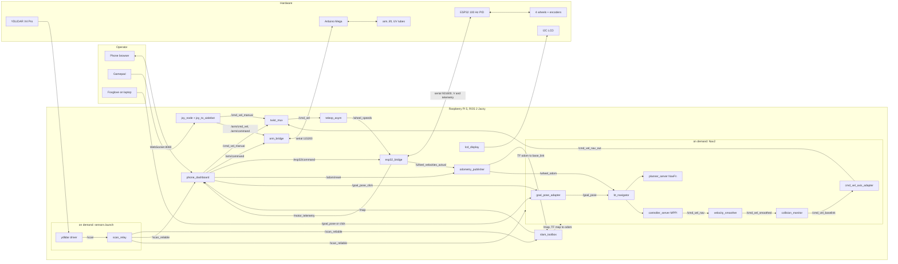
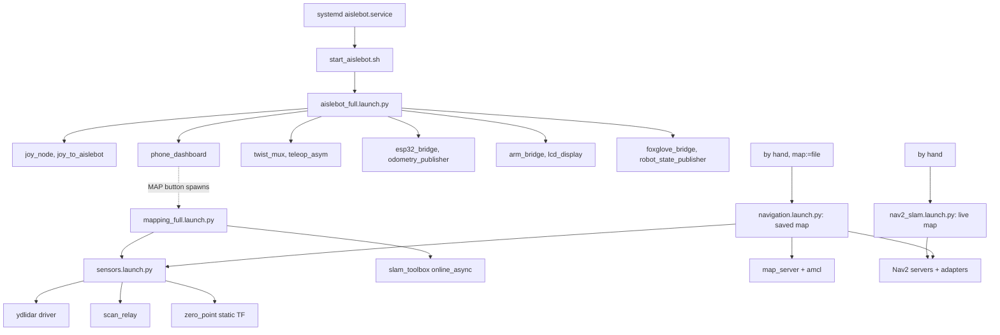

# NarrowAisleBot: full firmware and ROS 2 inventory

Written 30 Sep 2026 from the repo at commit `09e52cb` (branch `claude/kind-pasteur-nyfeig`, on top of `main` at `ea76bca`). Every launch file, node, config and sketch under `src/`, `system/`, `firmware/` and the two root `.ino` files was read for this. Nothing here was taken from older docs without checking the code, and where the code and a doc disagree the code wins and the disagreement is listed in section 14.

What was NOT checked: the live Pi. The Pi audit of 29 Sep matched 25 of 27 tracked files by hash (the two differences were comment-only), so the repo is a fair picture of what runs, but a "live" claim below without a source tag means "from code". Lines marked (live) came from the audit or the pre-flight on the robot.

The tables are laid out so each row is one box or one arrow. Node table = boxes, topic table and cmd_vel chain = arrows, launch tree = grouping. Section 15 has two Mermaid drafts that GitHub renders directly.

---

## 1. The machine, layer by layer

| Layer | Thing | Talks to | Link | Firmware or software |
|---|---|---|---|---|
| Compute | Raspberry Pi 5, Ubuntu, ROS 2 Jazzy, Cyclone DDS, domain 42, loopback-only multicast | everything below | | ROS workspace `~/ros2_ws` |
| Drive MCU | ESP32 Dev Module, 240 MHz, 2 cores | Pi | USB serial, `/dev/esp32`, 921600 baud | `aislebot_esp32.ino` v3.0 (repo root) |
| Arm MCU | Arduino Mega | Pi | USB serial, `/dev/mega`, 115200 baud | `aislebot_arm.ino` v8 (repo root) |
| Scanner | YDLIDAR X4 Pro | Pi | USB serial, `/dev/ydlidar`, 128000 baud | vendor `ydlidar_ros2_driver` (humble branch, builds on Jazzy) |
| Status | 16x2 I2C LCD at 0x27 | Pi | I2C | `lcd_display.py` |
| Operator | Phone browser (or PC) | Pi | Wi-Fi AP `aislebot-ap`, 10.42.0.1:8080 | `phone_dashboard.py` |
| Viewer | Foxglove Studio on a laptop | Pi | WebSocket, port 8765 | `foxglove_bridge` |
| Drivetrain | 4 mecanum wheels, 6 inch (r = 0.0762 m), Cytron-style PWM+DIR drivers | ESP32 | 3.3 V PWM and DIR | asymmetric geometry l1 0.403, l2 0.333, d 0.15769 |
| Encoders | Front pair GTK08 (1000 PPR), rear pair RMCS-2086 (500 lines), through an 8-channel BSS138 level shifter | ESP32 | hardware PCNT units 0 to 3 | |
| Arm actuators | 2x NEMA23 (arms, via TB6600), 1x NEMA34 (lift, via BH-MSD), 3 UV tubes on relay boards | Mega | STEP/DIR pins, relays | |

Robot body: 1.00 m long, 0.36 m wide at the widest wheel, planned with a 6 cm margin into a 1.12 x 0.48 m footprint. LiDAR sits at (0, 0.27, 0.275) from `base_link`. There is no IMU fitted (the URDF has an `imu_link` and `esp32_bridge` has an IMU parse path, both unused).

### udev, so the ports never move (`system/99-aislebot.rules`)

| Symlink | Match | Why it is written this way |
|---|---|---|
| `/dev/esp32` | CP2102 (10c4:ea60), USB port path `4-1` | The LiDAR adapter is the same chip with the same serial number, so only the physical port tells them apart. Moving the cable breaks the link. |
| `/dev/ydlidar` | CP2102 (10c4:ea60), USB port path `2-2` | same |
| `/dev/mega` | CH340 (1a86:7523) | unique VID:PID |

---

## 2. Boot chain and launch tree

```
systemd  aislebot.service           (User aritra, Restart=on-failure, RestartSec=10)
  -> /home/aritra/start_aislebot.sh (system/start_aislebot.sh)
       sources ROS + ~/ros2_ws, sets domain 42, Cyclone on loopback
       waits up to 30 s for /dev/esp32 (aborts if absent), 15 s for /dev/mega (warns only)
       exec ros2 launch mecanum_robot aislebot_full.launch.py
```

`aislebot_full.launch.py` starts eleven processes and is the only thing that runs at boot:

| # | Executable | Node name | Gated by |
|---|---|---|---|
| 1 | `joy` / `joy_node` | joy_node | `use_joystick` (default true) |
| 2 | `mecanum_robot` / `joy_to_aislebot` | joy_to_aislebot | `use_joystick` |
| 3 | `mecanum_robot` / `phone_dashboard` | phone_dashboard | `use_phone` |
| 4 | `twist_mux` / `twist_mux` | twist_mux | always |
| 5 | `mecanum_robot` / `teleop_asym` | mecanum_teleop_asymmetric | always |
| 6 | `mecanum_robot` / `esp32_bridge` | esp32_bridge | always |
| 7 | `mecanum_robot` / `odom_pub` | odometry_publisher | always |
| 8 | `mecanum_robot` / `arm_bridge` | arm_bridge | always |
| 9 | `mecanum_robot` / `lcd_display` | lcd_display | always |
| 10 | `foxglove_bridge` | foxglove_bridge | `use_foxglove` |
| 11 | `robot_state_publisher` | robot_state_publisher | always (URDF read at launch time) |

Started on demand, never at boot:

| Launch file | Package | Starts | Who starts it | Notes |
|---|---|---|---|---|
| `sensors.launch.py` | mecanum_robot | ydlidar driver (lifecycle node), `scan_relay.py`, `map->zero_point` static TF | included by the two below | Exactly one may run; two drivers on one serial port is not a soft failure. |
| `mapping_full.launch.py` | mecanum_robot | `sensors.launch.py` + slam_toolbox `online_async_launch.py` with `~/ros2_ws/slam_nodom.yaml` | dashboard MAP button (`subprocess.Popen`, own process group) | Stdout and stderr go to DEVNULL on this path. |
| `nav2_slam.launch.py` | mecanum_navigation | Nav2 while slam_toolbox maps (no localiser) | by hand, after the two above | Order matters: map first, then nav, or the global costmap rejects a "malformed" map until one arrives. |
| `navigation.launch.py` | mecanum_navigation | `sensors.launch.py` + map_server + AMCL + the same Nav2 set | by hand, with `map:=...` | Saved-map mode. Never run on hardware as of the 15 Sep audit. Must not run beside `mapping_full`. |
| `simulation.launch.py` | mecanum_robot | Gazebo, warehouse world, `gazebo_bridge` | by hand | Sim only. Not used on the robot. |
| `slam.launch.py` | mecanum_navigation | slam_toolbox + `robot_localization` EKF + rviz | nobody | Legacy, see section 14. |

---

## 3. Node catalogue

Frame and axis convention first, because it explains half the nodes. `base_link`, `odom` and `map` all use +X = right, +Y = forward (fixed at the source on 27 Aug, `docs/Axis_Convention.md`). The wheel kinematics and everything that talks to the motors use REP-103 (+X forward, +Y left). `cmd_vel_axis_adapter` is the one place the two meet on the autonomous path.

### 3.1 Always running (aislebot.service)

| Node | Source | Subscribes | Publishes | Parameters that matter | Talks to hardware |
|---|---|---|---|---|---|
| joy_node | `joy` package | | `/joy` | device_id 0, deadzone 0.05, autorepeat 25 Hz | USB gamepad (none fitted on this deployment) |
| joy_to_aislebot | `joy_to_aislebot.py` (190 lines) | `/joy` | `/cmd_vel_manual` (Twist), `/arm/cmd_vel` (Twist), `/arm/command` (String) | max_linear 0.15, max_angular 0.30, deadzone 0.10, Xbox axis map, Y=HOME, B=ESTOP, START=CLEAR | |
| phone_dashboard | `phone_dashboard.py` (3998 lines: the first ~2400 are the docstring and the HTML/JS page held in one Python string, the rest is Python) | `/motor_telemetry`, `/map` (transient_local), `/scan_reliable`, `/scan_relay_stats`, TF lookups at 10 Hz | `/cmd_vel_manual`, `/arm/command`, `/esp32/command`, `/goal_pose_click`, `/odom/reset`; client of `/scan_relay/set_parameters` | port 8080, log_dir `~/aislebot_logs`, locations `~/locations.json`, map_name, scan_trust_range 5.0, scan_publish_hz 5 | Serves HTTP + WebSocket. Spawns subprocesses (section 11). |
| twist_mux | `twist_mux` 4.5.0 | `/cmd_vel_manual` (priority 100, timeout 0.5 s), `/cmd_vel_nav_out` (priority 10, timeout 0.5 s) | `/cmd_vel` | `use_stamped: false` | |
| mecanum_teleop_asymmetric | `mecanum_teleop_asymmetric.py` (147) | `/cmd_vel`, `/joy` | `/wheel_speeds` (Float64MultiArray [FR, FL, RR, RL] rad/s) | r 0.0762, l1 0.403, l2 0.333, d 0.15769, max_linear 0.15, max_angular 0.30 (launch overrides the file defaults of 0.48 and 1.0), wheel clamp 6.28 | |
| esp32_bridge | `esp32_bridge.py` v3.1 (351) | `/wheel_speeds`, `/esp32/command` | `/motor_telemetry_raw` (String), `/motor_telemetry` (12 floats), `/wheel_velocities_actual` (4 floats), `/imu/data_raw` only if enable_imu | port `/dev/esp32`, 921600, max_wheel_speed 5.20, watchdog 0.5 s, telemetry_enabled true, `<L1>` resent every 5 s | ESP32 serial. Sends `<E1>` then `<L1>` on connect, `<S>` then `<E0>` on shutdown. |
| odometry_publisher | `odometry_publisher.py` (321) | `/wheel_velocities_actual`, `/odom/reset` (Empty) | `/wheel_odom` (Odometry), TF `odom->base_link` | r, l1, l2, d as above, publish_tf true, lateral_scale 0.92 (live-settable) | |
| arm_bridge | `arm_bridge.py` (270) | `/arm/cmd_vel`, `/arm/command` | `/arm/status` (String) | `/dev/mega`, 115200, command_timeout 300 ms, auto_enable_on_connect true, disable_joystick_on_connect true | Mega serial. 50 Hz transmit timer, reconnect timer 3 s. |
| lcd_display | `lcd_display.py` (133) | none | none | | I2C LCD via RPLCD. Line 1 is the wlan0 IP, line 2 is `AP :8080`, `NET :22` or `NO NETWORK`. Refresh 2 s. |
| foxglove_bridge | `foxglove_bridge` | all (viewer) | | port 8765 | |
| robot_state_publisher | ROS | `/robot_description` | `/robot_description`, fixed-joint TFs | URDF `aislebot.urdf` | |

### 3.2 Sensor chain (on demand, `sensors.launch.py`)

| Node | Source | Subscribes | Publishes | Parameters that matter |
|---|---|---|---|---|
| ydlidar_ros2_driver_node (lifecycle) | vendor, params from `system/ydlidar_params.yaml` | | `/scan` (BEST_EFFORT) | port `/dev/ydlidar`, baud 128000, single channel, angle -180..180, range 0.1..10 m, frame `laser_frame`, auto_reconnect, `invalid_range_is_inf: false`. The file says `frequency: 6.0`; the scan rate measured on the Pi was 11.35 to 11.45 Hz (live). |
| scan_relay | `src/scan_relay/scan_relay.py` (643, plain script, not a colcon package, run through `ExecuteProcess`) | `/scan` | `/scan_reliable` (RELIABLE), `/scan_relay_stats` (Float64MultiArray, every 3rd sweep) | mirror true, yaw_offset 270 deg, mask -135..-45 deg to NaN (107 beams), range_cap/floor 0 (off), persist_n/k 1/1 (off). All ten parameters are live-settable and validated by a two-pass callback. |
| zero_point_tf | `tf2_ros static_transform_publisher` | | TF `map->zero_point` (identity, yaw 0) | |

What scan_relay does, in order: re-index the sweep to undo the sensor's mirrored bearing (reported = 270 deg - true), blank the rear mast arc to NaN (not 0, not inf, so it neither marks nor clears), apply the optional range window, apply the optional K-of-N persistence gate. It republishes as RELIABLE because slam_toolbox and the costmaps subscribe RELIABLE and the driver publishes BEST_EFFORT.

### 3.3 Mapping (on demand)

| Node | Source | Subscribes | Publishes | Config |
|---|---|---|---|---|
| slam_toolbox (`async_slam_toolbox_node` through `online_async_launch.py`) | apt, v2.8.5 | `/scan_reliable`, TF `odom->base_link` | `/map`, TF `map->odom`, its services | `~/ros2_ws/slam_nodom.yaml`, which matches `system/slam_nodom_stageB.yaml` by hash (live). Key values in section 9. |

### 3.4 Navigation (on demand, `nav2_slam.launch.py` or `navigation.launch.py`)

All are Nav2 1.3.12 nodes. `cmd_vel_axis_adapter` and `goal_pose_adapter` are the only project-written ones and are plain rclpy nodes outside the lifecycle set.

| Node | Lifecycle managed | Plugin or role | Subscribes | Publishes | Key values |
|---|---|---|---|---|---|
| controller_server | yes | `MPPIController` (Omni motion model), `PoseProgressChecker`, `SimpleGoalChecker`; local costmap inside | `/scan_reliable` via costmap, odometry (see section 14, item 3) | `/cmd_vel_nav` (remapped) | 20 Hz, vx/vy/wz max 0.12/0.12/0.30, 300 samples, 40 steps at 0.05 s, 7 critics, goal tolerance 0.05 m / 0.05 rad |
| planner_server | yes | `NavfnPlanner`, A*, `allow_unknown: true`, tolerance 0.5; global costmap inside | | | expected frequency 5 Hz |
| smoother_server | yes | `SimpleSmoother` | | | |
| behavior_server | yes | Spin, BackUp, Wait | | `/cmd_vel_nav` (remapped) | Runs automatically as BT recovery |
| velocity_smoother | yes | | `/cmd_vel_nav` | `/cmd_vel_smoothed` | max 0.12, 0.12, 0.30, accel 0.3, 0.3, 0.6, decel -0.5, -0.5, -1.0, OPEN_LOOP, odom `/wheel_odom` |
| collision_monitor | yes | `FootprintApproach` polygon, action `approach`, `/scan_reliable` source | `/cmd_vel_smoothed` | `/cmd_vel_baselink` | time_before_collision 1.2 s, min_points 6, footprint from `/local_costmap/published_footprint` |
| bt_navigator | yes | `navigate_to_pose_w_replanning_and_recovery.xml` (installed default) | `/goal_pose` | drives the action servers | odom_topic `/wheel_odom`, BT xml path resolved in the launch file |
| waypoint_follower | yes | WaitAtWaypoint 200 ms | | | |
| map_server | yes (saved-map mode only) | | | `/map` | `yaml_filename` from the launch arg |
| amcl | yes (saved-map mode only) | | `/scan` (its default, see section 14 item 2), `/map` | TF `map->odom` | `nav2_amcl::OmniMotionModel`, 500 to 2000 particles, max_beams 60, likelihood field |
| lifecycle_manager_navigation | | | | | Brings the list up in order, all-or-nothing |
| cmd_vel_axis_adapter | no | rotates TF-axis velocity to wheel axis | `/cmd_vel_baselink` (queue depth 1) | `/cmd_vel_nav_out` | out.x = in.y, out.y = -in.x, yaw unchanged. Publishes one zero Twist on exit. |
| goal_pose_adapter | no | dragged yaw + `yaw_offset_deg` (now 0.0) | `/goal_pose_click` | `/goal_pose` | Inert unless something publishes to `/goal_pose_click`. The dashboard does. |

Deliberately not started: `route_server`, `opennav_docking` (no graph, no dock), and `robot_localization` (no IMU).

---

## 4. Topics, services, actions

Topic table for edges. QoS only where it matters.

| Topic | Type | Publisher | Subscribers |
|---|---|---|---|
| `/joy` | Joy | joy_node | joy_to_aislebot, teleop_asym (see section 14, item 6) |
| `/cmd_vel_manual` | Twist | joy_to_aislebot, phone_dashboard, keyboard_teleop | twist_mux |
| `/cmd_vel_nav` | Twist | controller_server, behavior_server | velocity_smoother |
| `/cmd_vel_smoothed` | Twist | velocity_smoother | collision_monitor |
| `/cmd_vel_baselink` | Twist | collision_monitor | cmd_vel_axis_adapter |
| `/cmd_vel_nav_out` | Twist | cmd_vel_axis_adapter | twist_mux |
| `/cmd_vel` | Twist | twist_mux | teleop_asym |
| `/wheel_speeds` | Float64MultiArray | teleop_asym | esp32_bridge (and gazebo_bridge in sim) |
| `/esp32/command` | String | phone_dashboard | esp32_bridge |
| `/motor_telemetry_raw` | String | esp32_bridge | none in-tree |
| `/motor_telemetry` | Float64MultiArray (12) | esp32_bridge | phone_dashboard |
| `/wheel_velocities_actual` | Float64MultiArray (4) | esp32_bridge | odometry_publisher |
| `/wheel_odom` | Odometry | odometry_publisher | bt_navigator, velocity_smoother |
| `/odom/reset` | Empty | phone_dashboard | odometry_publisher |
| `/scan` | LaserScan, BEST_EFFORT | ydlidar driver | scan_relay, and AMCL in saved-map mode (its default topic, see section 14 item 2) |
| `/scan_reliable` | LaserScan, RELIABLE | scan_relay | slam_toolbox, AMCL, both costmaps, collision_monitor, phone_dashboard |
| `/scan_relay_stats` | Float64MultiArray | scan_relay | phone_dashboard |
| `/map` | OccupancyGrid, transient_local | slam_toolbox or map_server | global costmap static layer, phone_dashboard |
| `/goal_pose_click` | PoseStamped | phone_dashboard, tools/nav_goal.py | goal_pose_adapter |
| `/goal_pose` | PoseStamped | goal_pose_adapter, Foxglove panel | bt_navigator |
| `/arm/cmd_vel` | Twist | joy_to_aislebot | arm_bridge |
| `/arm/command` | String | joy_to_aislebot, phone_dashboard | arm_bridge |
| `/arm/status` | String | arm_bridge | none in-tree |
| `/robot_description` | String | robot_state_publisher | Foxglove |
| `/local_costmap/published_footprint` | PolygonStamped | controller_server | collision_monitor |
| `/collision_monitor_polygon`, `/collision_monitor_state` | | collision_monitor | Foxglove |

Services and actions in use:

| Name | Kind | Server | Client |
|---|---|---|---|
| `/scan_relay/set_parameters` | service | scan_relay | phone_dashboard (LiDAR tuner) |
| `/navigate_to_pose` | action | bt_navigator | Foxglove, `tools/nav_goal.py`, `tools/zero_point_scan.py`, dashboard (cancel-all on E-STOP) |
| `/compute_path_to_pose`, `/follow_path`, `/smooth_path`, `/spin`, `/backup`, `/wait` | actions | planner, controller, smoother, behavior_server | bt_navigator |
| `/slam_toolbox/*` (save_map, serialize, and so on) | services | slam_toolbox | not used by the dashboard, which saves through `nav2_map_server map_saver_cli` |

---

## 5. The two velocity paths (this is the heart of the flowchart)

```
MANUAL   phone joystick / gamepad / keyboard
           -> /cmd_vel_manual  (REP-103 axes, straight to the wheels' convention)
             -> twist_mux (priority 100) ─┐
                                          ├-> /cmd_vel -> teleop_asym -> /wheel_speeds
AUTONOMOUS controller_server, behavior_server        │      -> esp32_bridge -> <V,fr,fl,rr,rl>
           -> /cmd_vel_nav                            │      -> ESP32 PID
             -> velocity_smoother -> /cmd_vel_smoothed│
               -> collision_monitor -> /cmd_vel_baselink   (base_link TF axes)
                 -> cmd_vel_axis_adapter -> /cmd_vel_nav_out (wheel axes)
                   -> twist_mux (priority 10) ────────┘
```

Rules baked into this:

- Manual beats autonomous while it is publishing and stops beating it 0.5 s after the last manual message.
- Nothing autonomous reaches the wheels without passing the smoother and the collision monitor. The behavior_server remap exists so Spin and BackUp take the same path.
- The adapter is last on purpose. Everything before it, the collision polygon included, works in the same axes as the footprint.
- Three watchdogs stack: twist_mux timeouts (0.5 s), the bridge (0.5 s, sends zero speeds), the ESP32 (750 ms, ramps to stop). The velocity_smoother also stops after 1 s without input.
- The dashboard E-STOP order is: zero the drive command, send `<S>` to the ESP32 (latches in the ESP32 firmware), ESTOP the arm, kill calibration, stop mapping.

Feedback loop closing the other way:

```
wheels -> encoders -> ESP32 PCNT (100 Hz PID) -> telemetry line (20 Hz, <L1>)
  -> esp32_bridge parses actual velocities -> /wheel_velocities_actual
    -> odometry_publisher integrates (forward kinematics, lateral_scale)
      -> /wheel_odom + TF odom->base_link
```

---

## 6. TF tree

| Parent | Child | Published by | Note |
|---|---|---|---|
| map | odom | slam_toolbox (mapping) or AMCL (saved map) | Only one of them may run. With `use_scan_matching: false` slam_toolbox moves it only when it admits a scan, at about 0.18 m of travel. |
| map | zero_point | static_transform_publisher | Fixed marker at the map origin |
| odom | base_link | odometry_publisher | Also the only pose source for Nav2 while scan matching is off |
| base_link | laser_frame | robot_state_publisher (URDF `laser_joint`, 0, 0.27, 0.275) | Vendor launch file's competing placeholder TF is deliberately not used |
| base_link | chassis, safety_cushion, base_footprint, imu_link | robot_state_publisher | Fixed joints |
| base_link | wheel_fr, wheel_fl, wheel_rr, wheel_rl | not published | The wheel joints are `continuous` and nothing in the repo publishes `/joint_states`, so these four frames do not exist on the TF tree. Harmless for navigation. |

URDF wheel origins in `base_link` (x = strafe axis, y = forward axis): FR (0.15769, 0.403), FL (-0.15769, 0.333), RR (0.15769, -0.333), RL (-0.15769, -0.403).

---

## 7. Odometry, in enough detail to argue about

`odometry_publisher.py`, per `/wheel_velocities_actual` message:

1. `dt` = ROS clock time since the previous message (arrival time on the Pi, not the ESP32 timestamp, which the bridge drops). Messages with dt <= 0 or dt > 1 s are ignored.
2. Forward kinematics from four filtered wheel speeds:
   - vx = (r/4)(w_fr + w_fl + w_rr + w_rl)
   - vy = (r/4)(w_fr - w_fl - w_rr + w_rl) x lateral_scale (0.92)
   - wz = (r/4)(w_fr/K_out - w_fl/K_in + w_rr/K_in - w_rl/K_out), with K_out 0.56069 and K_in 0.49069
   - This is the exact inverse of the inverse kinematics in `teleop_asym` and in the ESP32, which I checked algebraically: the vx, vy and pure-rotation terms cancel cleanly.
3. Midpoint integration in the internal REP-103 frame, theta wrapped to [-pi, pi].
4. Publish rotated by -90 degrees so +X reads right and +Y reads forward: pub_x = -y, pub_y = x, pub_theta = theta. Twist is rotated the same way.
5. Covariance is fixed: 0.01 on x and y, 0.03 on yaw. No estimator uses it.
6. `odom/reset` zeroes x, y, theta in place. The dashboard refuses the request while mapping, because slam_toolbox pins `map->odom` to identity at its first scan.

What upstream data looks like: the ESP32 filters each wheel velocity with an EMA (alpha 0.4, about 15 ms) and sends it at 20 Hz. It also keeps an exact unfiltered count integral (`position_rad`) that ships only in telemetry mode `<L2>`. The bridge asks for `<L1>`, so that number never reaches the Pi.

---

## 8. Nav2 configuration, the numbers as committed

Source: `src/mecanum_navigation/config/nav2_params.yaml` (874 lines). Every x/y-labelled value is swapped for this robot: element 0 is strafe (right), element 1 is forward.

| Block | Values |
|---|---|
| Footprint (both costmaps) | rectangle x ±0.24, y ±0.56 (tape measured 0.36 x 1.00, plus 6 cm margin) |
| Local costmap | rolling 3 x 3 m, 0.05 m, 5 Hz update, obstacle layer on `/scan_reliable` (raytrace 9 m, mark 8 m), inflation radius 0.65, cost scaling 5.0 |
| Global costmap | `map` frame, 0.05 m, 1 Hz, track_unknown_space true, static + obstacle + inflation (radius 0.65) |
| MPPI | Omni, vx/vy max 0.12 m/s, wz max 0.30 rad/s, std 0.06 / 0.06 / 0.15, 300 samples, 40 steps, dt 0.05, temperature 0.3, gamma 0.015; critics: Constraint 4.0, Cost 3.81, Goal 5.0, GoalAngle 3.0, PathAlign 14.0, PathFollow 5.0, Twirling 5.0 |
| Progress checker | PoseProgressChecker, 0.10 m radius, 0.25 rad, 10 s |
| Goal checker | 0.05 m, 0.05 rad, stateful |
| Planner | NavFn with A*, allow_unknown true, tolerance 0.5 m |
| Collision monitor | polygon approach, 1.2 s lookahead, 0.1 s step, 6 points minimum |
| AMCL (unused so far) | OmniMotionModel, 500 to 2000 particles, max_beams 60, alphas 0.2 (alpha5 0.1), update 0.15 m / 0.1 rad, initial pose (0, 0, yaw 0) |
| map_saver | free 0.25, occupied 0.65 |

The behaviour tree is Nav2's stock `navigate_to_pose_w_replanning_and_recovery.xml`, which includes ClearEntireCostmap, Spin 1.57 and BackUp 0.30 in its recovery branch. Nothing in the repo replaces it.

On this robot `BackUp` is a 0.30 m strafe to the left, not a reverse. Nav2's `DriveOnHeading` commands `linear.x` and checks collisions along the base frame's x axis (source read on 30 Sep 2026, upstream jazzy branch), and base_link +X is the robot's right. The `Collision Ahead - Exiting DriveOnHeading` abort in the 30 Sep run therefore meant something within 0.30 m to the robot's left.

---

## 9. slam_toolbox, live values

Live file is `~/ros2_ws/slam_nodom.yaml` = `system/slam_nodom_stageB.yaml` (hash a6b75d36..., live). Trimmed to what changes behaviour:

| Setting | Value |
|---|---|
| solver | Ceres, SPARSE_NORMAL_CHOLESKY, LEVENBERG_MARQUARDT |
| mode | mapping, asynchronous, `enable_interactive_mode: false` |
| use_scan_matching | false (Stage G) |
| do_loop_closing | true, chain size 8, search distance 2.0 m, response coarse 0.25 and fine 0.35 |
| minimum_travel_distance / heading | 0.2 m / 0.2 rad (this gate gives the 0.18 m cadence) |
| max_laser_range | 5.0 m |
| resolution, update interval | 0.05 m, 1.0 s |
| scan buffer | 10 scans, 10 m |
| transform_publish_period | 0.02 s |
| scan_topic | `/scan_reliable` |

---

## 10. Microcontroller firmware

### 10.1 ESP32 drive controller: `aislebot_esp32.ino` v3.0 (1154 lines, deployed)

Pi is the only command source. WiFi and the web joystick were removed in v3.0.

Pin map: PWM/DIR for FR 4/16, FL 17/18, RR 19/21, RL 22/23. Encoder A/B for FR 36/39, FL 34/35, RR 32/33, RL 25/26 (all through the level shifter, five volt side).

Two FreeRTOS tasks:

| Task | Core | Priority | Rate | Job |
|---|---|---|---|---|
| PID (`pidControlTask`) | 1 | 3 | 100 Hz (`vTaskDelayUntil`, 10 ms) | read PCNT deltas, EMA velocity (alpha 0.4), slew the target, compute PID, write PWM, check safety trips, apply the command watchdog |
| Comms (`communicationTask`) | 0 | 1 | polls every 1 ms | parse serial commands, print telemetry every `telemetry_interval_ms` (default 50 ms) |

Control law per motor: `pwm = Kff*w + Kstat*sgn(w)` (two-term feedforward, Kstat faded in between 0.05 and 0.20 rad/s) plus PID on velocity error. Kp 45, Ki 250, Kd 0.5 with derivative on measurement, dynamic anti-windup against real PWM headroom, integral hard cap 20. Kff {37.3, 38.4, 38.3, 38.0}, Kstat 8. Air calibrated, not loaded.

Limits: max wheel speed 5.20 rad/s, slew 12 rad/s², PWM 8 bit at 5 kHz, minimum output 5.

Encoders: front CPR 186264, rear CPR 93132 (per motor, because the fronts have twice the resolution), MOTOR_DIR_SIGN and ENC_DIR_SIGN both {-1, +1, -1, +1}.

Safety: latching E-STOP (`<S>`, cleared by `<E1>`), command watchdog 750 ms, overspeed trip (1.30 x limit for 300 ms), runaway trip (saturated PWM, wheel turning the wrong way, 500 ms), stall trip (PWM over 250, speed under 0.15 rad/s, 2 s). Trips latch the E-STOP and print a `[TRIP,...]` line.

Serial protocol, every command wrapped in `< >`:

| Command | Meaning |
|---|---|
| `<V,fr,fl,rr,rl>` | wheel velocities, rad/s, closed loop (the one the bridge uses) |
| `<B,vx,vy,wz>` | body twist, the ESP32 runs the inverse kinematics |
| `<M,fr,fl,rr,rl>` | direct PWM, open loop until the next V, B or T |
| `<T,idx,vel>` | single motor closed loop |
| `<S>` / `<E1>` / `<E0>` | latching stop / enable and clear / disable |
| `<W1>` `<W0>` | watchdog on or off |
| `<Y1>` `<Y0>` | runaway and stall trips on or off |
| `<G,kp,ki,kd>` `<F,...>` `<K,...>` `<A,accel>` `<X,vmax>` | gains, feedforward, static friction, slew, speed limit (runtime, no reflash) |
| `<L0>` `<L1[,hz]>` `<L2[,hz]>` | telemetry off, 13-column compatible, extended |
| `<O>` `<R>` | print or zero accumulated wheel angles |
| `<P>` `<I>` `<?>` `<H>` | ping, config dump, live state, help |

Telemetry `<L1>` line: `ms, then per motor target, actual, pwm` for FR, FL, RR, RL (13 columns). `<L2>` appends error, feedforward, integral term and `position_rad` per motor.

### 10.2 Arduino Mega arm: `aislebot_arm.ino` v8 (418 lines, deployed)

- Pins: right arm STEP/DIR 2/3 (TB6600 #1), left arm 4/5 (TB6600 #2), lift 6/7 (BH-MSD), optional analog joystick A0 to A2, LED 13, UV relay channels on 53, 51 and 49 (active low, both boards ganged).
- Library: AccelStepper.
- Commands: `<P>` ping, `<I>` info, `<?>` status, `<E1>/<E0>` enable, `<S>` latching ESTOP (also kills UV), `<C>` clear, `<H>` home (close arms, lower lift), `<A,arm,lift>` velocity in -1..+1, `<J1>/<J0>` joystick fallback, `<U1>` UV staged start (tube 1 at 0 s, tube 2 at 5 s, tube 3 at 10 s, non-blocking), `<U0>` all UV off, `<U?>` UV status.
- Watchdog: 500 ms without `<A,...>` stops motion. UV is deliberately not on the watchdog.
- Travel limits are opened past the mechanical range on purpose (end stops are physical).
- Bridge side adds its own 300 ms twist watchdog and auto-enable on connect.

### 10.3 Other sketches in `firmware/` (bench and diagnostics, not deployed)

| File | Board | Purpose |
|---|---|---|
| `narrowaislebot_mini_esp32.ino` (670) | ESP32 | The small MiniAisleBot prototype: same protocol and pin map, `ROBOT_PROFILE` switches constants, optional BNO055 (`ENABLE_IMU`, G14/G13) and a compact WiFi joystick. Only place an IMU driver exists. |
| `nab_bench_calibration_esp32.ino` (708) | ESP32 | Automatic bench calibration rig, USB serial to a PC, no Pi |
| `nab_bench_manual_drive_diagnostic_esp32.ino` (712) | ESP32 | Manual drive plus full encoder diagnostic |
| `nab_encoder_handturn_diagnostic_esp32.ino` (413) | ESP32 | Hand-turn each wheel, check counts and direction |
| `nab_encoder_isolation_test_esp32.ino` (137) | ESP32 | Encoder inputs with no motor drive |
| `nab_front_encoder_speed_direction_esp32.ino` (223) | ESP32 | Front encoder speed and direction, event gated |
| `nab_mega_4encoder_levelshifter_test.ino` (282) | Mega | All four encoders through the shifter |
| `nab_mega_front_encoder_levelshifter_test.ino` (114) | Mega | Front encoders through the shifter |
| `nab_mega_front_encoder_pins4567.ino` (108) | Mega | Same test on relocated pins D4 to D7 |
| `past_iterations/firmware/aislebot_esp32_v2.ino`, `aislebot_arm_v7.ino` | | Superseded versions, kept for comparison |
| `sim/wokwi/mini_sim.ino` | | Wokwi simulation of the mini |

---

## 11. The phone dashboard, as a system

One Python file, two halves: a FastAPI app (uvicorn, port 8080) serving one HTML page, and a ROS node on its own thread. ROS callbacks write plain attributes, a single asyncio task reads them on a timer, so there is no cross-thread scheduling.

Server to browser over `/ws`: pose (10 Hz), scan (5 Hz, up to 240 points), map (1 Hz and only when changed, sent immediately to a new client), LiDAR tuner state (2 Hz), notices. HTTP: `GET /` (page), `GET /calib_status`.

Browser to server, dispatched in `_dispatch`:

| Message type | Effect |
|---|---|
| `drive` | Twist to `/cmd_vel_manual` |
| `arm`, `uv` | String to `/arm/command` |
| `map_start` | Spawns `ros2 launch mecanum_robot mapping_full.launch.py` (own process group), starts telemetry CSV and pose CSV |
| `map_stop` | Kills calibration if running, saves the map (`map_saver_cli`, falling back to writing the cached grid), SIGINTs the launch group (SIGKILL after 10 s), writes the run report |
| `rezero` | Publishes `/odom/reset`, refused while mapping or calibrating |
| `goal` | PoseStamped to `/goal_pose_click` (nose yaw) |
| `save_location`, `goto_location` | Named locations in `~/locations.json`, guarded by `map_name` |
| `lidar_set`, `lidar_preset`, `lidar_reset`, `lidar_save` | Sets scan_relay parameters over the parameter service, presets in `~/lidar_tune.json` |
| `calib_start`, `calib_stop` | Runs `tools/zero_point_scan.py`, refuses unless mapping is live and `bt_navigator` is on the graph |
| `estop`, `estop_clear` | See section 5 |

It also installs its own SIGTERM and SIGINT handlers so a `systemctl restart` saves an open map instead of losing it (a 24 minute run was lost that way once).

Files it writes: `~/aislebot_logs/run_<stamp>.csv` (13-column motor telemetry), `run_<stamp>_pose.csv` (map, odom and correction pose at 10 Hz), `run_<stamp>.pgm/.yaml` (map), a JSON run report from `run_report.py`, `calib_*.log`.

Editing rule (from `CLAUDE.md`): the embedded JavaScript must be checked as Python evaluates it, with `python3 tools/tests/dashboard_html_syntax.py`, before any commit that touches `DASHBOARD_HTML`, and the page must be opened in a real browser console after deploy.

---

## 12. Tools and tests

All in `tools/`, all run on the Pi or on the laptop against pulled files. Not part of the running system.

| Group | Files |
|---|---|
| Deployment and audit | `pi_audit.sh` (read-only inventory), `pi_clean.sh` (dry run by default), `verify_live_config.sh` (is the robot running what the repo says), `sync_bench_logs.ps1` |
| Driving and goals | `nav_goal.py`, `zero_point_scan.py`, `drive_circle.py`, `repeatability_test.py`, `trajectory_viz.py`, `pathlog.py` |
| Map and run analysis | `map_integrity.py`, `map_corpus.py`, `map_watch.py`, `run_analyzer.py`, `run_bundle.py`, `graph_residuals.py`, `bag_tf_diff.py` |
| Odometry and wheels | `wheel_forensics.py`, `verify_axis_chain.py`, `nab_pid_logger.py`, `analyze_bench_log.py` |
| LiDAR | `scan_quality.py`, `scan_bearing.py`, `scan_range_envelope.py`, `scan_window_sweep.py` |
| Geometry (Year 2) | `sensor_coverage.py` |
| Tests (`tools/tests/`) | `dashboard_html_syntax.py`, `dashboard_goal_roundtrip.py`, `dashboard_lidar.py`, `dashboard_locations.py`, `dashboard_scan_geometry.py`, `scan_relay_gate.py`, `nab_pid_logger_autodetect.py`, `nab_pid_logger_settling.py` |

Also in the repo: `docs/` (research journal, phase plans, handoffs, APS report and study material), `cad/` (SolidWorks chassis, wheels, motor, dimension render), `data/` (bench logs, field runs), `research_articles/`, `past_iterations/`, `ros2/mini_robot.yaml` (parameter file for the small robot), `install.sh` (one-click fresh install), `.claude/skills/` (three project skills).

---

## 13. Where things live on the Pi

| Thing | Repo | Pi |
|---|---|---|
| ROS packages | `src/mecanum_robot`, `src/mecanum_navigation` | `~/ros2_ws/src/`, built to `~/ros2_ws/install/` |
| scan_relay | `src/scan_relay/scan_relay.py` | `~/ros2_ws/src/scan_relay/scan_relay.py` (launch default) |
| SLAM config | `system/slam_nodom_stageB.yaml` | `~/ros2_ws/slam_nodom.yaml` (renamed, absolute path needed at launch) |
| LiDAR params | `system/ydlidar_params.yaml` | `~/ros2_ws/src/ydlidar_ros2_driver/params/ydlidar.yaml` |
| Boot script and unit | `system/start_aislebot.sh`, `aislebot.service` | `~/start_aislebot.sh`, `/etc/systemd/system/aislebot.service` |
| udev | `system/99-aislebot.rules` | `/etc/udev/rules.d/` |
| Nav2 params | `src/mecanum_navigation/config/nav2_params.yaml` | installed under the package share directory |
| Maps and logs | | `~/aislebot_logs/`, `~/ros2_ws/maps/` |
| Locations, LiDAR presets | | `~/locations.json`, `~/lidar_tune.json` |
| Boot log | | `~/aislebot_boot.log` |
| Firmware sources | `aislebot_esp32.ino`, `aislebot_arm.ino` | flashed from the Windows laptop, not from the Pi |

---

## 14. Things found while reading, ranked by how much they could bite

These are from reading code, not from driving. Most have a live check that would settle them.

1. **A fresh install would deploy the wrong SLAM config.** `install.sh` line 228 copies `system/slam_nodom.yaml` (pre-Stage-G: `use_scan_matching: true`, `max_laser_range: 12.0`) to `~/ros2_ws/slam_nodom.yaml`. The live robot runs the Stage B file. The old file's own header says so. Fix is one line in `install.sh` pointing at `slam_nodom_stageB.yaml`. Check: `sha256sum ~/ros2_ws/slam_nodom.yaml` should end `...dc842075`.
2. **AMCL would listen to the raw scan.** The `amcl` block in `nav2_params.yaml` has no `scan_topic`, and the upstream default is `scan` (`amcl_node.cpp` line 227 in the Jazzy source read earlier). So in saved-map mode AMCL would subscribe to `/scan`, the driver's raw output, which has the mirrored bearings and the rear mast still in it, instead of `/scan_reliable`. Every other consumer in this stack was pointed at `/scan_reliable` for exactly that reason. It has never been noticed because AMCL has never run. One line fixes it (`scan_topic: /scan_reliable` under `amcl`), left undone because the saved-map work is paused. Check on the live node when it matters: `ros2 param get /amcl scan_topic`.
3. **Controller odometry topic is not set.** The params file sets `odom_topic: /wheel_odom` for `bt_navigator` and `velocity_smoother` but not for `controller_server`. From memory of Nav2, an unset controller odometry topic defaults to `odom`, and nothing publishes `/odom` here. I did not confirm this against the 1.3.12 source, so treat it as a suspicion. If true, MPPI has been starting every rollout from zero measured velocity. Check on the live node: `ros2 param get /controller_server odom_topic` and `ros2 topic info /odom`.
4. **Pose comes from wheel odometry alone.** No IMU, no EKF, scan matching off, so `map->odom` is effectively frozen between admitted scans and Nav2's pose is dead reckoning. Section 7 lists what feeds it. Documented error: closure 1.1 to 1.5 percent on long routes, a phantom yaw of about 4 degrees, lateral scale that depends on the floor (0.80 on one floor, 0.92 on another).
5. **The `esp32_bridge` port fallback can grab the wrong device.** When disconnected it scans serial ports and adopts the first whose description contains `CP2102` or whose path contains `USB`. The LiDAR adapter is also a CP2102. The udev symlink is the normal path so this only bites after a disconnect, and it has not been seen. Read from `check_connection()`.
6. **`teleop_asym` also subscribes to `/joy` and publishes wheel speeds directly**, which bypasses `twist_mux`. No gamepad is fitted, so it is latent. If one were plugged in, two writers would reach the wheels.
7. `slam.launch.py`, `slam_params.yaml` and `ekf_params.yaml` are legacy. `slam.launch.py` also names a `slam.rviz` that is not in the repo, so it would fail as written. Nothing calls it.
8. Wheel joints are `continuous` with no `/joint_states` source, so the four wheel frames are absent from TF. Cosmetic.
9. Version strings disagree: the dashboard docstring says v2.5 and v2.6 sections, the startup log line says v2.4.
10. `teleop_asym` file defaults (0.48 m/s, 1.0 rad/s) are much higher than what the launch passes (0.15, 0.30). Anyone running the node bare gets the higher limits.

---

## 15. Flowchart drafts

Mermaid, renders on GitHub and in most editors. Runtime data flow first, then launch grouping. Edit labels freely; every edge below is backed by a row in sections 3 to 5.





---

## 16. Where "pose estimation is off" should start

Not a diagnosis. The pipeline in section 7 says every pose the robot believes is wheel odometry, so if the pose looks wrong there are only a few places it can go wrong, in this order of cheapness to check:

1. What "off" looks like matters more than anything here. Yaw drift while driving straight, a lateral error after a strafe, a scale error over distance, a jump in `map->odom`, and a mismatch between the map and the room are five different faults with different owners. The pose CSV the dashboard writes (`run_*_pose.csv`, map, odom and correction columns) separates the last two directly.
2. Lateral scale for the current floor (0.92 was measured on the floor the zero mark sits on, 0.80 on another).
3. The front/rear encoder ratio. The firmware comments say the measured ratio was 2.0 to 2.1, and the code assumes exactly 2.0. A 2.5 percent mismatch on one axle pair shows up as yaw drift and lateral drift.
4. The filtered-velocity path (section 7): rectangular integration of 20 Hz filtered speeds against Pi-side arrival time. `<L2>` already exposes `position_rad`.
5. The controller odometry topic suspicion in section 14 item 3, which affects control rather than estimation but would look the same from the driver's seat.
6. Only then more sensing: the URDF already has an `imu_link` at (0, 0, 0.05), the bridge already parses `[IMU]` lines, and `ekf_params.yaml` is already drafted. What is missing is the sensor and the ESP32 code to read it.

---

## 17. Live graph check, 30 Sep 2026 16:44 IST

Source: `~/check_ros.sh` on the Pi, output pasted by the operator. The script is not in the repo yet and its raw output is not stored here. Robot state at the time: up 1 h 39 min, drive stack running since 15:05, mapping stack (`mapping_full.launch.py`) since 16:12, Nav2 stopped.

This check turned the inventory's "from code" claims into "seen running" for the graph. It found one wrong label, which is fixed above (the runtime graph shows slam_toolbox takes odometry from TF only, and `/wheel_odom` had no subscriber at all with Nav2 down).

### Confirmed at runtime

- All eleven `aislebot_full` processes are up (ten in the process list, `foxglove_bridge` in the node list), plus `ydlidar_ros2_driver_node`, `scan_relay`, `slam_toolbox` and `zero_point_tf` from the mapping launch.
- Domain 42, `rmw_cyclonedds_cpp`, wlan0 at 10.42.0.1 (the AP), eth0 up with no address.
- `ros2 doctor` reports every publisher and subscriber pair as QoS compatible. There are no mismatches in the running graph.
- `/joint_states` has one subscriber (robot_state_publisher) and no publisher, as section 6 says.
- `/motor_telemetry_raw` and `/arm/status` have no subscribers, as section 4 says.
- `/joy` has two subscribers, `joy_to_aislebot` and `teleop_asym`. That is the latent `twist_mux` bypass from section 14 item 6, now seen on the live graph.
- No `/odom` topic exists (the script's ODOM section printed nothing).

### Not in section 4 (found on the live graph)

| Topic or service | Publisher | Note |
|---|---|---|
| `/diagnostics` | probably joy_node | not checked |
| `/point_cloud` (PointCloud) | probably the LiDAR driver | no subscribers. Check with `ros2 topic info /point_cloud -v`. |
| `/pose` (PoseWithCovarianceStamped) | slam_toolbox | slam_toolbox's own pose output |
| `/map_metadata` | slam_toolbox | |
| `/slam_toolbox/graph_visualization`, `/slam_toolbox/scan_visualization`, `/slam_toolbox/update`, `/slam_toolbox/feedback` | slam_toolbox | the pose-graph markers are what the node-id-gap loop closure test would read |
| `/clock` | none | one subscriber (probably foxglove_bridge) |
| `/joy/set_feedback` | none | joy_node subscribes |
| `/start_scan`, `/stop_scan` (services) | LiDAR driver | |
| `/slam_toolbox/*` services | slam_toolbox | save_map, serialize_map, deserialize_map, pause_new_measurements, reset, manual_loop_closure and others |

slam_toolbox appears twice as a `/tf` publisher, and `/tf` has four publishers in all (robot_state_publisher, slam_toolbox twice, odometry_publisher). The `transform_listener_impl_*` node is slam_toolbox's internal TF listener, not a separate program, so it does not belong on a flow chart.

### Ghosts in the ROS 2 daemon cache

The services list still shows `/controller_server/*`, `/planner_server/*`, `/bt_navigator/*`, `/collision_monitor/*`, `/lifecycle_manager_navigation/*`, both costmaps, and the old `launch_ros_2469`, `_2893` and `_4559` entries, even though Nav2 was not running (empty NAV2 and ACTIONS sections, no Nav2 in the process list). These are stale entries from processes that already exited. Do not read them as "Nav2 is up". `ros2 daemon stop` clears them.

### Runtime edge list, from the QoS section of `ros2 doctor` (parameter_events left out)

| Topic | Publisher | Subscribers |
|---|---|---|
| `/joy` | joy_node | joy_to_aislebot, teleop_asym |
| `/cmd_vel_manual` | joy_to_aislebot, phone_dashboard | twist_mux |
| `/cmd_vel` | twist_mux | teleop_asym |
| `/wheel_speeds` | teleop_asym | esp32_bridge |
| `/wheel_velocities_actual` | esp32_bridge | odometry_publisher |
| `/motor_telemetry` | esp32_bridge | phone_dashboard |
| `/esp32/command` | phone_dashboard | esp32_bridge |
| `/odom/reset` | phone_dashboard | odometry_publisher |
| `/arm/cmd_vel` | joy_to_aislebot | arm_bridge |
| `/arm/command` | joy_to_aislebot, phone_dashboard | arm_bridge |
| `/scan` | ydlidar_ros2_driver_node | scan_relay |
| `/scan_reliable` | scan_relay | slam_toolbox, phone_dashboard |
| `/scan_relay_stats` | scan_relay | phone_dashboard |
| `/map` | slam_toolbox | phone_dashboard, slam_toolbox |
| `/tf` | odometry_publisher, slam_toolbox, robot_state_publisher | phone_dashboard, slam_toolbox's listener |
| `/tf_static` | zero_point_tf, robot_state_publisher | phone_dashboard, slam_toolbox's listener |

### Load snapshot (`ps`, cumulative average since start, not peak)

| Process | CPU since start |
|---|---|
| phone_dashboard | 13.9 % of one core (13 min 53 s of CPU in 1 h 39 min) |
| esp32_bridge | 4.5 % |
| arm_bridge | 4.2 % (a 50 Hz transmit timer to an idle Mega) |
| odom_pub | 3.1 % |
| scan_relay | 2.0 % |
| slam_toolbox | 1.5 % |

The dashboard is the largest single consumer in the stack. These are averages with Nav2 down, so they say nothing yet about the controller's 5.5 to 8.9 Hz. That needs `top` while Nav2 runs.

### What the script does not do

It lists the graph but checks no numbers: no message rates, no live parameters, no TF frame check, no file hashes. Its ODOM section queries `/odom`, which does not exist here, so it prints nothing; `/wheel_odom` is the topic to query. `pi_audit.sh` covers files and power, `verify_live_config.sh` covers parameters. This script covers the graph. Nothing on the ROS side can show which firmware is flashed on the ESP32 or the Mega. That takes a serial query (`<I>` and `<?>` on the ESP32, `INFO` on the arm).

