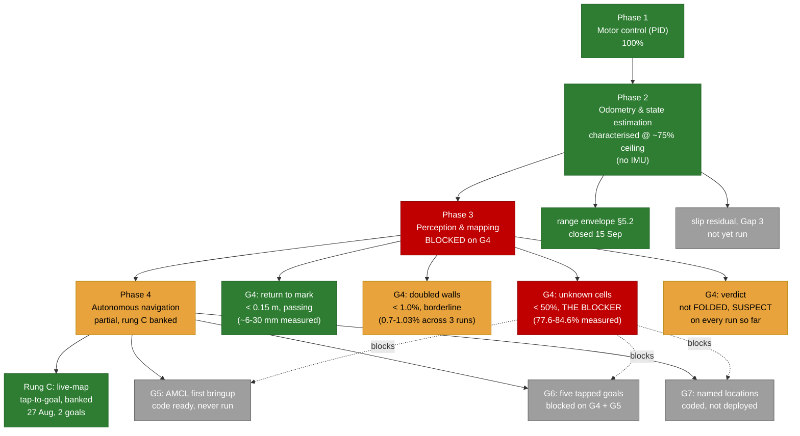
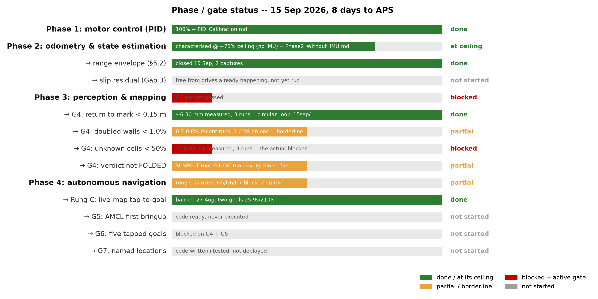

# Project status, 15 Sep 2026 (8 days to APS)

Living document. Regenerate the chart after any status change:
`python3 docs/aps_report/figure_src/f_status.py`. Every row below traces to
a specific doc or evidence folder, listed inline, so nothing here is a
claim that can't be checked against a source.

---

## First: the LiDAR configuration question, answered precisely

**Two different goals need two different settings, and conflating them
would hurt whichever one gets the wrong one.**

| Goal | What it needs | Setting |
|---|---|---|
| **G4 (SLAM mapping, Phase 3)** | maximum coverage, since unknown cells at 77-85% is the active failing gate | **loose gate** (RAW/AISLE), because a tight gate drops beams that would otherwise clear cells |
| **Obstacle avoidance / narrow-aisle navigation (Phase 4)** | trustworthy short-range returns, since a bad reading near the robot is a safety question, not a coverage one | **tight range cap** (~1.5 m, measured 15 Sep, `Phase2_Without_IMU.md` §5.2.1) |

So: **yes, prioritise accuracy and reliability over range for navigation and
obstacle-finding.** That's Phase 4 territory (`collision_monitor`, the local
costmap, eventually AMCL), and it's exactly where the tight range measurement
belongs. It is **not** applied to the SLAM mapping gate right now, because
tightening the cap there would make the one gate currently failing fail
worse, for a benefit (protecting the scan matcher) that doesn't exist while
`use_scan_matching: false`.

Both are true at once. Nothing contradictory here, just two different
consumers with two different jobs.

---

## The flowchart

Same information as a chart, generated from the table below by
`docs/aps_report/figure_src/f_status.py`:

---

## The table this all comes from

| Item | Status | Evidence |
|---|---|---|
| Phase 1: motor control (PID) | ✅ done, 100% | `PID_Calibration.md` §5 |
| Phase 2: odometry & state estimation | ✅ at ceiling, ~75% (no IMU) | `Phase2_Without_IMU.md` |
| ↳ range envelope (§5.2, the headline) | ✅ done | `Phase2_Without_IMU.md` §5.2.1, 2 captures 15 Sep |
| ↳ slip residual (Gap 3) | ⬜ not started | free data from drives already happening |
| Phase 3: perception & mapping | 🔴 blocked on G4 | `Phase_234_Push.md` §4 |
| ↳ G4 return to mark < 0.15 m | ✅ passing | `docs/evidence/circular_loop_15sep/`, 6.4 to 80.6 mm across 3 runs |
| ↳ G4 doubled walls < 1.0% | 🟡 borderline | same folder, 0.7-1.03% across 3 runs |
| ↳ G4 unknown cells < 50% | 🔴 **the blocker** | same folder, 77.6-84.6% across 3 runs |
| ↳ G4 verdict not FOLDED | 🟡 SUSPECT, not clean | same folder, every run so far |
| Phase 4: autonomous navigation | 🟡 partial | `Phase_234_Push.md` §8, the fallback ladder |
| ↳ Rung C: live-map tap-to-goal | ✅ banked | 27 Aug, two goals, 25.9 s and 21.0 s |
| ↳ G5: AMCL first bringup | ⬜ not started | code ready, never executed on hardware |
| ↳ G6: five tapped goals | ⬜ blocked | needs G4 + G5 |
| ↳ G7: named locations | ⬜ blocked | code written and unit-tested, not deployed |

---

## Today's evidence, all of it, linked

- `docs/evidence/circular_loop_15sep/`: three drive runs (video, pose CSVs,
  saved maps, `map_integrity.py` verdicts), the retention/coverage ray-cast
  analysis, and the reversal on LiDAR-gate advice (STRICT hurts coverage,
  loose gate is correct for G4)
- `docs/X4Pro_Datasheet_Findings.md`: the vendor datasheet review, the
  "<2% of range" figure repeated across ~13 places was wrong, corrected to
  2 cm/3.5%/unspecified-above-6m; the motor-speed-control pin found and
  documented as a post-APS candidate
- `docs/Phase2_Without_IMU.md` §5.2.1: today's two range-envelope captures,
  the 1.0-1.5 m reliable / 1.5-2.5 m grey zone / 2.5 m+ unreliable finding,
  and the explicit decision not to apply it to the live G4 config
- `tools/drive_circle.py`: exact-radius, exact-lap circle driver, written
  but not yet run on hardware
- `tools/pi_audit.sh`: existing read-only Pi inventory, not yet run this
  session

## What's still open, unweighted by urgency

1. G4 coverage: the active blocker, plan is loose gate + repeated laps
2. The Nav2 "not replanning when blocked" report: no live diagnostic data
   yet, three candidate causes listed in chat, none confirmed
3. `pi_audit.sh` full run, requested, not yet returned
4. Slip residual measurement (Gap 3): free, whenever a drive happens anyway
