# Annual Progress Report — Year 1

## An Asymmetric Mecanum Platform for Autonomous Operation in Narrow Aisles

**Aritra Das**
Roll No. 25D0074
Department of Biosciences and Bioengineering
Indian Institute of Technology Bombay

**Research Supervisor:** Prof. Ambarish Kunwar

**Reporting period:** first year of registration
**Draft revision:** 3 September 2026

---

> **Status of this document.** A working draft, assembled from the project's own
> version-controlled record rather than written from memory: `Research_Journal.md`
> (3594 lines, 56 dated entries in Part XVII alone), the theory and audit
> documents under `docs/`, twenty-two analysis tools and scripts under `tools/`,
> four telemetry logs under `data/bench_logs/`, and three field runs with pose
> and map data under `data/field_runs/`. Every quantitative claim is traceable to
> one of those or to a paper in §13. Numbers in the results sections were
> recomputed from the raw logs for this report and agree with the journal.
>
> Items marked **[CONFIRM]** need a decision or a piece of information the
> repository does not hold.
>
> **[CONFIRM] Before submission:** the APS deadline and cycle with the Academic
> Office; the departmental report format and expected length; the supervisor's
> view on how much of §11 to include; and the IRCC position on disclosing the
> UV-C subsystem if a patent filing is contemplated.

---

## Contents

1. [Summary](#1-summary)
2. [Motivation and problem statement](#2-motivation-and-problem-statement)
3. [Literature reviewed and where this work sits](#3-literature-reviewed-and-where-this-work-sits)
4. [Objectives](#4-objectives)
5. [The platform as built](#5-the-platform-as-built)
6. [Closed-loop velocity control](#6-closed-loop-velocity-control)
7. [Perception, mapping and the frame-convention faults](#7-perception-mapping-and-the-frame-convention-faults)
8. [The SLAM front-end investigation](#8-the-slam-front-end-investigation)
9. [Autonomous navigation](#9-autonomous-navigation)
10. [Critical evaluation](#10-critical-evaluation)
11. [Parallel project — instrumentation and control for a UVGI air-disinfection unit](#11-parallel-project--instrumentation-and-control-for-a-uvgi-air-disinfection-unit)
12. [Research gaps and the plan for years 2 to 4](#12-research-gaps-and-the-plan-for-years-2-to-4)
13. [References](#13-references)
14. [Appendices](#14-appendices)

---

## 1. Summary

This year produced a working 45.5 kg omnidirectional robot, a validated control
stack beneath it, autonomous point-to-point navigation on top of it, and a
five-week measurement campaign that root-caused why the one remaining component
does not work. The last of those is the most substantial research content, and
it is the reason this report is organised the way it is.

The platform is built around a non-collinear mecanum wheelbase: the two diagonal
wheel pairs sit at different longitudinal distances from the body centre, 403 mm
and 333 mm, and that 70 mm offset is the geometric premise the machine exists to
test.

**What works, measured and reproduced.** Closed-loop velocity control tracks
commanded wheel speeds to 1.2–1.4 % of peak with no saturation and roughly half
the actuator range unused. The controller has now been exercised on the floor as
well as in the air, and the ground-load increase in feedforward demand came out
at a mean of 24 %, inside the 10–30 % band predicted in advance. Wheel odometry
closed a 4.582 m route to 3.1 mm, which is 0.07 %, and 21.85 m to 0.229 m, which
is 1.27 % and exactly its own specification. The robot completed its first
autonomous forward-and-return round trip on 14 August, and by late August was
reaching operator-tapped goals inside a live mapping session in 21–26 seconds.

**What does not work, and why.** Every occupancy map this project has produced
grades as folded and unusable for localisation. Five sessions of scan-matcher
tuning did not fix it, and the reason they could not is the single sharpest
result of the year: the cumulative pose correction measured 2.80, 2.85 and
2.86 m across three different parameter sets, invariant to within 2 %. A
quantity that does not move when every available lever is pulled is not being
set by those levers. Measuring the sensor input instead, for the first time in
the project, found 74.8–78 % of LiDAR rays flipping between valid and invalid
between consecutive scans with the robot stationary. The scan matcher is handed
a different point cloud every sweep. The YDLIDAR X4 Pro is a triangulation
scanner rated at under 2 % of range and it is performing to that specification;
the specification is not sufficient for the task.

The response was to select the better of two measured estimators rather than
keep tuning the worse one. Disabling the sequential scan matcher, so the pose
comes from the wheels and the scan is stamped down there, removed the fault
completely: zero corrections across 698 seconds and 18.5 m of driving on two
structurally different routes, against 48 correction events on the drive it
replaced.

**One finding that changes a load-bearing assumption.** Photogrammetry on the
run video, measured against the floor tile grout and validated each time against
a frame of known rotation, found that heading error the project had recorded as
physical wheel slip is substantially estimator error. Two runs, on different
routes: odometry reported 3.85° and 4.49° of heading drift where the floor says
0.03° and 0.00°. Physical slip cannot be corrected by better estimation.
Estimator error can. This converts the case for an inertial sensor from a
general recommendation into one with a measurement behind it.

**What has not been done.** No accepted commissioning map exists, and the
localisation mode that depends on one has never executed. The inertial sensor
has not been procured. Eighty-two distinct defects were root-caused and fixed
across the year, and §10.2 treats the pattern in them as a finding rather than
as housekeeping.

Alongside this, a second and independent project was carried out: an
instrumentation and control system for a UV-C air-disinfection unit under a
departmental TIH-IoT activity, reported in §11 with its own objectives and its
own self-audit.

---

## 2. Motivation and problem statement

### 2.1 The environments that motivate the geometry

A robot working in a warehouse aisle, an aircraft cabin corridor or a restaurant
service passage faces a constraint most mobile-robot research does not treat as
primary: the corridor is barely wider than the machine. Differential-drive and
steered platforms handle this badly, because correcting lateral position
requires a manoeuvre that consumes longitudinal space the corridor does not
have. Mecanum wheels remove that constraint by decoupling the three planar
degrees of freedom.

Mecanum kinematics alone do not solve the problem, because a conventional
four-wheel platform places its wheels at the corners of a rectangle and the
chassis must then be at least as wide as the track plus clearance. This platform
breaks that symmetry, placing wheels non-collinearly in a point-symmetric rather
than mirror-symmetric layout, following the geometry established in the
foundational paper on asymmetric narrow-aisle platforms [1].

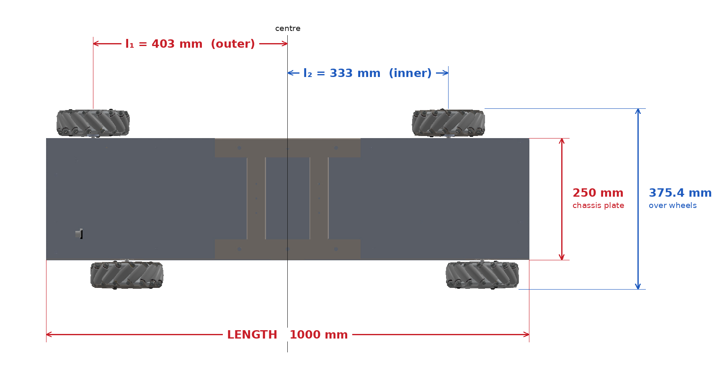

**Figure 1.** (a) Plan view to scale. The footprint was tape-measured at
1.00 × 0.36 m, wheel outer to wheel outer. (b) The consequence for control: each
wheel carries its own yaw coefficient. Substituting a single symmetric value for
*K* anywhere in the software converts the machine, in that code path only, into
an ordinary mecanum platform. This happened once; see Appendix D.

The inverse kinematics that follow are

$$
\omega_{FR} = \tfrac{1}{r_w}\left(u + v + r K_{o}\right), \qquad
\omega_{FL} = \tfrac{1}{r_w}\left(u - v - r K_{i}\right),
$$
$$
\omega_{RR} = \tfrac{1}{r_w}\left(u - v + r K_{i}\right), \qquad
\omega_{RL} = \tfrac{1}{r_w}\left(u + v - r K_{o}\right),
$$

with $r_w = 0.0762$ m, $K_{o} = l_1 + d = 0.5607$ m and $K_{i} = l_2 + d =
0.4907$ m.

An unexpected consequence of the asymmetry, found by auditing the kinematics in
August, is worth recording because it is the best piece of theory the platform
has produced. Rows 1 and 4 of the inverse-kinematics matrix share the
translational term $(u+v)$ and rows 2 and 3 share $(u-v)$, so each diagonal pair
measures yaw independently, on its own lever arm:

$$
\hat{\omega}_{\text{outer}} = \frac{r(\omega_{FR} - \omega_{RL})}{2K_{o}},
\qquad
\hat{\omega}_{\text{inner}} = \frac{r(\omega_{RR} - \omega_{FL})}{2K_{i}}
$$

Their mean is the published yaw rate. Their *difference*, scaled by $2K_{o}/r$,
is exactly the slip residual

$$
s = \omega_{FR} + 1.142656\,\omega_{FL} - 1.142656\,\omega_{RR} - \omega_{RL}
$$

which the wheel-forensics tool uses to detect slip from encoders alone. The yaw
signal and its own error bar come out of the same measurement, and the pair is
non-degenerate only because $l_1 \neq l_2$. The asymmetry that motivates the
chassis also, incidentally, makes the drivetrain self-diagnosing.

### 2.2 The application thread, and the connection to this department

Two application targets appear in the record and both are relevant to a
Department of Biosciences and Bioengineering. The platform carries a three-tube
staged UV-C germicidal lighting subsystem on its cargo arm, giving a mobile
aisle-scale disinfection capability; the parallel project in §11 instruments a
fixed UV-C air-disinfection chamber. The unifying question across both is dose
delivery: germicidal effect depends on the product of irradiance and exposure
time, and neither system yet measures the irradiance it delivers in a way that
could close a loop around that product.

The record also describes an autonomous food-delivery cart as a long-term
target, which imposes a different constraint set (smooth motion so liquids are
not spilled, predictable behaviour around people, acoustic noise as a
first-order parameter).

> **[CONFIRM]** Which of these is the thesis application, or whether the thesis
> is framed at the platform level with both as demonstrators. This shapes §4 and
> §12 and should be settled with the supervisor before the seminar. The draft
> below is written at the platform level, with UV-C dose delivery as the primary
> application thread, because that is the framing with the clearest connection
> to the department.

### 2.3 The research question

> Does non-collinear mecanum wheel placement deliver a usable reduction in
> chassis width without a corresponding loss of trajectory-tracking accuracy or
> disturbance rejection, and can a platform built on that geometry localise and
> navigate reliably in corridors whose clearance is comparable to its own
> inscribed radius?

Three sub-questions follow, and the third emerged from this year's measurements
rather than from the literature:

1. What is the quantitative cost of the asymmetry? The foundational paper
   validates the kinematics in simulation. No controlled comparison of an
   asymmetric platform against a symmetric one of matched capability appears to
   have been published.
2. How does the eccentricity between geometric centre and centre of mass affect
   tracking under a varying cargo load?
3. What sensing is actually required for corridor-width localisation? This
   year's work establishes that a low-cost triangulation LiDAR, performing to
   its own specification, is not sufficient, and that a substantial part of the
   remaining error is estimator drift rather than physical slip. Both findings
   narrow the question from "add sensors" to a specific, measured deficit.

---

## 3. Literature reviewed and where this work sits

Every paper cited was retrieved from the publication record and checked for
retractions before use; the full list with DOIs is maintained in
`research_articles/README.md` and reproduced in §13.

### 3.1 Asymmetric and omnidirectional platforms

The geometric basis comes from the foundational work on asymmetric narrow-aisle
platforms [1], which derives the wheel-velocity to body-velocity transformation
for non-collinear placement and validates it in simulation. The contribution
here is a physical implementation with a closed control loop and a perception
stack, not a new kinematic derivation.

Galati and co-workers provide the empirical result that shaped the whole
autonomy roadmap [2]: open-loop heading on a mecanum platform drifts 4.56° over
10 m on industrial concrete. For a machine 0.36 m wide in a corridor with a few
centimetres of clearance per side, that is roughly 0.8 m of lateral error over
10 m, which is a collision rather than a tolerance problem. This number is why
fused localisation was scheduled as a separate phase. It is also, as §8.4
reports, a number this project can now partly attribute to the estimator rather
than to the floor.

Adaptive and fuzzy tuning approaches [3, 4] were read and deliberately not
adopted. A fixed-gain controller whose plant has not been identified is not a
fair baseline against which to judge an adaptive scheme, so the comparison is
deferred to §12.

### 3.2 SLAM

The algorithm choice was reviewed before any parameter was touched, and written
up in `docs/SLAM_Theory.md`. The conclusion was to retain `slam_toolbox` [5] on
stated grounds.

Rao-Blackwellised particle filtering [6] carries one map copy per particle, so
memory and computation scale with particle count times map size. That cost is
quantified by the two accelerator papers of Sugiura and Matsutani [7, 8], which
exist because the method is too slow on embedded hardware without dedicated
silicon; this platform runs on a Raspberry Pi 5 with no GPU. An empirical
comparison on an RPLidar-A1, the same class of low-cost rotating sensor as the
YDLIDAR used here, found GMapping noisier and less accurate than scan-matching
methods on that sensor tier [9].

Hector SLAM [10] is a legitimate alternative whose no-odometry design suited
this project while its own odometry was unreliable. It has no pose-graph
back-end, so drift is minimised going forward and never corrected. Cartographer
[11] is more capable, using submaps with branch-and-bound global matching, and
remains a sensible upgrade if the mapped area grows beyond a single aisle
environment. `slam_toolbox` was retained because it offers scan-matching-only
operation *and* a Ceres-based pose-graph optimiser descended from Sparse Pose
Adjustment [12].

The mathematics the pipeline runs was derived rather than cited in passing: the
point-to-line ICP metric [13] that correlative front ends approximate, the
nonlinear least-squares pose-graph formulation [14], and the Bayesian log-odds
occupancy update [15]. That last connection turned out to be practically useful.
The three-value PGM convention the map files use, 0 occupied, 205 unknown,
254 free, is the saturated log-odds value, so the recurring "85 % unknown"
figure of §7.4 is not a separate diagnostic but a direct statement that those
cells never accumulated enough evidence to move off a prior of one half.

One structural property of the chosen implementation had to be established by
reading its source rather than its documentation, and it materially shaped the
investigation in §8. This installed build of `slam_toolbox` registers no
listener for the automatic loop-closure candidate events and publishes no topic
carrying them, confirmed against the running node's own topic list. There is no
observable signal, console or topic, for whether an automatic closure was
accepted or rejected. A whole class of instrumentation is therefore unavailable
on this stack, and knowing that saved subsequent sessions from searching for it.

### 3.3 Navigation

The navigation stack, its layered costmap architecture and its local controllers
were reviewed in `docs/Navigation_Theory.md` [16–20]. The stack itself [16]
contributes behaviour-tree task orchestration over lifecycle-managed nodes, with
collision checking in SE(2) that admits holonomic platforms rather than assuming
a differential-drive motion model; its motivating deployments are warehouse and
retail floors.

Two results from that reading changed the configuration materially.

The layered-costmap semantics [17] make explicit that the inflation band is a
*path preference*, not a collision statement, and that safety comes from the
exact footprint polygon check. That distinction matters disproportionately here,
because an inflation radius set generously "for safety" makes an aisle the
machine physically fits appear impassable.

The choice between the Dynamic Window Approach [18] and Model Predictive Path
Integral control [20] was settled on source rather than preference, and then
revisited on evidence. DWB was adopted first on the reasoning that it is lighter
and the original MPPI experiments run on a GPU this robot does not have. That
choice was then reversed in August for a reason the earlier reading had not
anticipated: DWB's rotate-to-goal critic enforces a bit-exact zero-translation
test, and because the sampler builds a full cross-product grid, only one
candidate in fifty survives it. Rotation-only goals failed structurally, not
intermittently. MPPI's critics are uniformly additive with no
throw-and-eliminate path anywhere in the optimiser, so that failure class cannot
occur by construction, and its omnidirectional motion model samples the lateral
axis genuinely rather than as a coarse discretisation. Li and co-workers'
diagnosis of DWA's local-minimum behaviour in dead ends [19] is why the global
planner and the recovery behaviours remain load-bearing.

### 3.4 The gap this work addresses

The asymmetric narrow-aisle geometry has been derived and simulated [1] but not,
as far as the reviewed literature shows, built and characterised on hardware
with a closed control loop. Mecanum drift has been measured empirically on
symmetric platforms [2], and the standard slip formulation assumes symmetry;
whether per-wheel slip differs between the inner and outer pairs of a
non-collinear layout has not been reported. Navigation stacks and their costmap
machinery are mature [16, 17], but the parameter regime they are documented for
assumes clearance comfortably exceeding the robot's inscribed radius, which is
exactly what a narrow-aisle deployment violates. To those three this year adds a
fourth, which is empirical rather than theoretical: the sensor tier that the
low-cost 2D SLAM literature is built on has a specified accuracy that, quantified
against a corridor-width error budget, does not close.

---

## 4. Objectives

### 4.1 Thesis objectives

**Objective 1: Build and characterise a physical asymmetric mecanum platform
with closed-loop velocity control.** Deliverable: a machine whose wheels track
commanded velocities to a stated accuracy, loaded and unloaded, with the
calibration methodology and its uncertainties documented reproducibly.

**Objective 2: Establish localisation adequate for corridor-width clearances.**
Deliverable: a pose estimate characterised against ground truth, with a stated
drift figure over a stated distance, and an explicit account of which sensors
are required to reach it.

**Objective 3: Demonstrate autonomous point-to-point navigation in a corridor
whose clearance is comparable to the platform's inscribed radius.**
Deliverable: repeated goal-directed runs with success rate, clearance statistics
and failure modes reported.

**Objective 4: Quantify the cost and benefit of the asymmetry.** Deliverable: a
controlled comparison against a symmetric baseline of matched capability.

**Objective 5: Close a dose-based control loop for the UV-C payload.**
Deliverable: measured germicidal irradiance driving exposure time or traverse
speed, so a stated log-reduction is delivered rather than assumed.

### 4.2 Objectives set for year 1, and their outcome

| # | Objective | Outcome |
|---|---|---|
| 1.1 | Closed-loop velocity control on real-time hardware | **Achieved**, validated in air and on the floor |
| 1.2 | Per-motor feedforward calibration from measured data | **Achieved**; the ground-load increase was predicted at 10–30 % and measured at 24 % |
| 1.3 | Plant identification for the velocity loop | **Not achieved.** The proportional gain remains an estimate |
| 1.4 | Live LiDAR perception and a savable occupancy map | **Achieved** and repeatable |
| 1.5 | Automated post-run analysis of every recorded run | **Achieved**; grew into twelve analysis tools |
| 1.6 | Inertial measurement and fused state estimation | **Not started.** Sensor not procured. §8.4 now gives a measured case for it |
| 1.7 | Autonomous navigation | **Achieved on a live map**, 14 August. Not achieved on a saved map |
| 1.8 | An accepted commissioning map | **Not achieved.** One of four acceptance sub-criteria met, once |

Objective 1.7 was reached before 1.6, which the roadmap had listed as its
prerequisite. That is recorded as an out-of-order result rather than tidied
away: navigation inside a live mapping session does not need fused localisation,
and it was worth having a working demonstration in hand while the harder problem
was worked. Navigation on a *saved* map still needs 1.8, which needs the
sensing question of 1.6 resolved.

---

## 5. The platform as built

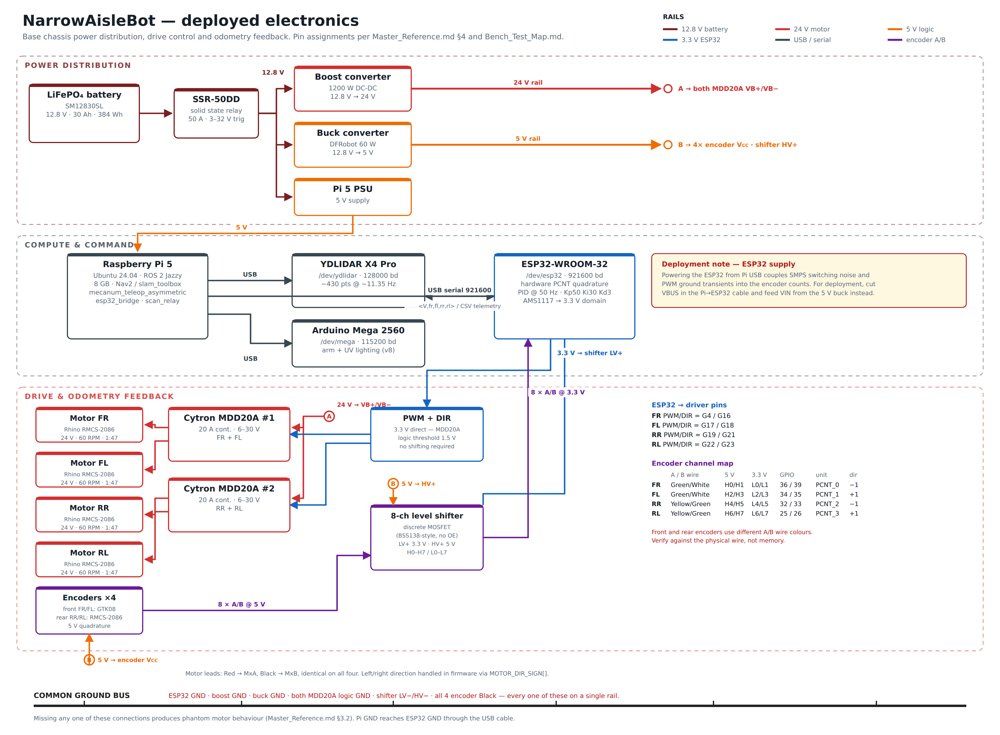

**Figure 2.** The three-layer architecture, each link annotated with its rate and
payload. Orange is the command path, blue is telemetry and perception. The
command loop was closed on 14 August: the planner's velocity now runs through an
axis adapter and a priority multiplexer into the same asymmetric inverse
kinematics the operator drives through, so manual override outranks the planner
at the one point they meet.

The responsibility split follows from a hardware constraint rather than a
software preference. With the encoders originally fitted, each motor at rated
speed produces about 93,000 counts per second, and the two replacement units
fitted since produce twice that. Interrupt-driven quadrature counting at those
rates consumes the entire instruction budget of an ATmega2560. The ESP32's
pulse-counter peripheral decodes quadrature in silicon at no processor cost,
which is why motor control moved onto it.

### 5.1 Principal specifications

| Item | Value |
|---|---|
| Footprint, measured | 1.00 × 0.36 m (wheel outer to wheel outer) |
| Mass | 45.54 kg |
| Outer / inner wheel distance | $l_1 = 0.403$ m, $l_2 = 0.333$ m |
| Half track width | $d = 0.15769$ m |
| Wheel radius | $r_w = 0.0762$ m |
| Drive motors | 4 × Rhino RMCS-2086, 24 V, 1:47, 60 RPM |
| Encoders | FR/FL GTK08 at 186 264 CPR; RR/RL optical at 93 132 CPR |
| Real-time controller | ESP32-WROOM-32, FreeRTOS, 100 Hz loop |
| Host | Raspberry Pi 5, Ubuntu 24.04, ROS 2 Jazzy |
| LiDAR | YDLIDAR X4 Pro, triangulation, rated under 2 % of range |
| Local controller | MPPI, omnidirectional motion model |
| Power | LiFePO₄ 12.8 V / 30 Ah; boost 24 V drive, buck 5 V logic |
| Cargo arm | 2 × NEMA 23 lateral, 1 × NEMA 34 vertical, 3-tube staged UV-C |
| Operating velocity clamp | 0.12 m/s linear, 0.30 rad/s yaw |

### 5.2 A deliberate departure from the standard frame convention

This robot's base frame puts $+X$ to the right and $+Y$ forward, which is not
the ROS convention. The choice was made in August after two independently
validated subsystems were found to disagree about which way the robot faces, and
it was resolved by changing the side with weaker evidence rather than the side
that was more convenient. That reasoning is recorded in §7.3.

The decision has cost more than it saved, and the report says so. Five separate
stale compensations for it have been found and removed since, in the dashboard
canvas, in a print-site relabel, in a goal-pose adapter, in a zero-point yaw
constant, and in the localisation node's initial pose. Four of them together hid
a real frame fault for two weeks. The convention is now unified across all three
frames, stated once in `docs/Axis_Convention.md`, and enforced by a verification
script that fails if it is edited back out. A project starting over would adopt
the standard convention and place the compensation at the sensor.

---

## 6. Closed-loop velocity control

### 6.1 Why open loop was insufficient, established by measurement

The first complete platform was open loop. Forward and backward motion was
adequate; lateral translation stuttered audibly. Characterising all four motors
at a fixed PWM explained it.

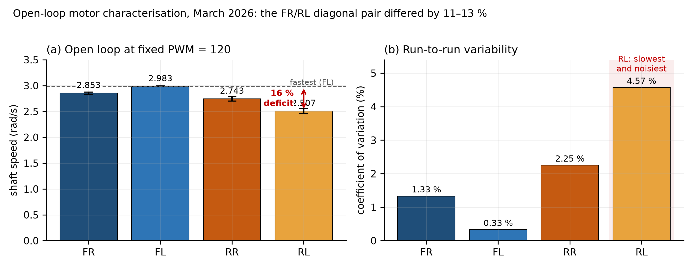

**Figure 3.** Open-loop motor characterisation at PWM 120, 20 Hz sampling, March
2026. The rear-left unit was slowest and most variable, 16 % below the fastest
wheel with a coefficient of variation of 4.57 %.

The relevant number is not the 16 % spread across four motors but the 11–13 %
mismatch *within* the front-right/rear-left diagonal pair. Under mecanum
kinematics, lateral translation is produced by the two diagonal pairs acting in
concert; when one member does 12 % more work than the other, the difference
appears as a net yaw torque fighting the intended motion. That is the stutter.
The conclusion is stronger than "closed loop is better": open-loop control is
acceptable when motors are well matched or when only one axis is used, and
becomes untenable the moment two actuators must act together. Mecanum geometry
makes that unavoidable.

### 6.2 The controller

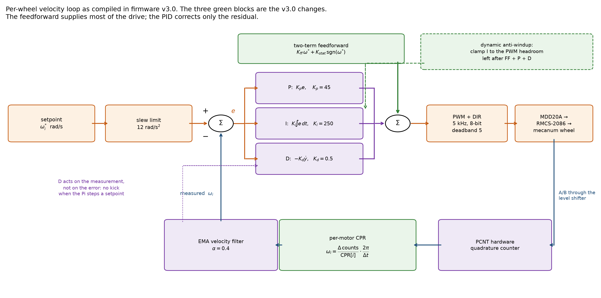

**Figure 4.** The per-wheel velocity loop as compiled. The two-term feedforward
supplies most of the drive signal; the PID terms correct the residual.

Three design choices are worth defending individually.

**A two-term feedforward, not one slope.** A single-slope model cannot fit the
data, because the measured PWM-per-rad/s ratio rises at low speed. That is the
signature of static friction and it requires a constant breakaway term alongside
the viscous slope.

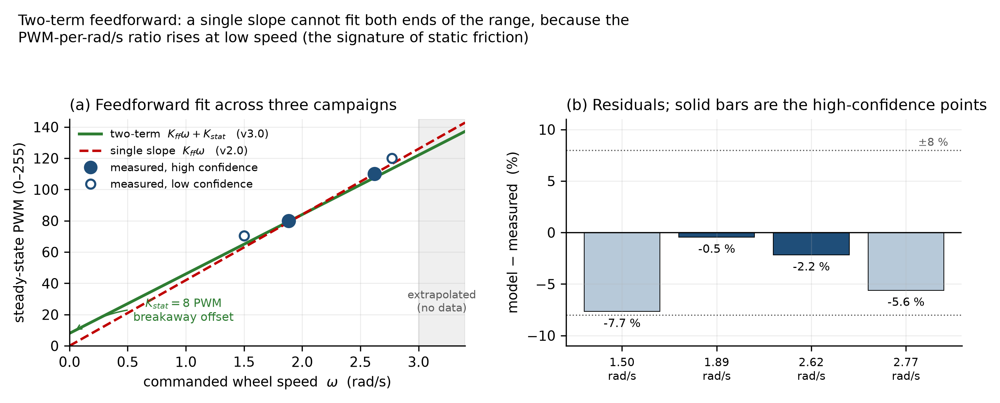

**Figure 5.** The two-term fit against three independent in-air campaigns. Every
point falls within about 8 % and the two highest-confidence points within 2.3 %.
The shaded region above 3 rad/s is extrapolation, where the model will
over-predict as the motor approaches rated speed. Over-prediction is the safe
direction: the output saturates and the integral unwinds it, rather than the
wheel falling short.

An honest limitation belongs with that figure. The split between the viscous and
breakaway terms is poorly determined, because every measurement lies between 1.8
and 2.8 rad/s and over that span many parameter pairs fit almost equally well.
What is well determined is the value of the whole expression across the measured
range, which is what the controller consumes.

**The integral gain follows from the plant gain, not from tuning by hand.** The
feedforward fit hands over the plant DC gain as $K = 1/38 = 0.0263$ rad/s per
PWM count. Direct-synthesis tuning gives $K_i = 1/(K\lambda)$, and with a
conservative closed-loop time constant of 0.15 s that is 253, rounded to 250.
The useful property is that this expression does not contain the plant time
constant, which had not been measured. The previous value of 30 moved the output
3 PWM per second for a 0.1 rad/s error, so closing a realistic 10-PWM
feedforward gap took over three seconds. That is exactly the 3.79 s worst-case
settling time logged in May. At 250 the same gap closes in 0.4 s.

**Anti-windup that actually binds.** The previous fixed clamp, at the old
integral gain, permitted an integral contribution of about 6000 PWM, some
23 times the output range. The clamp existed but could never engage. The current
implementation clamps against the PWM headroom genuinely remaining after the
other three terms, recomputed every tick.

### 6.3 The dual-encoder fault

Two motors carry a different encoder from the other two, following replacement
of two failed units, and the replacements have exactly twice the resolution.
Firmware through v2.0 applied one shared constant to all four.

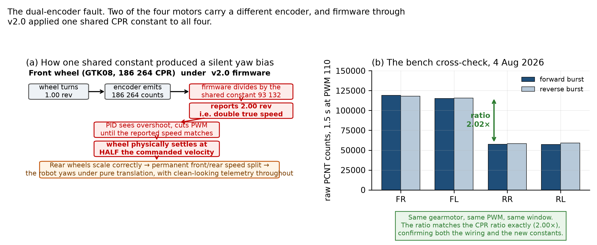

**Figure 6.** (a) The failure mechanism. (b) The bench cross-check that detected
it: front and rear raw counts at matched PWM and matched window, on physically
identical gearmotors, differing by exactly the ratio of the two resolutions.

The mechanism earns its emphasis because of how it fails, not how it is fixed. A
front wheel completing one revolution emits 186 264 counts; divided by the
shared constant of 93 132 that reports as 2.00 revolutions. The controller
believes the sensor, sees itself overshooting, and reduces PWM until the
*reported* speed matches the target, meaning until the wheel physically turns at
half the commanded velocity. The rear wheels track properly. The result is a
permanent front-to-rear speed split that scales with commanded velocity: the
robot yaws under pure translation, with no error raised and clean tracking in
every telemetry plot, because the loop *is* tracking. It is tracking a lie.

No test that examines one wheel at a time can find this. It was found by
comparing front against rear on the same command, and it is the strongest early
argument in this year's work for cross-subsystem verification as routine
practice rather than as a debugging measure.

A second finding fell out of the same correction.

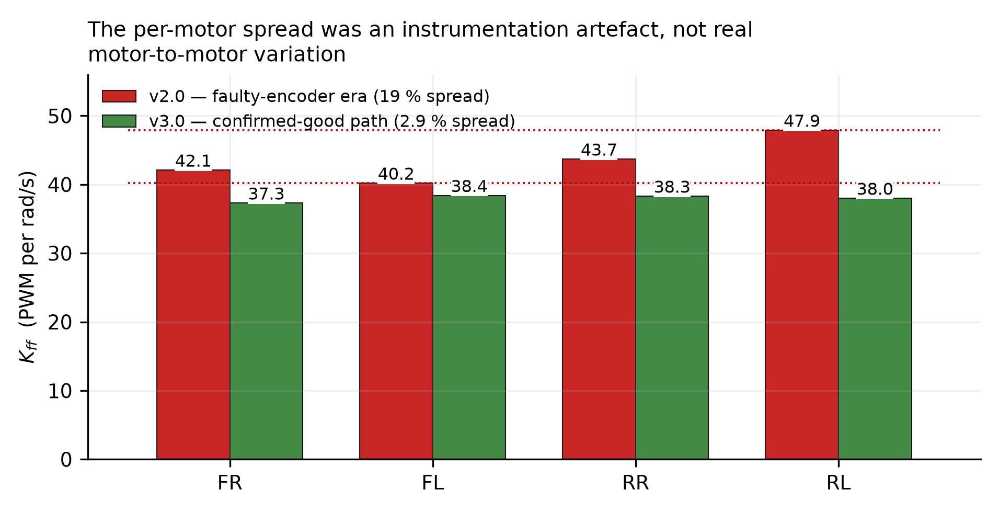

**Figure 7.** Re-measured on the confirmed-good signal path, all four motors fall
within a 2.9 % band. The earlier 19 % spread had been treated for months as a
physical property of the motors and used to justify per-motor compensation.

### 6.4 Results, in the air and on the floor

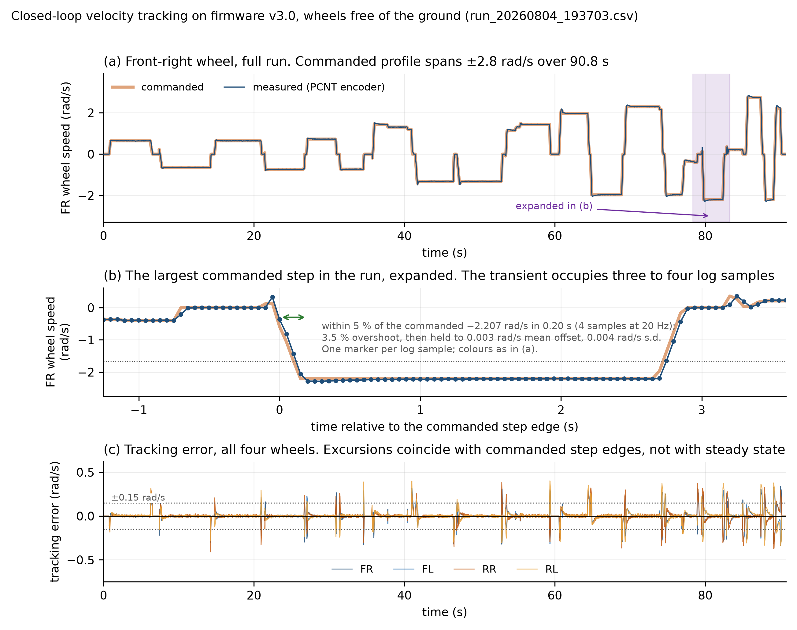

**Figure 8.** Closed-loop velocity tracking, wheels free, 1816 samples over
90.8 s. (a) The front-right wheel across the full run, with an inset over one
commanded step. (b) Tracking error for all four wheels. Excursions coincide with
commanded step edges and not with steady-state operation, which is the expected
behaviour of a well-conditioned loop.

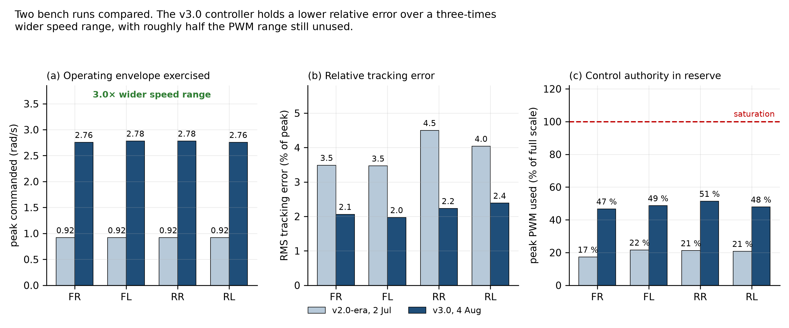

**Figure 9.** The same metrics against a run on the previous firmware
generation. The current controller holds a lower relative error over a three
times wider speed range with roughly half the actuator range unused.

| Run | Peak commanded | RMS error, % of peak | Peak PWM of 255 | Saturation |
|---|---|---|---|---|
| Bench, 2 Jul, previous firmware | 0.92 rad/s | 3.5–4.5 % | 55 | 0 |
| Bench, 4 Aug, v3.0 | 2.78 rad/s | 2.0–2.4 % | 131 | 0 |
| Bench, 5 Aug, v3.0 | 2.78 rad/s | 1.2–1.4 % | 128 | 0 |
| **Ground, 6 Aug, v3.0** | **1.39 rad/s** | **3.4–4.0 %** | **77** | **0** |

The ground run is the one that closes an objective. The feedforward calibration
carried a prediction, written down in `docs/PID_Calibration.md` §7 before any
floor test existed: ground load would raise the feedforward demand by 10–30 %.

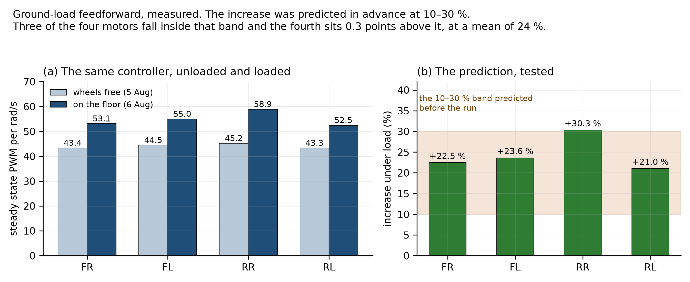

**Figure 10.** Steady-state PWM per rad/s, unloaded against loaded, computed from
the two logs for this report. All four motors land inside the predicted band, at
a mean of 24 %. A prediction registered in advance and then met is worth more
than an explanation offered afterwards, and this is one of two such results in
the year; §8.3 is the other.

**What these numbers establish and do not.** They establish a loop that is
healthy, consistent across all four wheels, free of saturation and of
direction-sign faults, and now exercised under real chassis weight. They do not
establish a step response, because these are live driving logs rather than
isolated-step tests, so rise time and settling time cannot be fitted from them.
The plant time constant remains unmeasured and the proportional gain remains an
estimate; the bench run that closes it is implemented and takes about 40 seconds.

---

## 7. Perception, mapping and the frame-convention faults

### 7.1 Bringup, and three faults that produced no error message

A YDLIDAR X4 Pro was integrated and its parameters read off the hardware rather
than copied from a forum. Getting from "the sensor spins" to "the map builds"
took considerably longer than expected, for reasons worth reporting because all
three obstacles shared a diagnostic character.

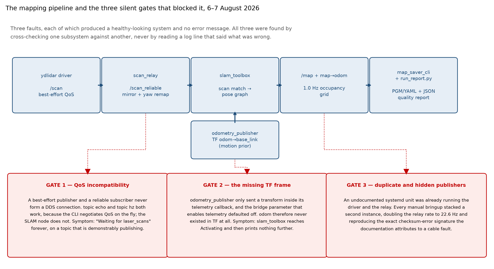

**Figure 11.** The mapping pipeline and the three faults that blocked it. None
produced an error message. Each was found by comparing one subsystem against
another rather than by inspecting the component that appeared to be failing.

The quality-of-service incompatibility is the most transferable. The driver
publishes scans as best-effort; the SLAM node subscribes as reliable; in DDS
those endpoints never connect. Both `ros2 topic echo` and `ros2 topic hz` work
perfectly on that topic, because the command-line tools negotiate a compatible
profile at runtime and the SLAM node does not. A topic being demonstrably alive
is not evidence that a given node will receive it. The same fault recurred later
in a different consumer, the navigation costmaps, and was caught in the audit
described in §9.1. A documented workaround is not a fix; only a check that fails
when the workaround is bypassed is.

### 7.2 Self-occlusion, measured and then masked

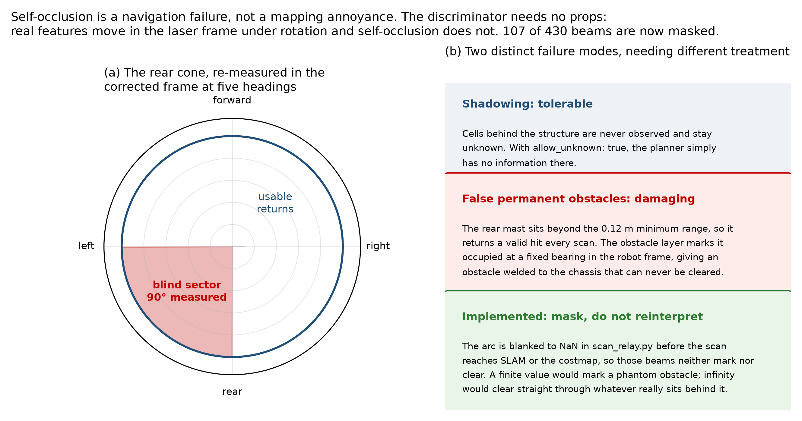

**Figure 12.** The rear cone, re-measured in the corrected frame at five headings
roughly 90° apart. Cross-checking the five sector tables against each other
found exactly one bearing block returning a close reading in all five
independent headings: a 90° wedge centred directly behind the robot. Every other
"always close" flag appeared in exactly one run, which is a real wall the robot
happened to face, correctly not persisting.

The second failure mode is the damaging one. If the rear mast sits beyond the
sensor's 0.12 m minimum range it returns a *valid* hit on every scan, and the
obstacle layer marks those cells occupied. Because they are fixed in the robot's
own frame they translate and rotate with it: a permanent obstacle welded to the
chassis, which the inflation layer expands and the planner reads as a direction
blocked everywhere and always.

The mask is implemented. The arc is blanked to not-a-number in the relay node
before the scan reaches SLAM or the costmap, so those beams neither mark nor
clear. A finite value would mark a phantom obstacle; infinity would clear
straight through whatever really sits behind it. 107 of 430 beams, one quarter
of every scan, are now masked, and that fact is carried explicitly into the
loop-closure threshold reasoning of §8.

The discriminator needed no apparatus: rotate in place in a static environment
and compare scans, because real features move in the sensor frame under rotation
and self-occlusion does not. An earlier proposal to establish the same thing by
standing opaque sheets around the chassis would not have worked, because sheets
on all sides block everything and cannot separate self-occlusion from the sheet.

### 7.3 Two frame-convention faults, and the rule that came out of them

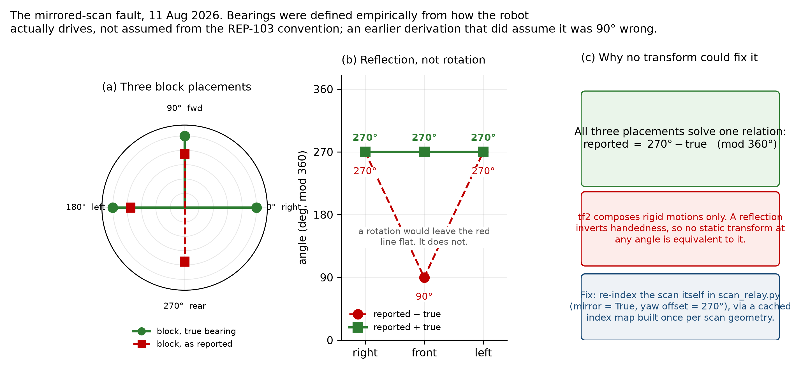

**Figure 13.** The mirrored-scan fault. Bearings were defined empirically from
how the robot actually drives rather than assumed from the standard convention;
an earlier derivation that did assume it was 90° wrong and was caught before
deployment.

A block placed in front of the robot appeared behind it. Three placements at
known bearings all satisfied one relation. The distinction that mattered is that
the *difference* between reported and true bearing is not constant across the
three while their *sum* is, which is the signature of a reflection about a fixed
line rather than a rotation. That decided where the fix could live: transform
libraries compose rigid motions only, and a reflection inverts handedness, so no
static transform at any angle is equivalent to one.

Immediately afterwards, driving forward made the accumulated map slide sideways.
Raw transform measurements across two controlled single-axis moves showed 94 %
of a forward move on one axis and 96 % of a lateral move on the other, which is
the standard convention and the opposite of the one the scan fix had been built
on. Two internally consistent conventions existed and nothing in the physics
selects one. The question was therefore not which had been measured most
recently but which rested on weaker evidence. The scan side had been confirmed
by a recording of the robot driving toward a placed block while the block's
position closed in the map, made before the drift symptom was ever observed; the
odometry side rested on a single transform reading. The correction went to the
odometry node.

That decision was revisited a fortnight later and found to have been half
applied. The published orientation and twist had been rotated; the published
*translation* had not. Driving forward really did increase map *X*, and four
separate downstream compensations had grown over the seam, each undoing it for
one consumer, which is why it read as correct wherever anyone looked closely. It
was reopened by a video, which was decisive in a way that argument had not been.
The remaining half was applied, all four compensations were deleted in the same
commit, and a verification script now proves the chain and fails if it is edited
back out.

The standing rule that came out of this is stated in the project's own
documentation and is the most useful thing this episode produced: **never fix an
axis or placement complaint in the display.** A display-side correction makes one
consumer right and hides the fault from every other.

### 7.4 Why the maps were sparse

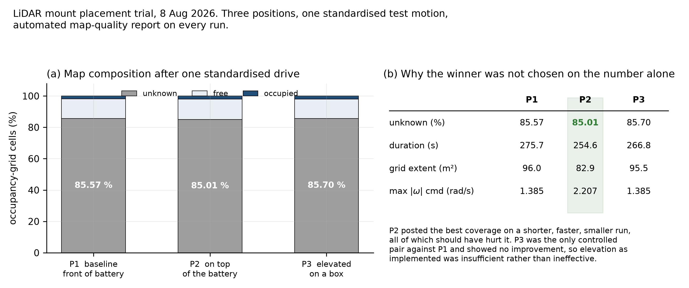

**Figure 14.** Placement-trial results, three mount positions on one standardised
drive. Position 2 was selected on two grounds together rather than on the
coverage figure alone: it posted the best number on a shorter, faster, smaller
run, all of which should have hurt it, and it is the only position that removes
the battery from the sensor's line of sight by mechanism rather than by degree.

The controlled comparison in that trial is a negative result and is reported as
one. Position 3 was the only run whose motion profile matched the baseline
closely and it showed no improvement at all. Photographs of the mount explain
why: on its temporary support the unit sat roughly level with the battery's top
edge rather than clearly above it. Elevation as a strategy was not refuted;
*that amount* of elevation was insufficient.

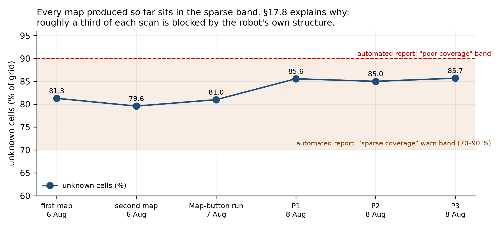

**Figure 15.** Unknown-cell fraction across the maps produced this year. All sit
in the band the automated report flags as sparse.

The explanation was assumed for weeks to be short drive paths and turned out to
be something else entirely, which §8.2 reports.

---

## 8. The SLAM front-end investigation

This section covers 19 August to 3 September and is the most substantial
research content of the year. It is reported as a campaign rather than a list of
fixes, because the method is the point: each stage carried a prediction written
before the test, several predictions failed, and two conclusions were retracted
in writing when the evidence went against them.

### 8.1 The symptom, and what it was not

Occupancy maps came back folded and unusable. The robot's estimated pose jumped
repeatedly during drives, sometimes by a quarter of a metre in a single 0.1 s
sample, which is six to twenty times anything the chassis can physically do.

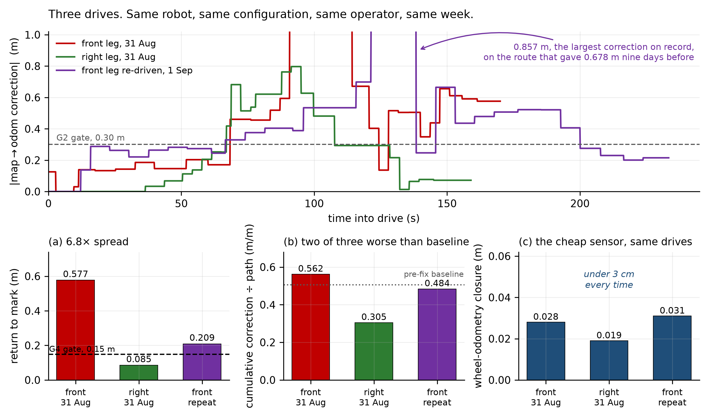

**Figure 16.** Three drives, same robot, same deployed configuration, same
operator, same week, replotted for this report from the raw pose logs in
`data/field_runs/`. (a) The 6.8× spread in return-to-mark across drives that
should have been equivalent. (b) Two of the three are worse than the pre-fix
baseline the tuning was built to cure. (c) The wheel odometry, on the same three
drives, closes under 3 cm every time.

Three candidate explanations were live and the data separated them. A repeat
test on the identical route was registered in advance with two possible
outcomes: reproduce near 0.577 m, meaning route geometry, or move toward
0.085 m, meaning intermittency. Neither happened. The repeat returned 0.209 m
with a peak correction of 0.857 m, the largest on record. A third distinct
number on one route rules out geometry.

Two things were ruled out by measurement rather than by argument. The back end
is healthy: the pose-graph watcher reported no node moved and no shift across
645 seconds through all 19 loop closures on one drive, and again through 9
closures on another. And wheel odometry registered nothing unusual at the exact
moment the map-frame estimate moved 40 cm, with per-tick deltas of 2.0–2.4 mm.
The fault is in the front end, between the scan and the pose, and it is neither
the optimiser nor the encoders.

### 8.2 A drive procedure that recorded nothing

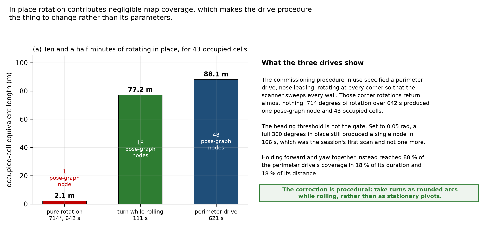

**Figure 17.** Rotation in place adds no pose-graph node and no map cell. Two
full turns, 714° over 642 seconds, produced 43 occupied cells: ten and a half
minutes of sweeping a room for two metres of wall.

The commissioning procedure in use since late August was "perimeter, nose
leading, rotating at every corner so the LiDAR sweeps every wall", adopted
specifically to work around the rear blind cone of §7.2. Those corner rotations
contribute nothing. Setting the heading threshold to a quarter of its value and
driving a full 360° in place still produced one pose-graph node in 166 seconds,
the session's first scan and not one more, which falsifies the threshold as the
gate. A mechanism is proposed in the record and explicitly marked as unverified
against source.

Turning while translating instead reached 88 % of the perimeter drive's wall
coverage in 18 % of its time and 18 % of its distance. This is a better
explanation for maps returning 63–87 % unknown than anything previously
considered, and it means the map-quality acceptance criterion was never
reachable by that method.

The methodological error is recorded alongside the result: three sessions of
parameter tuning had been spent against a tight-circle test geometry that
records almost nothing, and which is separately degenerate for scan matching. At
5 m range, 1° of heading error is indistinguishable from 8.7 cm of translation,
so rotation and translation stop being separable and the matcher resolves the
ambiguity in favour of heading. That predicts the measured signature exactly:
heading right to about 4°, position 27.6 cm out, wheels closing to 8 mm.
Choosing the benchmark badly cost more than any single wrong parameter.

### 8.3 The result that decided it

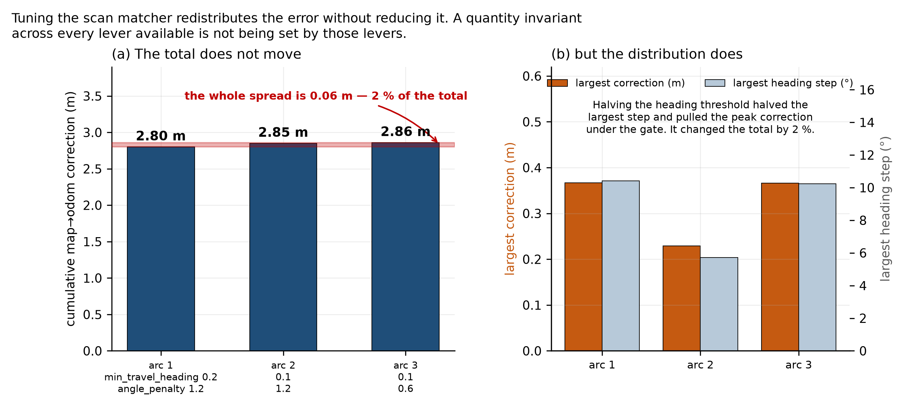

**Figure 18.** The same tight arc driven three times on three parameter sets.
Halving the heading threshold halved the largest heading step and pulled the
peak correction under the acceptance gate, exactly as predicted. It changed the
cumulative correction by 2 %.

This is the sharpest result of the year. Cumulative correction came out at 2.80,
2.85 and 2.86 m across every parameter set available. The tuning moves the
*distribution* of the error and never its amount, which is the signature of
something the search parameters do not reach.

Read against a second measurement, it becomes a diagnosis. Instrumenting the
sensor input for the first time in the project found 74.8–78 % of rays flipping
between valid and invalid between consecutive scans with the robot stationary,
and only 47.4 % valid at any instant. The matcher is not searching badly. It is
handed a different point cloud every sweep, and no search parameter can fix a
moving objective function.

The sensor is behaving correctly. The YDLIDAR X4 Pro is a triangulation scanner
rated at under 2 % of range, which is 32 mm at the 1.6 m median range measured
in this lab and 200 mm at 10 m. The measured 90th-percentile scatter of 22.8 mm
is inside specification. **The sensor is performing to specification and the
specification is not adequate for what is being asked of it.** That is a
conclusion pointing at hardware, and the reason to exhaust the software levers
first was to justify it rather than guess at it.

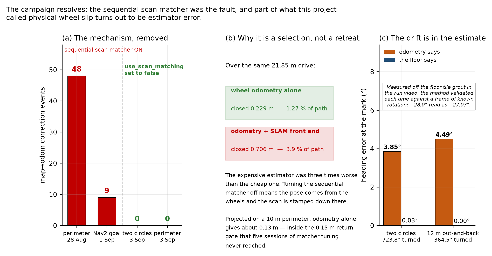

**Figure 19.** (a) The mechanism removed. (b) Why disabling it is a selection
between two measured estimators rather than a retreat. (c) The phantom-yaw
result of §8.4.

Over one 21.85 m drive, wheel odometry alone closed 0.229 m and odometry plus
the SLAM front end closed 0.706 m: the expensive estimator was three times worse
than the cheap one. Disabling the sequential matcher, so the pose comes from the
wheels and the scan is stamped down there, produced zero corrections across two
structurally different routes, 698 seconds and 18.5 m of combined driving. Not
one millimetre, across 6994 pose samples. The registered prediction was
"corrections approximately zero"; the measured answer is zero to six decimal
places.

The claim this supports is deliberately narrow. The correction mechanism is
gone. Whether the resulting map is geometrically true over a real route is the
next run's question, and loop closure running on a separate matcher is expected
to survive but is recorded as a hypothesis, not a result.

### 8.4 Phantom yaw

Photogrammetry on the run video, using the floor tile grout as a world-static
reference, gives a ground truth independent of every instrument in the
repository. Two runs, on different routes:

| Run | Rotation commanded | Odometry says | The floor says | Validation |
|---|---|---|---|---|
| Two circles | 723.8° | −3.85° | −0.03° | −28.0° read as −27.07° |
| 12 m out-and-back | 364.5° | −4.49° | +0.00° | −19.4° read as −18.50° |

The robot physically returned to its starting heading both times. The estimator
did not. Phantom yaw rates of 0.60°/m and 0.37°/m bracket the 0.58°/m this
project measured over 18 m in August and attributed to physical slip.

The consequence is not small. Physical slip cannot be fixed by better
estimation; estimator error can. A substantial fraction of what has been treated
as a hardware limit is recoverable in software with a gyroscope, and this
converts the inertial sensor from a general roadmap item into a measured
priority.

The method failed twice before it worked, and both failures are more instructive
than the result. The first attempt measured the robot's own wheels against the
video frame and returned "no rotation"; a validation frame of known −28.3°
rotation also returned zero, which is impossible. The camera is mounted on the
robot's own mast, so the robot sits still in frame while the world moves around
it. The second attempt measured a window that extended into the dashboard's own
border, a fixed screen edge that never rotates. Both were caught only because a
frame with a known answer was checked before the result was believed. **A
measurement that cannot fail its own check is not a measurement.**

---

## 9. Autonomous navigation

### 9.1 Bringup, and five configuration faults found by reading

The navigation stack was reviewed before it was run, and the review found five
defects in configuration that had never been exercised.

| Defect | Consequence had it run |
|---|---|
| Footprint declared 0.90 × 0.40 m against a real 1.00 × 0.36 m machine | Confident collisions along the length |
| Both costmaps subscribed to the best-effort scan topic | The §7.1 fault recurring in a new consumer |
| Unknown space forbidden to the planner | No path findable, since live maps run about 85 % unknown |
| Odometry topic pointed at a filter that has never run | No odometry reaching the behaviour tree |
| Raytrace and obstacle ranges exceeding the sensor's rating | Phantom clearing beyond the sensor's reach |

A further seven surfaced across the first bringups, and the class is consistent
enough to be worth naming: a stack default that is silently wrong here purely
because this robot's base frame is non-standard, or because a node the
configuration predates is now started automatically. Among them, a second
publisher of the same transform the odometry node already owns; a missing
velocity-smoother block whose stock defaults zero the lateral axis, which on
this robot is forward; a behaviour-tree parameter that replaces rather than
extends the default node list; a service timeout whose unit is milliseconds, set
to five; and two controller critics that assume the nose points along $+X$ and
would reward travelling sideways.

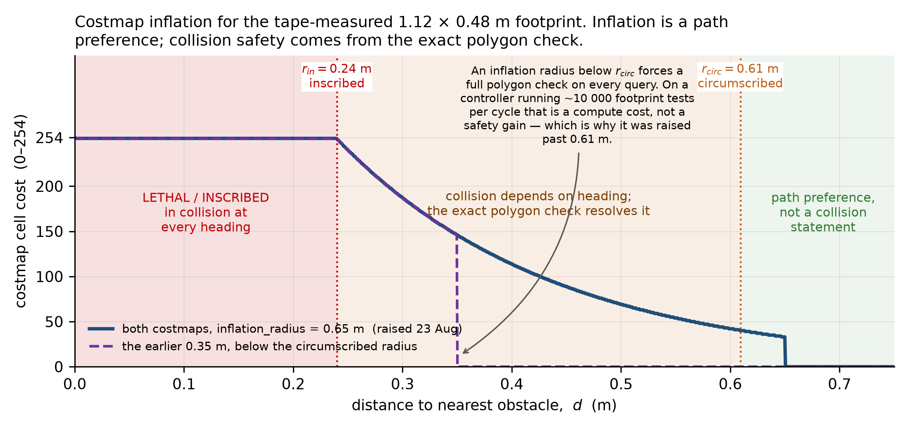

**Figure 20.** Costmap inflation for the tape-measured 1.12 × 0.48 m footprint.
Below the inscribed radius the robot is in collision at every heading; between
the inscribed and circumscribed radii collision depends on heading and is
resolved by the exact polygon check; beyond, the decaying cost expresses a
preference. Both inflation radii were later raised past the circumscribed radius,
because an inflation radius below it forces a full polygon check on every query
and the controller runs on the order of ten thousand of those per cycle.

### 9.2 The first autonomous goal, and the fault it exposed

The first goal ever sent travelled 0.96 m at 88.4° to the commanded direction and
was stopped after contacting an obstacle. Two individually correct, individually
validated axis conventions met at the velocity topic and nothing had reconciled
them. The planner writes velocity in the base frame's axes; the kinematics node
reads that topic as the standard convention. Manual driving had never noticed,
because its producers and its consumer already agreed with each other.

Because the error was a constant 90° rotation sitting inside a closed loop, the
planner's own cross-track corrections came out rotated too. The drive did not
fail as a single wrong turn. It failed by never converging, which is a
qualitatively harder failure to read from the outside.

The fix converts between the two conventions explicitly at the one place they
meet, rather than editing either validated file. Two goals after the fix
returned direction errors of 5.5° and 3.7°, the second stopping 4.6 cm short of
target, completing the first autonomous forward-and-return round trip on this
robot.

### 9.3 Where navigation stands

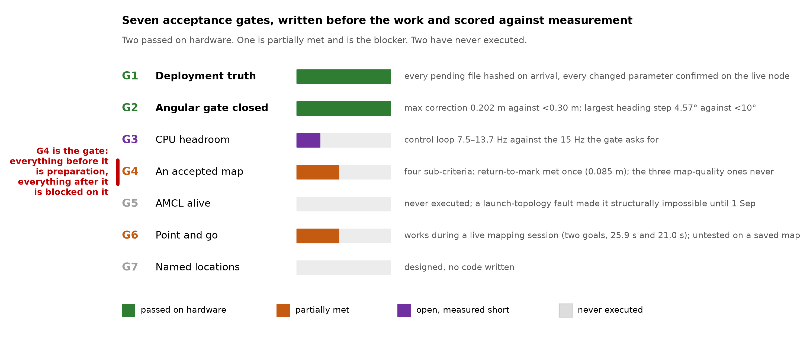

**Figure 21.** Seven acceptance gates, written before the work and scored against
measurement. Two passed on hardware, one is partially met and is the blocker,
two have never executed.

Point-and-go works today inside a live mapping session: two operator-tapped
goals reached in 25.9 s and 21.0 s. Navigation on a *saved* map does not, and the
reason is not the planner. Every navigation attempt in this project's history was
made inside a live SLAM session, against a map frame that was itself moving; on
one 21.85 m drive that frame moved 11.08 m. A goal captured as a fixed
coordinate in a frame that then slides underneath it is not a planner problem,
and naming that explicitly re-ordered the roadmap: commissioning quality is a
mapping problem, operating quality is a localisation problem, and the project
had been trying to solve the second by tuning the first.

The localisation mode that closes this has never executed, and one reason it
could not was found in September without any hardware. The launch file that
starts the LiDAR also starts the SLAM node, and the localisation launch file
forbids running alongside it while starting no scan source of its own. The only
thing that could bring up the sensor was the one thing localisation forbids. It
would have launched, activated, and waited for a scan forever, reading as a
localisation fault when it was a launch-topology fault. The sensor bringup is now
split into its own file, included by both.

---

## 10. Critical evaluation

### 10.1 What is established, what is provisional, what is not claimed

The project grades its own claims on a five-level scale, and this section uses
it: **measured** means measured on this hardware and reproduced on a second run
or by a second instrument; **single** means measured once; **hypothesis** means
reasoned but not measured; **retracted** means believed and now known false.

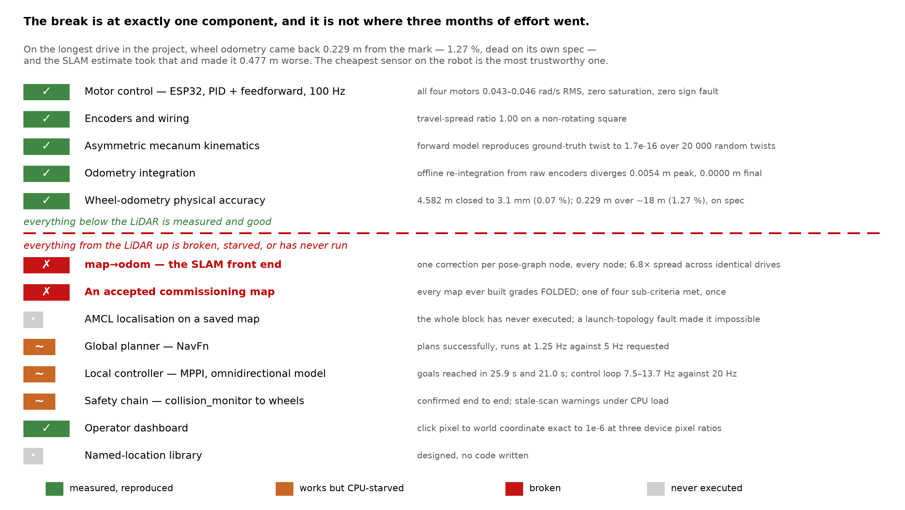

**Figure 22.** The layer-by-layer audit. The break is at exactly one component,
and it is not where most of the year's effort went.

**Measured, and reproduced.**

- Closed-loop velocity control tracks to 1.2–1.4 % of peak, wheels free, and
  3.4–4.0 % under real chassis weight, with zero saturation samples in either.
- Ground load raises feedforward demand by a mean of 24 %, inside a band
  predicted before the run.
- Wheel odometry closes 4.582 m to 3.1 mm and 21.85 m to 0.229 m.
- The forward kinematic model reproduces ground-truth twist to 1.7 × 10⁻¹⁶ over
  20 000 random twists, and offline re-integration from raw encoders diverges
  from the live estimate by 5.4 mm peak and 0.0 mm final.
- Cumulative pose correction is invariant to 2 % across every scan-matcher
  parameter set tried.
- Disabling the sequential matcher removes the correction mechanism entirely:
  zero events across two routes.
- Heading drift reported by odometry is substantially estimator error, confirmed
  on two runs by an independently validated method.
- The self-occlusion blind sector is a 90° wedge, consistent across five
  independent headings.

**Provisional, stated only with the caveat.**

- The proportional gain assumes an unmeasured plant time constant. Across a
  plausible range the cost is response speed, not stability, and the integral
  gain that was genuinely mis-set follows from the measured plant gain and is
  correct regardless.
- Whether loop closure survives with the sequential matcher disabled is a
  hypothesis supported only by a source read confirming the two matchers are
  separate objects.
- The translation half of the photogrammetry result is indicative rather than
  exact, because a mast camera at an oblique angle is sensitive to small pitch
  and roll of the mast.

**Not claimed.**

- No accepted commissioning map exists. One of four sub-criteria has been met,
  once.
- Localisation against a saved map has never run.
- No performance claim under cargo load.
- No quantitative verification of the width benefit that motivates the geometry.
  That claim rests on the foundational paper; reproducing it is Objective 4.
- No germicidal dose claim, in either project.

**Retracted in writing during the year**, and listed because the retractions are
part of the evidence: that a loop-closure relaxation caused the pose jumps
(the parameters were never deployed to the robot); that an earlier tuning
produced a 50 cm to 2 cm improvement (same cause, so what did produce it is
recorded as an open question rather than invented); that lateral motion is the
weak axis (a third recording failed on the forward leg at the same speed the
same day); and one pre-registered took-effect check, withdrawn before the
experiment it belonged to was scored, because it differenced displacement from
the origin on an out-and-back route where that quantity shrinks on the return.

### 10.2 The defect record as a finding

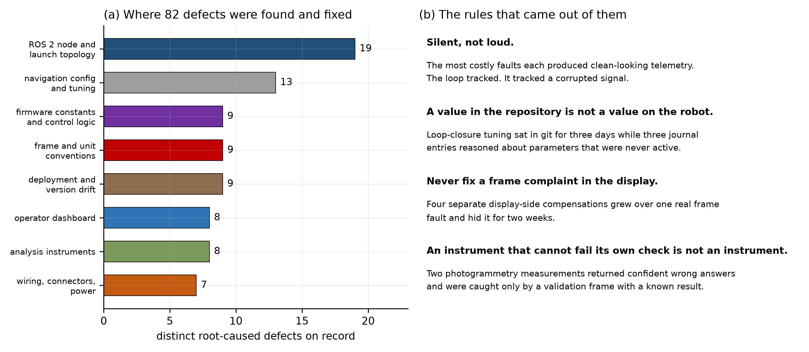

**Figure 23.** Distribution of the 82 root-caused defects documented this year,
and the four rules that came out of them.

The distribution is unremarkable. The shared diagnostic signature is not, and
neither are the working rules the year produced, which are now written into the
project's standing documentation:

**A value in the repository is not a value on the robot.** Loop-closure tuning
was committed on 19 August and reached the robot on 22 August. Three journal
entries in between reasoned in detail about parameters that were never active,
and one headline result had to be un-attributed. The check that matters is
querying the live node, not reading a file. A read-only audit script now hashes
every deployed file against the repository and reports the difference.

**Never fix an axis or placement complaint in the display.** Four separate
display-side compensations grew over one real frame fault and hid it for two
weeks. When an operator reports that the picture is wrong, the picture is
usually right.

**An instrument that cannot fail its own check is not an instrument.** Two
photogrammetry measurements returned confident wrong answers and were caught
only by validation frames with known results. Three analysis tools were found
raising false positives on turning drives, because their thresholds were written
for straight-line data; they were scheduled for repair rather than patched
immediately, because changing an instrument mid-campaign destroys the baseline
it is being compared against.

**Isolate before tuning.** Gains were touched only after the actuator, the
sensor and the unit conversion had each been verified independently. The
corollary the year added is that choosing the benchmark is part of the
isolation: three sessions were spent tuning against a test geometry that records
almost nothing.

Two occasions involved two simultaneous faults, and both cost days. A bench
supply current-limiting below peak demand masked a broken encoder line. An
undocumented system service auto-starting the LiDAR masked a missing transform
frame, and killing processes by hand did not converge because the service
restarted them. A symptom that changes character but does not disappear after
the suspected cause is fixed indicates at least one further fault.

### 10.3 On the balance between the two projects


**Figure 24.** The physical platform and the measurements taken on it.

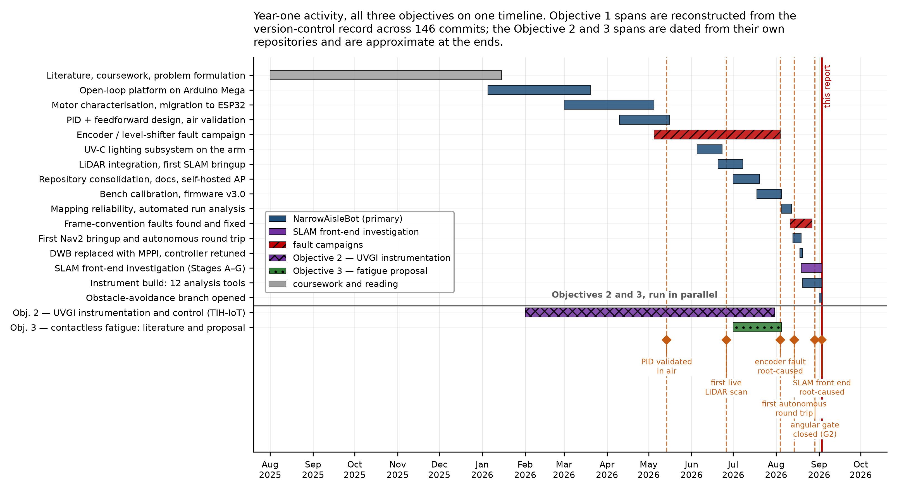

**Figure 25.** Both projects on one timeline, reconstructed from 146 commits.

> **[CONFIRM]** The start and end dates of the parallel project and an honest
> estimate of the fraction of working time it consumed. The repository holds no
> dates for it. This is the first question a committee will ask, and a
> defensible number offered voluntarily is a better answer than a range given
> under pressure.

---

## 11. Parallel project — instrumentation and control for a UVGI air-disinfection unit

An instrumentation and control system was designed, built and deployed for a
UV-C air-disinfection unit under a departmental TIH-IoT activity. This is a
parallel contribution and is not part of the thesis problem statement.

The justification for including it is capability rather than novelty.
Multi-channel environmental monitoring is well-trodden, and the honest statement
of what is new is narrow: the integration, and the dose-based control scheme
proposed but not implemented. What the work developed transfers directly to the
thesis: multi-sensor instrumentation and calibration, real-time acquisition with
time-series storage, closed-loop control with safety interlocks, embedded and
wireless protocol work, and a systematic self-audit. Every one of those appears
in §6 to §9 applied to the robot.

### 11.1 What was built

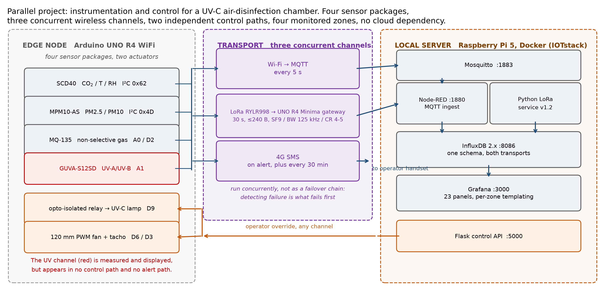

**Figure 26.** Five sensors, three concurrent wireless channels, two independent
control paths, four monitored zones across two radio-isolated deployments
sharing one database, and no cloud dependency.

| Item | Specification |
|---|---|
| Sensor node | Arduino UNO R4 WiFi, firmware v10.1 |
| Gateway | Arduino UNO R4 Minima with RYLR998, level-shifted, firmware v4.1 |
| Server | Raspberry Pi 5 (8 GB), containerised stack |
| Sensors | SCD40 (CO₂, temperature, humidity); MPM10-AS (PM2.5, PM10); MQ-135 (gas); GUVA-S12SD (UV) |
| Actuators | Opto-isolated relay for the lamp; 120 mm PWM fan with tachometer |
| Channels | Wi-Fi/MQTT at 5 s; LoRa at 30 s, ≤240 B; cellular SMS on alert and every 30 min |
| Server stack | Mosquitto, Node-RED, InfluxDB 2.x, Grafana, Portainer, Flask control API |
| Control law | Hysteresis, 150/200 dead band; fan scaled 128–255 across index 200–500 |
| Alert thresholds | 38 °C; 1200 ppm CO₂; gas index 200; 55 µg/m³ PM2.5 |
| Dashboard | 23 panels, per-zone templating, in-panel actuator control |

### 11.2 Three engineering decisions worth defending

Each was a response to an observed failure rather than anticipatory design,
which makes them stronger evidence than a clean specification would be.

**A dedicated gateway microcontroller.** Driving the radio directly from host
GPIO was attempted and abandoned. The command protocol needs deterministic
timing and Linux is not a real-time kernel, so scheduler jitter produced dropped
packets and truncated responses hard to distinguish from radio-link failures.
Interposing a microcontroller moved the timing-critical work to where timing is
deterministic: architecturally less elegant, substantially more reliable.

**Dual isolated power rails.** The cellular modem draws about 2 A in transmit
bursts. Sharing a rail with the microcontroller produced brownout resets. Two
supplies with a single common ground point eliminated them.

**Three concurrent channels rather than a failover chain.** A failover design
must detect failure before switching, and detection is exactly what fails first
in a dead network. Running all three continuously costs bandwidth the system
does not need anyway.

### 11.3 Self-audit

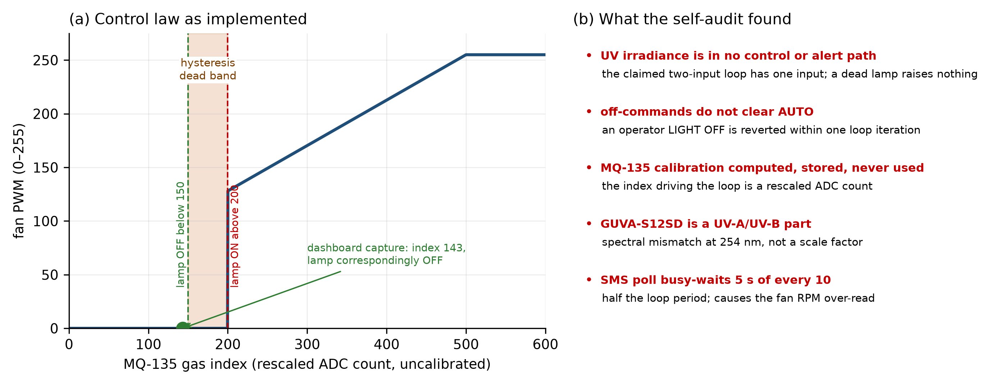

**Figure 27.** (a) The control law as implemented, with a dashboard capture at a
gas index of 143 confirming the lamp correspondingly off. (b) The verified
defect register.

A single dashboard capture demonstrates three separate things, and the third is
why this section exists. The gas index of 143 sits below the 150 threshold and
the lamp is off, confirming the control law executes as specified. The CO₂
reading of 1240 ppm exceeds the 1200 ppm alert threshold, so the node was in an
alert state and had fired on all three channels. And the irradiance panel reads
3.64 in units of mW/cm² *with the lamp off*, which is the clearest available
evidence that the ultraviolet channel is uncalibrated.

| Finding | Consequence |
|---|---|
| Irradiance appears in no control path and no alert path | The two-input loop has one input; a failed lamp raises nothing |
| Off-commands do not clear the automatic mode | An operator's explicit off is reverted within one loop iteration, safety-relevant for UV-C |
| Gas-sensor calibration computed, stored, never used | The index driving the loop is a rescaled analogue-to-digital count |
| The fitted UV sensor responds to UV-A and UV-B | A spectral mismatch at 254 nm, not a scale factor |
| Fan speed never divides by elapsed time | Over-reads during loop stalls, correlated with cellular activity |
| The cellular poll busy-waits 5 s of every 10 | Half the loop period, and the root cause of the item above |
| One node and its gateway share a radio address | A second node cannot be added to that deployment |

Presenting the third reading of the dashboard capture without being asked is the
difference between an audit and an excuse, and the same applies to this table.

### 11.4 What better would look like

The most defensible item is a conceptual correction rather than an engineering
improvement. The device is triggered by a non-selective gas sensor with no
causal relationship to airborne pathogen load. The established proxy is the
rebreathed-air fraction derived from carbon dioxide concentration, which sits
directly inside the Wells–Riley exposure model, and substituting it would make
the trigger physically meaningful rather than merely correlated with occupancy.

Dose-based control follows. Dose is irradiance times residence time, and
residence time is irradiated volume divided by airflow. Measuring irradiance
with a detector appropriate to 254 nm, choosing a target log-reduction and
computing the fan speed that delivers it would make the ultraviolet channel a
genuine second feedback input and would compensate automatically as the lamp
ages. This is the same dose-delivery problem the robot's own UV-C payload faces,
and is the concrete link between the two projects.

Remaining items: traceable calibration of every channel; correctly labelled
particulate sub-indices; liveness alerting; buffered store-and-forward with a
real-time clock; and authenticated control paths, since the present radio
separation is an addressing filter and not a security mechanism.

> **[CONFIRM]** Whether this section may be circulated. Consult the supervisor
> and IRCC on disclosure before the report leaves your hands, and consider
> marking it confidential.

---

## 12. Research gaps and the plan for years 2 to 4

### 12.1 Gaps this thesis can close

**Gap 1: the asymmetry has never been evaluated against a matched baseline.**
The geometry is derived and simulated [1]. Whether the width reduction costs
tracking accuracy, disturbance rejection or yaw authority, and by how much, is
unmeasured. A controlled comparison at matched mass, wheel and controller
parameters would be the first such result.

**Gap 2: what sensing corridor-width localisation actually requires.** This is
the gap the year's work opened, and it is the most defensible thing in this
section because it rests on measurement rather than on a literature shortage.
The low-cost 2D SLAM literature is built on a sensor tier whose specified
accuracy, quantified against a corridor-width error budget, does not close: a
triangulation scanner at 2 % of range gives 32 mm at 1.6 m, against a lateral
budget of a few centimetres over 10 m. Separately, a substantial fraction of the
heading drift this project attributed to physical slip is estimator error
recoverable with a gyroscope. The open question is the minimum sensor
complement, and its cost, that closes a stated error budget on a platform of
this class. That is a question the field answers by convention rather than by
measurement.

**Gap 3: slip and odometry models assume symmetric geometry.** The empirical
drift figures that motivate inertial fusion [2] were measured on symmetric
platforms and the standard slip formulation assumes symmetry. Whether per-wheel
slip differs systematically between the inner and outer pairs of a non-collinear
layout is open, and this platform's slip residual, derived in §2.1, is the
instrument that would answer it.

**Gap 4: costmap semantics degenerate at narrow clearance.** Inflation-based
planning assumes free space wide enough for the bands from opposing walls not to
meet. In a narrow aisle they do. What replaces or supplements inflation in that
regime, without losing its computational advantage, is not settled.

**Gap 5: self-occlusion from a tall payload is under-treated.** Two-dimensional
SLAM literature generally assumes an unobstructed sweep. A robot carrying a mast
violates that, and the trade-off between sensor placement, sector masking and
accepting reduced coverage has not been characterised quantitatively. This
platform now has the measurement (a 90° wedge, 107 of 430 beams) and the
mitigation, which is a starting point rather than a result.

**Gap 6: load-dependent dynamics.** Cargo changes mass and the position of the
centre of mass. Fixed-gain control is not adaptive to this, and whether it needs
to be is an empirical question a loaded trajectory-tracking experiment answers.

### 12.2 Plan by year

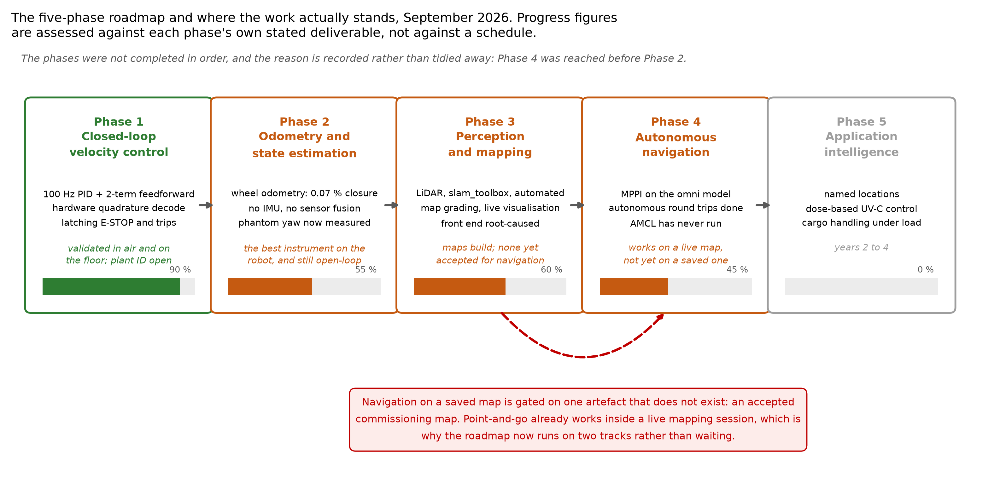

**Figure 28.** The five-phase roadmap and current standing. Progress figures are
assessed against each phase's own stated deliverable, not against a schedule.

**Year 2 — close the sensing question, then close the autonomy chain.**

The sequence is short and each step unblocks the next. Procure and mount an
inertial sensor, close to the geometric centre so that tangential acceleration
mixes minimally into the yaw channel, and quantify how much of the measured
phantom yaw it recovers; §8.4 gives a specific number to test against rather
than a general expectation. Run plant identification on the bench, which removes
the last estimated gain in about 40 seconds. Complete a commissioning drive
under the corrected procedure of §8.2 and grade it against the four existing
criteria. Save that map, bring up localisation against it, and run the
point-and-go sequence that currently works only inside a live session.

Two experiments are worth running whatever the outcome of that sequence. The
first is a sensor comparison: the case against the current LiDAR is now
quantitative, and putting a higher-grade scanner on the same routes with the
same instruments would convert an inference into a controlled result. The second
is the self-occlusion characterisation of Gap 5, which the platform is unusually
well placed to do because the mask, the measurement method and the map-grading
tools all already exist.

Publish the platform, its calibration methodology and the instrumentation-fault
taxonomy of §10.2 as a systems paper. The cross-checking methodology is a
contribution independent of the geometry, and the material for it exists now.

**Year 3 — the geometry question, and control under load.**

Build the symmetric baseline for Gap 1, in simulation first and on hardware if
the wheelbase can be reconfigured without a new chassis, and run matched
trajectory-tracking and disturbance-rejection experiments. Characterise
per-wheel slip against the fused estimate using the residual of §2.1 to address
Gap 3. Instrument the cargo arm's effect on chassis dynamics under load. Only
then compare fixed-gain control against the adaptive and model-based
alternatives read this year [3, 4], with the decision criterion stated in
advance: if the fixed-gain baseline produces visible imperfection in
cargo-handling motion, advance; if not, the simpler controller wins and that is
a result.

**Year 4 — application, evaluation and writing.**

Close the dose-based control loop for the UV-C payload, which requires a
detector appropriate to 254 nm and a traceable calibration. Demonstrate
end-to-end application behaviour in a realistic corridor. Complete whole-system
evaluation with success rates, clearance statistics and failure modes, and write
up.

### 12.3 Intended outputs

Three results appear publishable on their own terms, listed in the order the
underlying work completes.

The first is a systems and methods paper covering the platform, its calibration
methodology and the fault taxonomy of §10.2. Its contribution is the
verification practice rather than the robot: a catalogue of failure modes that
produce healthy-looking telemetry, and the cross-subsystem checks that detect
each one. That material exists now.

The second is the sensing result of Gap 2, which is the most novel thing the
year produced and the least anticipated. A quantitative account of why a
standard low-cost 2D SLAM stack fails at corridor-width tolerances, with the
invariance result as its central evidence, would be useful to anyone building on
the same sensor tier.

The third is the controlled comparison of Objective 4, which answers the
question the geometry was adopted to settle. It depends on Year 2's localisation
work, because a tracking comparison without a trustworthy pose estimate measures
the estimator rather than the geometry.

> **[CONFIRM]** Target venues, and whether the supervisor expects a conference or
> journal route. Also whether any part of the UV-C payload work is
> patent-restricted, since that changes what can be published and when.

### 12.4 Immediate next steps

| Priority | Action | Blocks |
|---|---|---|
| 1 | Procure and integrate the inertial sensor | Phase 2, and the phantom-yaw recovery of §8.4 |
| 2 | Commissioning drive under the corrected procedure, graded | Everything on a saved map |
| 3 | First localisation bringup on that map | Objective 3 on a fixed frame |
| 4 | Plant identification bench run | The last estimated gain |
| 5 | Repair the three analysis tools raising false positives on turning drives | Trusting the instruments in year 2 |
| 6 | Sensor comparison against a higher-grade scanner | Converts Gap 2 from inference to result |

---

## 13. References

**Foundational and platform.**

1. *An Omnidirectional Asymmetric Mobile Robot for Narrow-Aisle Spaces.*
   **[CONFIRM]** — full bibliographic details required. Archived in the project
   documents; the kinematic basis of this platform.
2. Galati et al. *Adaptive heading correction for mecanum platforms.*
   **[CONFIRM]** — full citation required. Source of the 4.56°-over-10 m drift
   figure that motivates Phase 2.
3. *Modeling and Adaptive Control of an Omnidirectional Mobile Robot.*
   **[CONFIRM]** — full citation required.
4. *Fuzzy Adaptive PID Control of a Mecanum-Wheeled Mobile Robot.*
   **[CONFIRM]** — full citation required.

**SLAM.**

5. Macenski, S., & Jambrečić, I. (2021). SLAM Toolbox: SLAM for the dynamic
   world. *Journal of Open Source Software*, 6(61), 2783.
   https://doi.org/10.21105/joss.02783
6. Grisetti, G., Stachniss, C., & Burgard, W. (2007). Improved techniques for
   grid mapping with Rao-Blackwellized particle filters. *IEEE Transactions on
   Robotics*, 23(1), 34–46. https://doi.org/10.1109/tro.2006.889486
7. Sugiura, K., & Matsutani, H. (2021). An FPGA acceleration and optimization
   techniques for 2D LiDAR SLAM algorithm. *IEICE Transactions on Information
   and Systems*, E104.D(6), 789–800.
   https://doi.org/10.1587/transinf.2020edp7174
8. Sugiura, K., & Matsutani, H. (2022). A universal LiDAR SLAM accelerator
   system on low-cost FPGA. *IEEE Access*, 10, 26931–26947.
   https://doi.org/10.1109/access.2022.3157822
9. Laksono, P. S., & Kusuma, T. M. (2022). Performance analysis of Hector SLAM
   and GMapping for mobile robot navigation. *Jurnal Ilmiah Teknologi dan
   Rekayasa*, 27(2), 144–153. https://doi.org/10.35760/tr.2022.v27i2.6063
10. Kohlbrecher, S., von Stryk, O., Meyer, J., & Klingauf, U. (2011). A flexible
    and scalable SLAM system with full 3D motion estimation. *SSRR 2011*,
    155–160. https://doi.org/10.1109/ssrr.2011.6106777
11. Heß, W., Kohler, D., Rapp, H., & Andor, D. (2016). Real-time loop closure in
    2D LIDAR SLAM. *ICRA 2016*, 1271–1278.
    https://doi.org/10.1109/icra.2016.7487258
12. Konolige, K., Grisetti, G., Kümmerle, R., Burgard, W., Limketkai, B., &
    Vincent, R. (2010). Efficient sparse pose adjustment for 2D mapping.
    *IROS 2010*, 22–29. https://doi.org/10.1109/iros.2010.5649043
13. Censi, A. (2008). An ICP variant using a point-to-line metric. *ICRA 2008*,
    19–25. https://doi.org/10.1109/robot.2008.4543181
14. Grisetti, G., Kümmerle, R., & Stachniss, C. (2010). A tutorial on
    graph-based SLAM. *IEEE Intelligent Transportation Systems Magazine*, 2(4),
    31–43. https://doi.org/10.1109/mits.2010.939925
15. Moravec, H., & Elfes, A. (1985). High resolution maps from wide angle sonar.
    *ICRA 1985*, 116–121. https://doi.org/10.1109/robot.1985.1087316

**Navigation.**

16. Macenski, S., Martín, F., White, R., & Ginés Clavero, J. (2020). The
    Marathon 2: A navigation system. *IROS 2020*.
    https://doi.org/10.48550/arxiv.2003.00368
17. Lu, D. V., Hershberger, D., & Smart, W. D. (2014). Layered costmaps for
    context-sensitive navigation. *IROS 2014*, 709–715.
    https://doi.org/10.1109/iros.2014.6942636
18. Fox, D., Burgard, W., & Thrun, S. (1997). The dynamic window approach to
    collision avoidance. *IEEE Robotics & Automation Magazine*, 4(1), 23–33.
    https://doi.org/10.1109/100.580977
19. Li, X., Liu, F., & Liu, J. (2017). Obstacle avoidance for mobile robot based
    on improved dynamic window approach. *Turkish Journal of Electrical
    Engineering & Computer Sciences*, 25, 666–676.
    https://doi.org/10.3906/elk-1504-194
20. Williams, G., Drews, P., Goldfain, B., Rehg, J. M., & Theodorou, E. A.
    (2018). Information-theoretic model predictive control: theory and
    applications to autonomous driving. *IEEE Transactions on Robotics*, 34(6),
    1603–1622. https://doi.org/10.1109/tro.2018.2865891

References 5–20 were retrieved from the publication record and checked for
retractions. References 1–4 are held in the project's document archive and need
their full bibliographic details recovered before submission.

---

## 14. Appendices

### Appendix A — Controller parameters as compiled

```
ENCODER_CPR = {186264, 186264, 93132, 93132}   // FR FL | RR RL
Kff         = { 37.3,   38.4,   38.3,  38.0}   // PWM per rad/s, air
Kstat       = {  8.0,    8.0,    8.0,   8.0}   // PWM breakaway
Kp = 45      Ki = 250     Kd = 0.5             // 100 Hz loop
max_wheel_speed = 5.20 rad/s                   // AIR value
max_wheel_accel = 12.0 rad/s²
velocity filter alpha = 0.4    minimum output = 5
```

Every gain except `Kp` is derived from measured data; `Kp` assumes an unmeasured
plant time constant. Measured ground-load feedforward is 24 % above these air
values (§6.4), which is the correction to apply when the gains are refitted.

### Appendix B — Derived geometric constants

| Quantity | Symbol | Value |
|---|---|---|
| Outer wheel longitudinal distance | $l_1$ | 0.403 m |
| Inner wheel longitudinal distance | $l_2$ | 0.333 m |
| Half track width | $d$ | 0.15769 m |
| Wheel radius | $r_w$ | 0.0762 m |
| Outer yaw lever arm | $K_{o} = l_1 + d$ | 0.5607 m |
| Inner yaw lever arm | $K_{i} = l_2 + d$ | 0.4907 m |
| Footprint for collision checking | — | 1.12 × 0.48 m |
| Inscribed radius | $r_{in}$ | 0.24 m |
| Circumscribed radius | $r_{circ}$ | 0.61 m |
| Padded footprint corner from centre | — | 0.622 m |
| In-place rotation clearance required | — | ≈ 0.87 m in every direction |

### Appendix C — Acceptance gates and their current state

| Gate | Criterion | State |
|---|---|---|
| G1 | Every pending file hashed on arrival; every changed parameter confirmed on the live node | **Passed** |
| G2 | No correction > 0.30 m; largest heading step < 10° | **Passed** at 0.202 m and 4.57°, on a shorter test than the gate specifies |
| G3 | Control loop ≥ 15 Hz sustained; no transform-extrapolation errors in five minutes | **Open**, measured at 7.5–13.7 Hz |
| G4 | Map not folded; doubled walls < 1.0 %; unknown < 50 %; return to mark < 0.15 m | **One of four met, once** (0.085 m return) |
| G5 | Localisation reaches active on a saved map; pose covariance converges | **Never executed** |
| G6 | Five consecutive tapped goals, each within 0.15 m / 10° measured on the floor | **Partially met** on a live map |
| G7 | Three taught locations recalled after a full power cycle | **Never executed** |

### Appendix D — Defect register, by category

Eighty-two distinct root-caused defects are documented across
`docs/Research_Journal.md`. They are grouped here by where they lived. The
section numbers in this table belong to **that document**, not to this report,
and are the entry point for the detail.

| Class | Count | Representative faults |
|---|---|---|
| ROS 2 node and launch topology | 19 | best-effort publisher against reliable subscriber (§13.4); telemetry parameter defaulting off, so the odometry transform never published (§16.9); duplicate node instances doubling the relay rate (§16.8); a second publisher of a transform another node owns (§17.14); the launch topology that made localisation structurally impossible (§17.49) |
| Navigation configuration and tuning | 13 | footprint declared smaller than the machine (§17.6); a service timeout whose unit is milliseconds, set to five (§17.23); progress checker measuring position only, on rotation-only goals (§17.21); inflation radius below the circumscribed radius (§17.23) |
| Firmware constants and control logic | 9 | encoder CPR from a different motor, a factor of 22.5 (§7.1); wheel radius hard-coded at 0.05 m (§7.2); one shared encoder constant across two encoder types (§16.1); an anti-windup clamp 23× larger than the output range (§16.1) |
| Frame and unit conventions | 9 | the mirrored scan, a reflection outside what any transform could correct (§17.9); the velocity-topic axis mismatch that sent the first autonomous goal 88.4° wrong (§17.19); a half-applied frame conversion hidden by four downstream compensations (§17.38) |
| Deployment and version drift | 9 | tuning committed to git that never reached the robot (§17.32); a parameter file committed without its nesting, which binds nothing and falls back to defaults (§17.33); a build-mode switch that reported success and destroyed two nodes (§17.49) |
| Operator dashboard | 8 | map view leaking drive commands into the joystick handler (§17.34); free-against-unknown contrast at 1.20:1 (§17.34); emergency stop not surviving a socket reconnect (§17.49); send failing silently while the interface reported success (§17.49) |
| Analysis instruments | 8 | a tuple-width mismatch that lost a 7117-sample run (§17.29); three false positives firing on every turning drive (§17.44, §17.47); map coverage estimated from a screenshot (§17.44) |
| Wiring, connectors and power | 7 | two broken level-shifter connections (§7.12); a front-encoder cross-connection that was the root cause of a multi-session campaign (§16.1); a bench supply current-limiting below peak demand and masking the first (§7.13) |

Four remain open: the pull-up fix for the UV relay boards, a suspected
controller brownout reset, the sensor-to-base translation still at a placeholder
in the transform tree, and the plant identification that would remove the last
estimated gain.

### Appendix E — Instruments built this year

Twelve analysis tools were written and are in `tools/`. They are listed because
several are the evidence behind claims in §8, and because the report's honesty
about what is measured depends on them.

| Tool | What it measures |
|---|---|
| `run_analyzer.py` | correction events, wheel behaviour and map statistics for a whole run |
| `map_integrity.py` | the fold signature as five numbers, of which doubled walls carries the verdict |
| `graph_residuals.py` | whether the pose-graph optimiser moved any node, per loop closure |
| `wheel_forensics.py` | position and slip re-integrated offline from raw encoders alone |
| `scan_quality.py` | geometric conditioning of the scan, and scan-to-scan ray stability |
| `bag_tf_diff.py` | genuine value changes in one transform pair, with the republish noise collapsed |
| `trajectory_viz.py` | live pose recording with wall-clock stamps for cross-log correlation |
| `zero_point_scan.py` | automated rotate-and-check mapping from the zero mark |
| `repeatability_test.py` | repeated tape-measured out-and-back trials in all four body directions |
| `verify_axis_chain.py` | proves the frame convention and fails if it is edited out |
| `pi_audit.sh` | hashes every deployed file against the repository, read-only |
| `map_corpus.py` | compares a folder of maps side by side, ranked by occupied fraction |

The doubled-wall detector is worth one sentence of method, because its argument
is falsifiable. Free cells between two near-parallel walls mean the LiDAR
returned through that space, so something observed both faces; but if the gap is
narrower than the robot's own 0.48 m, that something cannot have been this
robot. Two walls whose far faces were both seen across a gap nothing could
occupy is the geometry a false closure leaves behind. The known hole is that a
genuine narrow gap between shelves, viewed end-on, looks identical, which is why
flagged cells are reported in map coordinates rather than only counted.

### Appendix F — Open items carried into year 2

**Sensing.** Procure and integrate the inertial sensor. Quantify how much of the
measured phantom yaw it recovers. Run the sensor comparison that would convert
the Gap 2 inference into a controlled result.

**Control.** Plant identification bench run. Refit the feedforward with the
measured 24 % ground-load correction. Revisit the acceleration limit under load.

**Perception.** Complete a commissioning drive under the corrected procedure and
grade it. Correct the sensor-to-base translation still at a placeholder.
Establish whether loop closure survives with the sequential matcher disabled.

**Navigation.** First localisation bringup on a saved map. Repeat the point-and-go
sequence against a fixed frame. Address the control-loop rate, which the gate
specifies at 15 Hz and which measures 7.5–13.7 Hz.

**Instruments.** Repair the three analysis tools raising false positives on
turning drives, and re-baseline the campaign afterwards.

**Documentation.** Keep the research journal current. It is the primary record
from which this report was assembled, and every figure in it is regenerable from
the data in this repository.

---

*End of draft.*
