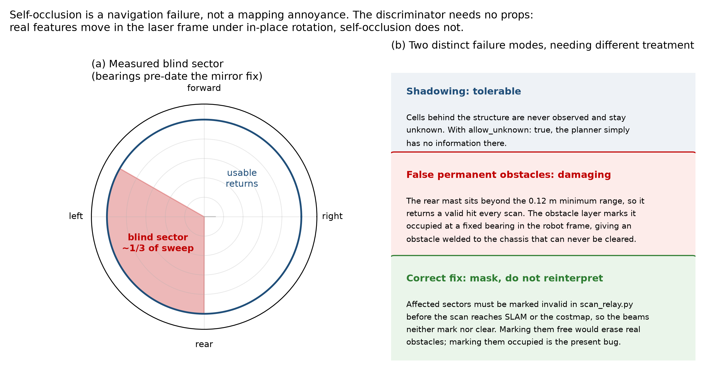
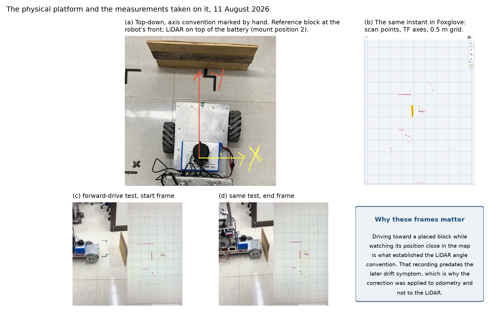
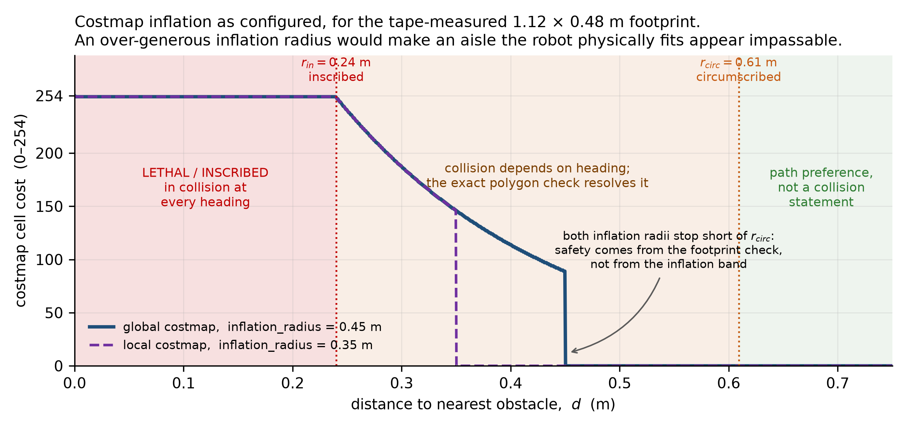
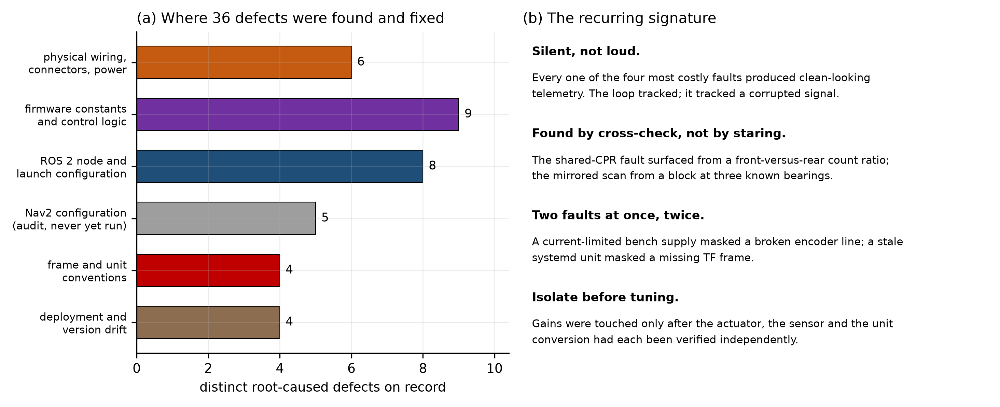
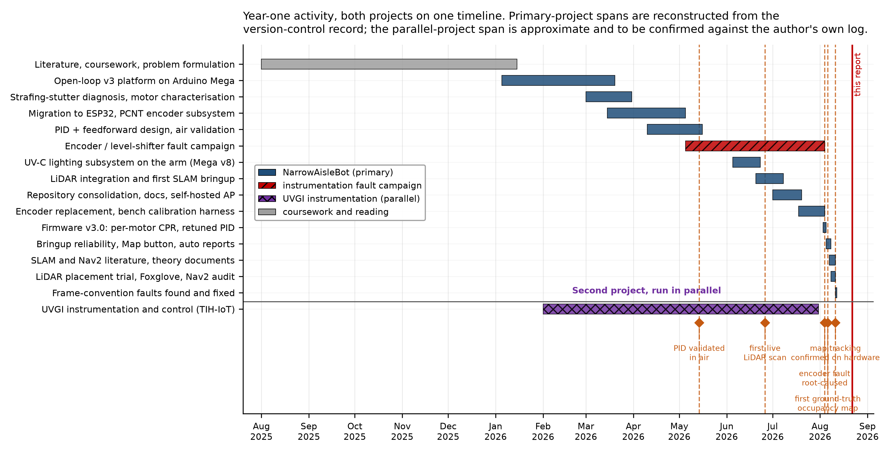
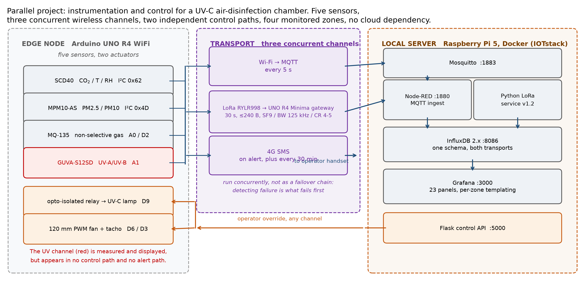
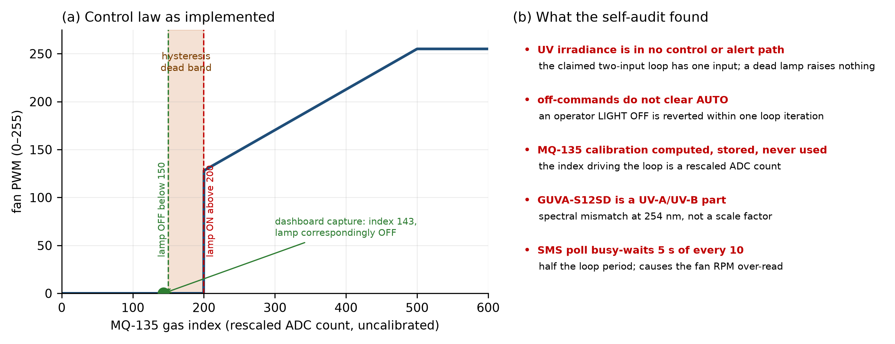
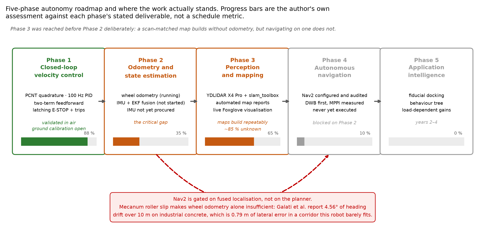

# Annual Progress Report — Year 1

## An Asymmetric Mecanum Platform for Autonomous Operation in Narrow Aisles

**Aritra Das**
Roll No. 25D0074
Department of Biosciences and Bioengineering
Indian Institute of Technology Bombay

**Research Supervisor:** Prof. Ambarish Kunwar

**Reporting period:** first year of registration
**Draft compiled:** 22 August 2026

---

> **Status of this document.** This is a working draft, assembled from the
> project's own version-controlled record: `docs/Research_Journal.md`
> (2313 lines, revision log through v2.11), `docs/PID_Calibration.md`,
> `docs/SLAM_Theory.md`, `docs/Navigation_Theory.md`,
> `docs/Bench_Test_Map.md`, `docs/LiDAR_Orientation_Calibration.md`, the
> firmware and ROS 2 sources, and the two bench telemetry logs under
> `data/bench_logs/`. Every quantitative claim below is traceable to one of
> those files or to a paper listed in §12. Items marked
> **[CONFIRM]** need a decision or a piece of information the repository
> does not contain.
>
> **[CONFIRM] Before submission:** the APS deadline and cycle with the
> Academic Office; the departmental report format and expected length; the
> supervisor's view on how much of the parallel project to include; and the
> IRCC position on disclosing the UV-C subsystem if a patent filing is
> contemplated.

---

## Contents

1. [Summary](#1-summary)
2. [Motivation and problem statement](#2-motivation-and-problem-statement)
3. [Literature reviewed and where this work sits](#3-literature-reviewed-and-where-this-work-sits)
4. [Objectives](#4-objectives)
5. [The platform as built](#5-the-platform-as-built)
6. [Phase 1 — closed-loop velocity control](#6-phase-1--closed-loop-velocity-control)
7. [Phase 3 — perception and mapping](#7-phase-3--perception-and-mapping)
8. [Phase 4 — navigation, prepared but not yet executed](#8-phase-4--navigation-prepared-but-not-yet-executed)
9. [Critical evaluation of the year's work](#9-critical-evaluation-of-the-years-work)
10. [Parallel project — instrumentation and control for a UVGI air-disinfection unit](#10-parallel-project--instrumentation-and-control-for-a-uvgi-air-disinfection-unit)
11. [Research gaps and the plan for years 2 to 4](#11-research-gaps-and-the-plan-for-years-2-to-4)
12. [References](#12-references)
13. [Appendices](#13-appendices)

---

## 1. Summary

The work of this year has been the design, construction, instrumentation and
progressive commissioning of a 45.5 kg omnidirectional mobile robot whose
defining feature is a non-collinear mecanum wheelbase. The two diagonal wheel
pairs sit at different longitudinal distances from the body centre, 403 mm and
333 mm, and that 70 mm offset is the geometric premise the platform is built
to test.

Three things were achieved and are demonstrable. A closed-loop velocity
controller runs on dedicated real-time hardware and tracks commanded wheel
speeds to within 2.0–2.4 % of peak across a ±2.8 rad/s manoeuvre, with no PWM
saturation and roughly half the actuator authority still in reserve. A
LiDAR-based simultaneous localisation and mapping pipeline builds and saves
occupancy grids repeatably, with map quality analysed automatically after every
run and no manual step between pressing a button and reading a report. A
navigation stack has been configured and audited against the literature,
though it has not yet been executed on the robot.

Two things are not achieved, and both are stated plainly here rather than left
for the committee to find. Fused localisation, meaning wheel odometry combined
with an inertial measurement unit through an extended Kalman filter, has not
been started; the sensor has not been procured. That single omission is what
blocks autonomous navigation, and it is the most important item for the coming
year. Separately, the controller has been calibrated only with the wheels free
of the ground. Ground-load calibration will raise the feedforward terms by an
expected 10–30 %, and until that is measured the tracking figures above
describe the unloaded machine only.

A substantial part of the year went into instrumentation faults rather than
into new capability. Thirty-six distinct defects were root-caused and fixed
across wiring, firmware, node configuration, frame conventions and deployment.
Four of them were serious, and all four shared a property worth reporting: each
produced a system that looked healthy in every plot and every log while
computing the wrong answer. The most costly, a single encoder constant applied
to two different sensor types, made half the wheels report double their true
speed, which the controller obediently corrected by running them at half the
commanded velocity. Nothing in the telemetry showed an error. The loop was
tracking; it was tracking a corrupted signal. Section 9 treats this as a
finding in its own right, because the methodology that eventually caught these
faults, independent cross-checks between subsystems rather than closer
inspection of any one of them, is transferable and is now standard practice on
the project.

Alongside the thesis work, a second and independent project was carried out: an
instrumentation and control system for a UV-C air-disinfection unit, built
under a departmental TIH-IoT activity. It is reported in §10 as a parallel
contribution with its own objectives and its own self-audit.

---

## 2. Motivation and problem statement

### 2.1 The environments that motivate the geometry

A robot that must work in a warehouse aisle, an aircraft cabin corridor or the
service passage of a restaurant faces a constraint that most mobile-robot
research does not treat as primary: the corridor is barely wider than the
machine. Differential-drive and steered platforms handle this badly, because
correcting lateral position requires a manoeuvre that consumes longitudinal
space the corridor does not have. Mecanum wheels remove that constraint by
decoupling the three planar degrees of freedom, so the robot can translate
sideways without rotating.

Mecanum kinematics alone do not solve the problem, though, because a
conventional four-wheel mecanum platform places its wheels at the corners of a
rectangle, and the chassis must then be at least as wide as the track plus
mounting clearance. The platform reported here breaks that symmetry. Wheels are
placed non-collinearly, in a point-symmetric rather than mirror-symmetric
layout, following the geometry established in the foundational paper on
asymmetric narrow-aisle mecanum platforms [1].


**Figure 1.** (a) Plan view to scale. The overall footprint was tape-measured
at 1.00 × 0.36 m; the width figure is wheel-outer to wheel-outer, which is the
widest part of the machine. (b) The consequence for control: because the two
diagonal pairs sit at different longitudinal distances, each wheel carries its
own yaw coefficient. Substituting a single symmetric value for *K* anywhere in
the control software converts the machine, in that code path only, into an
ordinary mecanum platform. This has happened once; see Appendix D, defect 9.

The inverse kinematics that follow from this layout are

$$
\omega_{FR} = \tfrac{1}{r_w}\left(u + v + r K_{o}\right), \qquad
\omega_{FL} = \tfrac{1}{r_w}\left(u - v - r K_{i}\right),
$$
$$
\omega_{RR} = \tfrac{1}{r_w}\left(u - v + r K_{i}\right), \qquad
\omega_{RL} = \tfrac{1}{r_w}\left(u + v - r K_{o}\right),
$$

with $r_w = 0.0762$ m, $K_{o} = l_1 + d = 0.5607$ m and
$K_{i} = l_2 + d = 0.4907$ m. The forward map used by the odometry node is the
corresponding pseudo-inverse, with the yaw component scaled by
$r_w / \left(2(l_1 + l_2 + 2d)\right)$.

### 2.2 The application thread, and the connection to this department

Two application targets appear in the project record, and both are relevant to
a Department of Biosciences and Bioengineering. The platform carries a
three-tube staged UV-C germicidal lighting subsystem on its cargo arm, giving a
mobile aisle-scale disinfection capability; the parallel project in §10
instruments a fixed UV-C air-disinfection chamber. The unifying engineering
question across both is dose delivery: germicidal effect depends on the product
of irradiance and exposure time, and neither system presently measures the
irradiance it delivers in a way that could close a control loop around that
product.

The record also describes an autonomous food-delivery cart as a long-term
target, which motivates a different set of constraints (smooth motion so that
liquids are not spilled, predictable behaviour around people, acoustic noise as
a first-order design parameter).

> **[CONFIRM]** Which of these is the thesis application, or whether the thesis
> is framed at the platform level with both as demonstrators. This decision
> shapes §4 and §11 and should be settled with the supervisor before the
> seminar. The draft below is written at the platform level, with UV-C dose
> delivery treated as the primary application thread, because that is the
> framing with the clearest connection to the department.

### 2.3 The research question

Stated as a question the thesis can answer rather than as a topic:

> Does non-collinear mecanum wheel placement deliver a usable reduction in
> chassis width without a corresponding loss of trajectory-tracking accuracy or
> disturbance rejection, and can a platform built on that geometry localise and
> navigate reliably in corridors whose clearance is comparable to its own
> inscribed radius?

Two sub-questions follow, and neither is answered by the existing literature:

1. What is the *quantitative* cost of the asymmetry? The foundational paper
   validates the kinematics in simulation. No controlled comparison of an
   asymmetric platform against a symmetric one of matched capability appears to
   have been published, on hardware or otherwise.
2. How does the eccentricity between geometric centre and centre of mass, which
   the asymmetry introduces by construction, affect tracking under a varying
   cargo load?

---

## 3. Literature reviewed and where this work sits

The reading this year fell into three groups. Every paper cited below was
retrieved from the publication record and checked for retractions or
corrections before being used; the complete list with DOIs is maintained in
`research_articles/README.md` and reproduced in §12.

### 3.1 Asymmetric and omnidirectional platforms

The geometric basis comes from the foundational work on omnidirectional
asymmetric mobile robots for narrow-aisle spaces [1], which derives the
wheel-velocity to body-velocity transformation for non-collinear placement and
validates it in simulation. The contribution of the present work relative to
that paper is a physical implementation with closed-loop control and a
perception stack, rather than a new kinematic derivation.

Galati and co-workers provide the empirical result that governs the whole
autonomy roadmap [2]: on a mecanum platform, open-loop heading drifts by 4.56°
over 10 m on industrial concrete. For a robot 0.36 m wide operating in a
corridor with a few centimetres of clearance per side, 10 m of travel therefore
accumulates roughly 0.8 m of lateral error, which is not a tolerance problem
but a collision. This number is the reason Phase 2 exists as a separate phase
and the reason navigation is gated behind it.

Adaptive and fuzzy tuning approaches for mecanum platforms were read but not
adopted [3, 4]. The reasoning is deliberate: a fixed-gain controller whose
plant has not yet been identified is not a fair baseline against which to judge
an adaptive scheme, so the comparison is deferred until §11.

### 3.2 SLAM

The algorithm choice was reviewed before any parameter on the robot was
touched, and the review is written up in full in `docs/SLAM_Theory.md`. The
conclusion was to retain `slam_toolbox` [5], but on stated grounds rather than
by inertia.

Rao-Blackwellised particle filtering [6] carries one map copy per particle, so
memory and computation scale with the product of particle count and map size.
That cost is quantified directly by the two accelerator papers of Sugiura and
Matsutani [7, 8], which exist precisely because the method is too slow on
embedded hardware without dedicated silicon; the present platform runs on a
Raspberry Pi 5 with no GPU. An empirical comparison on an RPLidar-A1, the same
class of low-cost rotating 2D sensor as the YDLIDAR X4 Pro used here, found
GMapping noisier and less accurate than scan-matching methods on that sensor
tier [9].

Hector SLAM [10] is a legitimate alternative whose no-odometry design was
appropriate while this project's own odometry was unreliable. It has no
pose-graph back-end, however, so accumulated drift is minimised going forward
and never corrected. Cartographer [11] is more capable, using submaps with
branch-and-bound global matching, and remains a sensible upgrade if the mapped
area grows well beyond a single aisle environment. `slam_toolbox` was retained
because it offers the scan-matching-only mode when odometry is untrustworthy
*and* a Ceres-based pose-graph optimiser, descended from Sparse Pose
Adjustment [12], for when it is not.

The mathematics the pipeline actually executes was derived rather than cited in
passing: the point-to-line ICP metric [13] that correlative scan matchers
approximate, the nonlinear least-squares pose-graph formulation [14], and the
Bayesian log-odds occupancy update [15]. That last connection turned out to be
practically useful. The three-value PGM convention the map files use, 0 for
occupied, 205 for unknown and 254 for free, is the saturated log-odds value,
which means the recurring "85 % unknown" figure in §7.5 is not a separate
diagnostic but a direct statement that those cells never accumulated enough
evidence to move off a prior of one half.

### 3.3 Navigation

The navigation stack, its layered costmap architecture and its local
controllers were reviewed in `docs/Navigation_Theory.md` [16–20]. The stack
itself [16] contributes behaviour-tree task orchestration over lifecycle-managed
nodes, with collision checking in SE(2) that admits holonomic platforms rather
than assuming a differential-drive motion model; its motivating deployments are
warehouse and retail floors, which is the same class of environment this
platform targets. Two results from that reading materially changed the
configuration.

First, the layered-costmap semantics [17] make explicit that the inflation band
is a *path preference*, not a collision statement, and that collision safety
comes from the exact footprint polygon check. That distinction matters
disproportionately for a narrow-aisle robot, because an inflation radius set
generously "for safety" makes an aisle the machine physically fits appear
impassable, since inflation from both walls meets in the middle.

Second, the choice between the Dynamic Window Approach [18] and Model
Predictive Path Integral control [20] was settled on evidence rather than
preference. MPPI samples the continuous $(v_x, v_y, \omega)$ space and is
therefore the better theoretical fit for a genuinely holonomic platform, where
DWB discretises the lateral axis coarsely. But the original MPPI experiments
run on a GPU, and this robot has none. The Nav2 implementation is CPU
vectorised, so whether it is affordable here is a measurement, not a
deduction. The decision was to start with DWB, instrument the processor load
and treat MPPI as an upgrade to be justified by measurement. Li and
co-workers' diagnosis of DWA's local-minimum behaviour in dead ends and its
neglect of robot size when judging gap traversability [19] is why the global
planner and the recovery behaviours are load-bearing parts of the design rather
than optional extras.

### 3.4 The gap this work addresses

Stated against what exists rather than as a shortage of studies. The asymmetric
narrow-aisle geometry has been derived and simulated [1] but not, as far as the
reviewed literature shows, built and characterised on hardware with a closed
control loop. Mecanum drift has been measured empirically on symmetric
platforms [2], and the standard slip models assume symmetric geometry; whether
the per-wheel slip characteristics of a non-collinear layout differ has not
been reported. Navigation stacks and their costmap machinery are mature
[16, 17], but the parameter regime they are tuned and documented for assumes
clearance comfortably exceeding the robot's inscribed radius, which is exactly
the assumption a narrow-aisle deployment violates. The present work sits at the
intersection of those three gaps.

---

## 4. Objectives

### 4.1 Thesis objectives

**Objective 1: Build and characterise a physical asymmetric mecanum platform
with closed-loop velocity control.** Deliverable: a machine whose four wheels
track commanded velocities to a stated accuracy, with the calibration
methodology and its uncertainties documented well enough for a third party to
reproduce.

**Objective 2: Establish localisation adequate for corridor-width clearances.**
Deliverable: a fused wheel-odometry and inertial estimate, characterised
against ground truth, with a stated drift figure over a stated distance.

**Objective 3: Demonstrate autonomous point-to-point navigation in a corridor
whose clearance is comparable to the platform's inscribed radius.**
Deliverable: repeated goal-directed runs with success rate, clearance
statistics and failure modes reported.

**Objective 4: Quantify the cost and benefit of the asymmetry.** Deliverable: a
controlled comparison of the asymmetric layout against a symmetric baseline of
matched capability, in simulation and, if the hardware permits, on the machine.

**Objective 5: Close a dose-based control loop for the UV-C payload.**
Deliverable: measured germicidal irradiance driving exposure time or traverse
speed, so that a stated log-reduction target is delivered rather than assumed.

### 4.2 Objectives set for year 1, and their outcome

| # | Objective set for the year | Outcome |
|---|---|---|
| 1.1 | Closed-loop velocity control on real-time hardware | **Achieved**, validated with wheels free of the ground |
| 1.2 | Per-motor feedforward calibration from measured data | **Achieved** for the unloaded case; ground-load calibration open |
| 1.3 | Plant identification for the velocity loop | **Not achieved.** The proportional gain remains an estimate; see §9.1 |
| 1.4 | Live LiDAR perception and a savable occupancy map | **Achieved** and repeatable across reboot cycles |
| 1.5 | Automated post-run analysis of every recorded run | **Achieved**, verified numerically against the reference implementation |
| 1.6 | Inertial measurement and fused state estimation | **Not started.** Sensor not procured. This is the critical gap |
| 1.7 | Autonomous navigation | **Not attempted**, correctly, since it depends on 1.6 |

---

## 5. The platform as built


**Figure 2.** The three-layer architecture, with every link annotated by its
rate and payload. Orange denotes the command path, blue the telemetry and
perception path, grey a connection that is configured but has never been
exercised. The single grey return arrow at the top is the honest summary of
where the year ended: everything downstream of `/cmd_vel` works and is
calibrated, and the planner that would generate `/cmd_vel` autonomously has not
yet been run.

The responsibility split across the three processors follows from a hardware
constraint rather than from a software preference, and it is worth stating
because it drove a mid-project migration. With the encoders originally fitted, each
motor at rated speed produces approximately 93,000 counts per second, and the
two replacement units fitted since produce twice that. Interrupt-driven
quadrature counting at those rates consumes the entire instruction budget of an
ATmega2560, corrupting the velocity estimate and causing the control loop to
miss deadlines. The ESP32's pulse-counter peripheral decodes quadrature in
silicon at no processor cost, which is why motor control moved onto it. The
general form of that lesson, that a workload exceeding the chosen processor is
an architecture problem rather than an optimisation problem, is recorded in the
project journal as a standing principle.

### 5.1 Principal specifications

| Item | Value | Source |
|---|---|---|
| Footprint, measured | 1.00 × 0.36 m (wheel outer to wheel outer) | tape measurement, 8 Aug 2026 |
| Mass | 45.54 kg | project record |
| Outer / inner wheel distance | $l_1 = 0.403$ m, $l_2 = 0.333$ m | design |
| Half track width | $d = 0.15769$ m | design |
| Wheel radius | $r_w = 0.0762$ m (DekuPro 6" SR mecanum) | measured |
| Drive motors | 4 × Rhino RMCS-2086, 24 V, 1:47, 60 RPM | datasheet |
| Encoders | FR/FL GTK08 at 186 264 CPR; RR/RL optical at 93 132 CPR | verified on bench |
| Drivers | 2 × Cytron MDD20A, 20 A per channel | datasheet |
| Real-time controller | ESP32-WROOM-32, FreeRTOS, 100 Hz control loop | firmware v3.0 |
| Host | Raspberry Pi 5, Ubuntu 24.04 LTS, ROS 2 Jazzy | as deployed |
| LiDAR | YDLIDAR X4 Pro, ≈1258 points/scan at ≈11.5 Hz | measured |
| Power | LiFePO₄ 12.8 V / 30 Ah, boost to 24 V drive, buck to 5 V logic | as built |
| Cargo arm | 2 × NEMA 23 lateral, 1 × NEMA 34 vertical, 3-tube staged UV-C | Mega firmware v8 |
| Conservative velocity clamp | 0.15 m/s linear, 0.30 rad/s yaw | teleoperation |

Chemistry choice is worth one sentence of justification. LiFePO₄ was selected
over lithium-ion for thermal-runaway tolerance and for the flatter discharge
curve, which keeps motor behaviour consistent until the pack is genuinely
depleted rather than degrading gradually across a session and confounding
calibration measurements.

---

## 6. Phase 1 — closed-loop velocity control

### 6.1 Why open loop was insufficient, established by measurement

The first complete platform was open loop. It moved when commanded, and for
forward and backward motion it was adequate. Lateral translation was not: the
chassis stuttered audibly and visibly.

Characterising all four motors at a fixed PWM explained it.


**Figure 3.** Open-loop motor characterisation at PWM 120, sampled at 20 Hz,
March 2026. The rear-left unit was both the slowest and the most variable,
running 16 % below the fastest wheel with a coefficient of variation of 4.57 %.

The relevant number is not the 16 % spread across all four motors but the
11–13 % mismatch *within the front-right/rear-left diagonal pair*. Under
mecanum kinematics, lateral translation is produced by the two diagonal pairs
acting in concert. When one member of a pair does 12 % more work than the
other, the difference appears as a net yaw torque that fights the intended
lateral motion, and the rollers resist it through friction. That is the
stutter. The conclusion, which is stronger than "closed loop is better", is
that open-loop control is acceptable when motors are well matched or when only
one axis is used, and becomes untenable the moment two actuators must act in
concert. Mecanum geometry makes that requirement unavoidable.

### 6.2 The controller


**Figure 4.** The per-wheel velocity loop as compiled in firmware v3.0. Green
blocks mark the changes introduced in that version. The two-term feedforward
supplies most of the drive signal, leaving the proportional-integral-derivative
terms to correct only the residual.

Three design choices in the current firmware are worth defending individually.

**A two-term feedforward, not one slope.** A single-slope model
$pwm = K_{ff}\,\omega$ cannot fit the data, because the measured ratio of PWM
to speed rises at low speed. That rise is the signature of static
friction, and it requires a constant breakaway term alongside the viscous
slope.


**Figure 5.** The two-term fit against three independent in-air campaigns. Every
point falls within about 8 % and the two highest-confidence points within 2.3 %.
The shaded region above 3 rad/s is extrapolation: no measurement exists there,
and the model will over-predict as the motor approaches its rated speed. Over-
prediction is the safe direction, because the output saturates and the integral
unwinds it rather than the wheel falling short.

An honest limitation belongs with that figure. The split between $K_{ff}$ and
$K_{stat}$ is poorly determined by the available data, because every
measurement lies between 1.8 and 2.8 rad/s, and over that narrow span many
parameter pairs fit almost equally well. A fit with $K_{ff} = 34.5$ and
$K_{stat} = 15$ is barely distinguishable from the shipped
$K_{ff} \approx 38$, $K_{stat} = 8$. What *is* well determined is the value of
the whole expression across the measured range, which is what the controller
consumes. Separating the two terms properly requires a static-friction
staircase test, which is implemented in `tools/nab_pid_logger.py` and has not
yet been run.

**The integral gain follows from the plant gain, not from tuning by hand.** The
feedforward fit hands over the plant direct-current gain directly as
$K = 1/38 = 0.0263$ rad/s per PWM count. Direct-synthesis tuning then
gives $K_i = 1/(K\lambda)$, and with a deliberately conservative closed-loop
time constant $\lambda = 0.15$ s, that is 253, rounded to 250. The useful
property is that this expression does not contain the plant time constant,
which had not been measured. The previous value of 30 moved the output by about
3 PWM per second for a 0.1 rad/s error, so closing a realistic 10-PWM
feedforward gap took over three seconds. That is precisely the 3.79 s
worst-case settling time recorded in the May validation run. At 250 the same
gap closes in 0.4 s.

**Anti-windup that actually binds.** The previous fixed clamp of ±200, at the
old integral gain, permitted an integral contribution of about 6000 PWM, some
23 times the output range. The clamp existed but could never engage. The
current implementation clamps the integral against the PWM headroom
genuinely remaining after the feedforward, proportional and derivative terms
are accounted for, recomputed every control tick, which makes windup
structurally impossible rather than merely bounded.

### 6.3 The dual-encoder fault

Two of the four motors carry a different encoder from the other two, following
the replacement of two failed units. The replacements have exactly twice the
resolution. Firmware through v2.0 applied one shared constant to all four.


**Figure 6.** (a) The failure mechanism. (b) The bench cross-check that
detected it: front and rear raw counts at matched PWM and matched window,
on physically identical gearmotors, differing by exactly the ratio of the two
encoder resolutions.

The mechanism deserves the emphasis it is given here because of how it fails,
not because of how it is fixed. A front wheel completing one revolution emits
186 264 counts. Divided by the shared constant of 93 132, that reports as 2.00
revolutions, or double the true speed. The controller believes the sensor, sees
itself overshooting, and reduces the PWM output until the *reported* speed
matches the target, meaning until the wheel is physically turning at half the
commanded velocity. The rear wheels, correctly scaled, track properly. The
result is a permanent front-to-rear speed split that scales with commanded
velocity: the robot yaws under pure translation and curves under commanded
rotation, with no error raised, no warning logged, and clean tracking in every
telemetry plot, because the loop *is* tracking. It is tracking a lie.

No test that examines one wheel at a time can find this. It was found by
comparing front against rear on the same command, and it is the single
strongest argument in the year's work for cross-subsystem verification as a
routine practice rather than a debugging measure.

The fix requires no scaling term anywhere except one per-motor array. Both
encoders measure the same physical quantity and differ only in how finely they
divide it, so dividing each motor's raw count by its own constant converts a
sensor-specific quantity into a physical one, and the factor of two cancels
exactly. What genuinely differs is resolution: one count corresponds to
3.37 × 10⁻⁵ rad of wheel rotation at the front and 6.75 × 10⁻⁵ rad at the rear,
giving velocity quanta of 0.0034 and 0.0067 rad/s at 100 Hz. Both sit far below
the mechanical and electrical noise floor, so neither limits the velocity loop.
The finer front resolution will matter for odometry integration in Phase 2,
where counts accumulate over minutes, rather than for control.

A second finding fell out of the same correction. The per-motor feedforward
spread of 19 % that the previous firmware carried was an artefact of the faulty
feedback path, not real motor-to-motor variation.


**Figure 7.** Re-measured on the confirmed-good signal path, all four motors
fall within a 2.9 % band. The earlier spread had been treated for months as a
physical property of the motors and used to justify per-motor compensation.

### 6.4 Results


**Figure 8.** Closed-loop velocity tracking on firmware v3.0, wheels free of the
ground, 1816 samples over 90.8 s. (a) The front-right wheel across the full run,
with an inset over one commanded step. (b) Tracking error for all four wheels.
Error excursions coincide with commanded step edges and not with steady-state
operation, which is the expected behaviour of a well-conditioned loop.


**Figure 9.** The same metrics compared against a run recorded on the previous
firmware generation. The current controller holds a lower *relative* error over
a three times wider speed range, with roughly half the actuator range unused.

| Metric | FR | FL | RR | RL |
|---|---|---|---|---|
| RMS tracking error (rad/s) | 0.057 | 0.055 | 0.062 | 0.066 |
| As a fraction of peak commanded | 2.1 % | 2.0 % | 2.2 % | 2.4 % |
| Peak PWM used, of 255 | 119 | 124 | 131 | 122 |
| Samples at saturation | 0 | 0 | 0 | 0 |

Peak commanded velocity was 2.78 rad/s and the worst wheel used a PWM of 131 out of 255, leaving 49 % of actuator authority in reserve. That reserve is
not spare capacity to be spent; it is the margin that ground loading will
consume, and §9.1 explains why the velocity ceiling must be reduced before the
robot is driven on the floor.

**What these numbers do and do not establish.** They establish that the loop is
healthy, consistent across all four wheels, and free of saturation and of
direction-sign faults across a realistic manoeuvre. They do not establish a
step response, because this is a live driving log rather than an isolated-step
test, so rise time, overshoot and settling time cannot be fitted from it. They
say nothing about behaviour under load. Both gaps close with bench runs already
implemented and not yet executed.

---

## 7. Phase 3 — perception and mapping

### 7.1 Sensor and pipeline

A YDLIDAR X4 Pro was procured and integrated in place of the originally planned
alternative. Its parameters were read off the hardware rather than copied from
a forum: single-channel operation, 128000 baud, sample rate 5.00 K, about 1258
points per scan at approximately 11.5 Hz. Single-channel operation means the
unit only streams and ignores device-information queries, so the log line
reporting a failure to read baseplate device information is expected and
harmless; configuring it for two-way operation makes it fail to start.

### 7.2 Three silent failure gates

Getting from "the sensor spins" to "the map builds" took considerably longer
than expected, and the reason is worth reporting because all three obstacles
shared a diagnostic character.


**Figure 10.** The mapping pipeline and the three faults that blocked it. None
of the three produced an error message. Each was found by comparing one
subsystem's behaviour against another's rather than by closer inspection of the
component that appeared to be failing.

The quality-of-service incompatibility is the most transferable of the three.
The driver publishes scans as best-effort; the SLAM node subscribes as
reliable; in DDS those endpoints never connect. Both `ros2 topic echo` and
`ros2 topic hz` work perfectly on that topic, because the command-line tools
negotiate a compatible profile at runtime, and the SLAM node does not. The
generalised lesson recorded in the journal is that a topic being demonstrably
alive is not evidence that a given node will receive it, and that
compatibility is a separate gate which the diagnostic tools conceal by adapting
to it. The same fault recurred later in a different consumer, the navigation
costmaps, and was caught in the audit described in §8.

### 7.3 Automated post-run analysis

Every mapping run is now recorded and analysed with no manual step. One button
press on the operator dashboard starts the mapping stack as a managed
subprocess and begins telemetry logging together; a second press saves the map
*before* terminating the stack, in that order, because the map topic ceases to
exist the moment the SLAM node dies; then generates a report combining
controller metrics and map-quality statistics.

The analysis code was verified numerically rather than accepted as reasonable.
The functions were ported from an existing browser-based reference
implementation, and both were run against the same real bench log and against
a synthetic pair with deliberately borderline pixel values chosen to exercise
the occupied/free/unknown classification boundaries. Every numeric field
matched exactly, including the generated findings text. A research tool that
silently disagreed with its own reference would be worse than no automation at
all.

Live visualisation was added in the same period. The robot runs headless with
its own access point and no route for multicast discovery, so a viewer on a
laptop cannot see its topics directly; a websocket bridge on the robot solves
this over plain TCP. The first occasion on which the map was watched building
in real time, rather than inspected after the fact, was also the occasion on
which the frame-convention faults of §7.6 became visible at all.

### 7.4 The LiDAR mount placement trial

Three candidate mount positions were compared using an identical drive
sequence: one minute stationary, forward, backward, one full clockwise rotation
in place, one full counter-clockwise rotation.


**Figure 11.** Placement-trial results. Position 2 was selected, but on two
grounds together rather than on the coverage figure alone.

The controlled comparison in this trial is the negative result, and it is
reported as such. Position 3 was the only run whose motion profile matched the
baseline closely, and it showed no improvement at all despite being intended to
lift the sensor clear of the battery. Photographs of the mount explain why: on
its temporary support the unit sat roughly level with the battery's top edge
rather than clearly above it, so the occlusion was probably still partly
present. Elevation as a strategy was not refuted by this trial; *this amount* of
elevation was insufficient.

Position 2 was selected because it posted the best coverage figure on a run
that was shorter, faster and covered less area, all of which should have hurt
it, and because it is the only position that removes the battery from the
sensor's line of sight by mechanism rather than by degree. A clean repeat with
a matched motion profile would tighten the margin and remains an open item.

### 7.5 Why every map is about 85 % unknown


**Figure 12.** Unknown-cell fraction across every map produced this year. All
of them sit in the band that the automated report flags as sparse coverage.

The explanation is not short drive paths, which was the working assumption
until it was measured. Rotating the robot in place with a reference block at a
known bearing showed that roughly one third of the full sweep is blocked by the
robot's own rear structure. Approximately a third of every scan is therefore
dead on arrival, which accounts for the persistent unknown fraction far better
than battery occlusion does, and also explains why all three mount positions in
the placement trial produced such similar numbers.



**Figure 13.** Self-occlusion produces two distinct failure modes that need
different treatment. Shadowing is tolerable. Marking is not, and the fix is to
declare the affected sectors invalid before the scan reaches the mapper or the
costmap, so those beams neither mark nor clear.

The second failure mode is the damaging one and deserves a sentence of
mechanism. If the rear mast sits beyond the sensor's 0.12 m minimum range, it
returns a *valid* hit on every scan. The obstacle layer marks those cells
occupied. Because they are fixed in the robot's own frame, they translate and
rotate with the robot: a permanent obstacle welded to the chassis at a fixed
bearing, which the inflation layer then expands and which the planner reads as
a direction that is blocked everywhere and always.

The discriminator for identifying the affected sectors requires no apparatus:
rotate in place in a static environment and compare scans, because real
features move in the sensor frame under rotation and self-occlusion does not.
An earlier proposal to establish the same thing by standing opaque sheets around
the chassis perimeter would not have worked, because sheets on all sides block
everything and cannot separate self-occlusion from the sheet.

### 7.6 Two frame-convention faults

Two faults found in the same session are reported together because the second
one changed how the first was resolved.


**Figure 14.** The mirrored-scan fault. Bearings were defined empirically from
how the robot actually drives rather than assumed from the standard convention.
An earlier derivation that did assume the standard convention produced a value
90° away from every measurement and was caught before deployment.

A block placed in front of the robot appeared behind it. Three placements at
known bearings all satisfied one relation, reported = 270° − true. The
distinction that mattered is that the *difference* between reported and true
bearing is not constant across the three measurements, while their *sum* is,
which is the signature of a reflection about a fixed line rather than a
rotation. This decided where the fix could live: transform libraries compose
rigid motions only, and a reflection inverts handedness, so no static transform
at any angle is equivalent to one. The correction had to re-index the scan
data, and it was implemented as a cached index map built once per scan geometry
in the relay node that already sat in the scan path.

Immediately afterwards, driving forward made the accumulated map slide sideways
rather than backward. Raw transform measurements across two controlled
single-axis moves showed 94 % of a forward move on the *X* axis and 96 % of a
lateral move on the *Y* axis, which is the standard convention and the opposite
of the one the scan fix had been built on. Re-solving the original block
measurements under the standard convention reproduced an earlier, discarded
hypothesis exactly.

The resolution is the part of this episode with methodological content, and it
generalises. Two internally consistent conventions existed, and nothing in the
physics selects one as correct. The question was therefore not which had been
measured most recently, but which rested on weaker evidence. The scan-side
value had already been confirmed by a video recording of the robot driving
toward a placed block while the block's position closed in the map, recorded
before the drift symptom was ever observed. The odometry side rested on a
single transform reading. The correction was therefore applied to the
odometry node, as a constant rotation of the *published* orientation and twist
only, leaving the internal integration untouched and verified algebraically at
an arbitrary heading rather than only at the heading actually tested.

That choice has a consequence which was handled rather than left as a trap. The
robot's base frame is now non-standard, and every axis-labelled parameter in
the navigation configuration was swapped to match, with a prominent warning
recorded at the top of that file.



**Figure 15.** The physical platform and the measurements taken on it,
11 August 2026.

---

## 8. Phase 4 — navigation, prepared but not yet executed

The navigation stack was configured and reviewed against the literature, and
the review found five defects in configuration that had never been exercised,
because the stack has never been run on this robot.

| # | Defect found | Consequence had it run |
|---|---|---|
| 1 | Footprint declared 0.90 × 0.40 m against a real 1.00 × 0.36 m machine | Confident collisions along the length: the planner believed the robot 10 cm shorter than it is. The declared width happened to be conservative, but only by accident, as §8 explains |
| 2 | Both costmaps subscribed to the best-effort scan topic | The §7.2 quality-of-service fault, recurring in a new consumer despite the relay existing and being documented |
| 3 | `allow_unknown: false` | The planner could essentially never find a path, since maps built live run about 85 % unknown |
| 4 | `odom_topic` pointed at the output of a filter that has never been run | No odometry reaching the behaviour tree |
| 5 | Raytrace and obstacle ranges of 12.0 / 10.0 m against a sensor rated to 10 m | Phantom clearing beyond the sensor's actual reach; the figure was inherited from a different sensor originally planned |

Item 2 is worth dwelling on as a process finding. The relay node exists, is
documented, has its own section in the journal, and the fault it was written to
solve still recurred verbatim in a configuration file written for a different
consumer. A documented workaround is not a fix; only a check that fails when
the workaround is bypassed is.



**Figure 16.** Costmap inflation as configured, for the tape-measured
footprint. The two dotted verticals mark the inscribed and circumscribed radii,
which give the band a meaning: below the inscribed radius the robot is in
collision at every heading; between the two, collision depends on heading and
is resolved by the exact polygon check; beyond, the decaying cost expresses a
preference and not a collision statement. Both configured inflation radii stop
short of the circumscribed radius, which is deliberate for a narrow-aisle
platform.

The footprint measurement that resolved item 1 corrected a belief in the wrong
direction, which is worth recording. A caution had been raised that the
proposed 0.48 m width was unsafe because the robot model declared a 0.50 m
chassis. Tape measurement showed 0.36 m and the model was the unreliable
source. The instructive part is not "trust the tape over the model" in general;
it is that the model contained two independent statements of width and only one
of them had been checked. The wheel-joint origins in that same model agreed
with the tape to within a centimetre and had been correct throughout, and those
origins, not the visual box, are what the inverse kinematics and the odometry
actually consume. Nothing in the control path was ever affected.

---

## 9. Critical evaluation of the year's work

### 9.1 What is established, what is provisional, and what is not claimed

**Established, with evidence in this report.**

- Closed-loop velocity control tracks to 2.0–2.4 % of peak commanded velocity
  across a ±2.8 rad/s manoeuvre, with zero saturation samples and no
  direction-sign faults, wheels free of the ground.
- The asymmetric inverse kinematics are implemented, and since the one code
  path that carried a symmetric coefficient was deleted along with the
  microcontroller's radio, every remaining command path uses them consistently.
- The mapping pipeline builds and saves an occupancy grid repeatably, verified
  across multiple reboot cycles and on separate days.
- Post-run analysis is automatic and numerically identical to its reference
  implementation, checked field by field.
- The self-occlusion blind sector is measured, qualitatively, at roughly one
  third of the full sweep.
- The complete system is reproducible from the repository: firmware, node
  sources, configuration, wiring, and a single-command installer.

**Provisional, and stated only with the caveat attached.**

- All controller gains are air-calibrated. The proportional gain assumes a
  plant time constant of approximately 0.18 s that has never been measured on
  this machine. The cost of that uncertainty is bounded and asymmetric: across
  a plausible range of 0.08 s to 0.30 s, an incorrect proportional gain costs
  response speed but not stability, whereas the integral gain, which was the
  one genuinely mis-set, follows from the measured plant gain and is correct
  regardless. The single bench run that removes this estimate is implemented
  and takes approximately 40 seconds.
- The velocity ceiling must be reduced before ground operation. At the air
  value of 5.20 rad/s the worst motor needs a PWM of 208 out of 255, leaving
  18 % of authority for the controller to regulate with. A 25 % ground-load
  increase consumes all of it. The calculated safe value is approximately
  4.2 rad/s.
- Map coverage is sparse in every run produced so far, at 79–86 % unknown.
- The blind-sector *bearings* were measured before the scan-mirror correction
  and are in the wrong frame. The qualitative finding stands; the degree values
  must be re-measured before any scan mask is written from them.

**Not claimed.**

- No autonomous navigation has been demonstrated. The stack has never been run.
- No localisation accuracy figure exists, because no fused estimate and no
  ground-truth comparison exist.
- No performance claim under cargo load, since no loaded test has been run.
- No quantitative verification of the width benefit that motivates the
  asymmetric geometry. That claim currently rests on the foundational paper,
  and reproducing it on hardware is Objective 4.
- No germicidal dose claim for the UV-C payload, in either project.

### 9.2 The defect record as a finding



**Figure 17.** Distribution of the 36 root-caused defects documented this year,
and the pattern they share.

Presenting this is a deliberate choice. The distribution itself is
unremarkable; the shared diagnostic signature is not. The four most costly
faults of the year, listed below, all produced a system that appeared healthy.

| Fault | What it looked like | How it was actually found |
|---|---|---|
| One shared encoder constant across two sensor types | Perfect tracking on every plot | Front-versus-rear raw count ratio at matched PWM |
| Broken level-shifter connection | Encoder reading exactly zero | Zero *with zero variance*, which a real stationary motor never produces |
| Missing transform frame | Every node alive, no errors logged | Querying the transform directly, rather than the node list |
| Mirrored scan indexing | Map built cleanly and looked plausible | A single block placed at three known bearings |

The second row is the sharpest of these and has become a standing check. A real
motor at rest produces jitter: bearing micro-motion, electrical noise, ground
bounce. A reading of exactly zero with exactly zero variance is not a motor
that is stationary. It is a signal path that is disconnected. That fingerprint
now precedes any other diagnostic when a motor "does not respond".

Two occasions this year involved two simultaneous faults, and both cost days.
A bench supply current-limiting below peak controller demand masked a broken
encoder line, so fixing either alone changed the symptom without removing it.
Later, an undocumented service auto-starting the LiDAR driver masked a missing
transform frame, and killing processes by hand did not converge because the
service restarted them. The generalisable rule, now written into the journal,
is that a symptom which changes character but does not disappear after the
suspected cause is fixed indicates at least one further fault.

Three practices came out of this year and are now routine. Isolate before
tuning: verify the actuator, the sensor and the unit conversion independently
before touching a gain, because tuning against a corrupt feedback signal can
consume days and produce only accidental near-stability. Cross-check between
subsystems rather than inspecting one more closely. And treat identical limits
declared at several layers as a defect class in their own right; the
saturation-at-46 %-of-stick-deflection fault was three layers disagreeing about
a velocity ceiling, and the smallest silently won.

### 9.3 On the balance between the two projects



**Figure 18.** Both projects on one timeline. Primary-project spans are
reconstructed from the version-control record; the parallel-project span is
approximate.

> **[CONFIRM]** The start and end dates of the parallel project, and an honest
> estimate of the fraction of working time it consumed. The repository contains
> no dates for it. This is the first question a committee will ask, and a
> defensible number given voluntarily is a much better answer than a range
> offered under pressure.

---

## 10. Parallel project — instrumentation and control for a UVGI air-disinfection unit

Alongside the thesis work, an instrumentation and control system was designed,
built and deployed for a UV-C air-disinfection unit under a departmental
TIH-IoT activity. This section reports that work. It is a parallel
contribution and is not part of the thesis problem statement.

The justification for including it is capability rather than novelty.
Multi-channel environmental monitoring is well-trodden ground, and the honest
statement of what is new here is narrow: the integration, and the dose-based
control scheme proposed but not yet implemented. What the work *did* develop is
directly transferable to the thesis: multi-sensor instrumentation and
calibration methodology, real-time acquisition with time-series storage and
reproducible analysis, closed-loop control design with safety interlocks,
embedded and wireless protocol work, and a systematic defect audit of the
author's own system. Every one of those appears in §6 to §8 of this report
applied to the robot.

### 10.1 What was built



**Figure 19.** The deployed system: five sensors, three concurrent wireless
channels, two independent control paths, four monitored zones across two
radio-isolated deployments sharing one database, and no cloud dependency.

| Item | Specification |
|---|---|
| Sensor node | Arduino UNO R4 WiFi (Renesas RA4M1), firmware v10.1 |
| Gateway | Arduino UNO R4 Minima with RYLR998, level-shifted to host GPIO, firmware v4.1 |
| Server | Raspberry Pi 5 (8 GB), containerised stack |
| Sensors | Sensirion SCD40 (CO₂, temperature, humidity); MPM10-AS (PM2.5, PM10); MQ-135 (gas); GUVA-S12SD (UV) |
| Actuators | Opto-isolated relay for the lamp; 120 mm four-pin PWM fan with tachometer |
| Channels | Wi-Fi/MQTT at 5 s; LoRa at 30 s, ≤240 B; cellular SMS on alert and every 30 min |
| LoRa | 915 MHz and 868 MHz variants, SF9, 125 kHz bandwidth, coding rate 4/5, network-ID separated |
| Server stack | Mosquitto, Node-RED, InfluxDB 2.x, Grafana, Portainer, Flask control API |
| Control law | Hysteresis with a 150/200 dead band; fan scaled 128–255 across index 200–500 |
| Alert thresholds | 38 °C; 1200 ppm CO₂; gas index 200; 55 µg/m³ PM2.5 |
| Dashboard | 23 panels with per-zone templating and in-panel actuator control |

### 10.2 Three engineering decisions worth defending

Each was a response to an observed failure rather than anticipatory design,
which makes them stronger evidence than a clean specification would.

**A dedicated gateway microcontroller.** Driving the radio module directly from
host GPIO was attempted and abandoned. The command protocol needs
deterministic timing, and Linux is not a real-time kernel, so scheduler jitter
produced dropped packets and truncated responses that were difficult to
distinguish from genuine radio-link failures. Interposing a microcontroller
moved the timing-critical work to where timing is deterministic. The result is
architecturally less elegant and substantially more reliable.

**Dual isolated power rails.** The cellular modem draws approximately 2 A in
transmit bursts. Sharing a rail with the microcontroller produced brownout
resets. Two supplies with a single common ground point eliminated them.

**Three concurrent channels rather than a failover chain.** A failover design
must detect failure before switching, and detection is exactly what fails first
in a dead network. Running all three continuously costs bandwidth the system
does not need in any case.

### 10.3 Self-audit



**Figure 20.** (a) The control law as implemented, with a dashboard capture at
a gas index of 143 confirming the lamp correspondingly off. (b) The verified
defect register.

A dashboard capture taken at one instant demonstrates three separate things at
once, and the third is the reason this section exists. The gas index of 143
sits below the 150 threshold and the lamp is correspondingly off, confirming
the control law executes as specified. The CO₂ reading of 1240 ppm exceeds the
1200 ppm alert threshold, so the node was in an alert state and had fired on
all three channels. And the irradiance panel reads 3.64 in units of mW/cm²
*with the lamp off*, which is the clearest available evidence that the
ultraviolet channel is uncalibrated.

The register of verified defects, each traced to a specific code path:

| Finding | Consequence |
|---|---|
| Irradiance appears in no control path and no alert path | The two-input control loop has one input; a failed lamp raises nothing |
| Off-commands do not clear the automatic mode | An operator's explicit off command is reverted within one loop iteration, which is safety-relevant for UV-C |
| Gas-sensor calibration is computed, stored, and never used | The index driving the control loop is a rescaled analogue-to-digital count |
| The fitted UV sensor responds to UV-A and UV-B | A spectral mismatch at 254 nm, not a scale factor; it cannot be calibrated into a germicidal instrument |
| Fan speed never divides by elapsed time | Over-reads during loop stalls, correlated with cellular activity |
| The cellular poll busy-waits 5 s of every 10 | Half the loop period, which is the root cause of the item above |
| One node and its gateway share a radio address | A second node cannot be added to that deployment |

Presenting the third finding of the dashboard capture without being asked is
the difference between an audit and an excuse, and the same applies to this
table.

### 10.4 What "better" would look like

The most defensible item is a conceptual correction rather than an engineering
improvement. The device is currently triggered by a non-selective gas sensor
that has no causal relationship to airborne pathogen load. The established
proxy is the rebreathed-air fraction derived from carbon dioxide concentration,
which sits directly inside the Wells–Riley exposure model, and substituting it
would make the trigger signal physically meaningful rather than merely
correlated with occupancy.

Dose-based closed-loop control follows from that. Dose is the product of
irradiance and residence time, and residence time is the irradiated volume
divided by airflow. Measuring irradiance with a sensor appropriate to 254 nm,
choosing a target log-reduction and computing the fan speed that delivers it
would make the ultraviolet channel a genuine second feedback input, and would
compensate automatically as the lamp ages. This is the same dose-delivery
problem the robot's own UV-C payload faces, which is the concrete link between
the two projects.

Remaining items: traceable calibration of every channel; correctly labelled
particulate sub-indices; liveness alerting; buffered store-and-forward with a
real-time clock; and authenticated control paths, since the present radio
separation is an addressing filter and not a security mechanism.

> **[CONFIRM]** Whether this section may be circulated. Consult the supervisor
> and IRCC on disclosure before the report leaves your hands, and consider
> marking it confidential.

---

## 11. Research gaps and the plan for years 2 to 4

### 11.1 Gaps this thesis can close

**Gap 1: the asymmetry has never been evaluated against a matched baseline.**
The geometry is derived and simulated [1]. Whether the width reduction costs
tracking accuracy, disturbance rejection or yaw authority, and by how much, is
unmeasured. A controlled comparison, symmetric against asymmetric at matched
mass, wheel and controller parameters, would be the first such result.

**Gap 2: slip and odometry models assume symmetric geometry.** The empirical
drift figures that motivate inertial fusion [2] were measured on symmetric
platforms, and the standard mecanum slip formulation assumes it. Whether
per-wheel slip differs systematically between the inner and outer pairs of a
non-collinear layout is an open question this platform is built to answer,
provided the fused localisation of Gap 3 exists to measure against.

**Gap 3: localisation adequate for clearance comparable to the inscribed
radius.** With an inscribed radius of 0.24 m and a target corridor clearance of
a few centimetres per side, the acceptable lateral error budget over a 10 m run
is smaller than the drift wheel odometry alone produces by roughly an order of
magnitude.

**Gap 4: costmap semantics degenerate at narrow clearance.** Inflation-based
planning assumes free space wide enough for the inflation bands from opposing
walls not to meet. In a narrow aisle they do, and the planner sees no corridor
at all. What replaces or supplements inflation in that regime, without
abandoning its computational advantage, is not settled in the literature.

**Gap 5: self-occlusion from a tall payload is under-treated.** Two-dimensional
SLAM literature generally assumes an unobstructed sweep. A robot carrying a
mast or a cargo arm violates that, and the trade-off between sensor placement,
sector masking and accepting reduced coverage has not been characterised
quantitatively.

**Gap 6: load-dependent dynamics.** Cargo changes both mass and the position of
the centre of mass, and the asymmetric layout means the geometric centre and
the centre of mass do not coincide even unloaded. Fixed-gain control is not
adaptive to this, and whether it needs to be is an empirical question that a
loaded trajectory-tracking experiment answers.

### 11.2 Plan by year



**Figure 21.** The five-phase roadmap and current standing. Progress figures
are the author's own assessment against each phase's stated deliverable and are
not a schedule metric.

**Year 2 — close the autonomy chain and characterise the platform.**

The immediate sequence is short and each step unblocks the next. Run plant
identification on the bench, which removes the last estimated gain in about
40 seconds. Repeat the static-friction staircase on the floor, which yields the
ground-load correction as the difference between the two runs. Reduce the
velocity ceiling to the calculated value before any loaded ground testing.
Procure and mount an inertial measurement unit, close to the geometric centre
so that tangential acceleration mixes minimally into the yaw-rate channel, and
bring up sensor fusion. Characterise the fused estimate against ground truth
over a stated distance, which produces the first quantitative localisation
result the project has. Then run the navigation stack end to end, instrumenting
processor load so that the choice between the two local controllers is settled
by measurement.

In parallel, close the self-occlusion loop: re-measure the blind sector in the
corrected frame, implement the sector mask in the relay node, and quantify what
it recovers in map coverage. Publish the platform, its calibration methodology
and its instrumentation-fault taxonomy as a systems paper, since the
cross-checking methodology of §9.2 is a contribution independent of the
geometry.

**Year 3 — the geometry question, and control under load.**

Build the symmetric baseline for Gap 1, in simulation first and on hardware if
the wheelbase can be reconfigured without a new chassis, and run matched
trajectory-tracking and disturbance-rejection experiments. Characterise
per-wheel slip against the fused estimate to address Gap 2. Instrument the
cargo arm's effect on chassis dynamics under load, which is where the
centre-of-mass eccentricity stops being a footnote. Only then compare
fixed-gain control against the adaptive and model-based alternatives read this
year [3, 4], with a decision criterion stated in advance: if the fixed-gain
baseline produces visible imperfection in cargo-handling motion, advance; if
not, the simpler controller wins and that is a result.

**Year 4 — application, evaluation and writing.**

Close the dose-based control loop for the UV-C payload, which requires a
detector appropriate to 254 nm and a traceable calibration. Demonstrate
end-to-end application behaviour in a realistic corridor. Complete
whole-system evaluation with success rates, clearance statistics and failure
modes, and write up.

### 11.3 Intended outputs

Three results from this plan appear publishable on their own terms, and they
are listed in the order in which the underlying work completes rather than in
order of ambition.

The first is a systems and methods paper covering the platform, its calibration
methodology and the instrumentation-fault taxonomy of §9.2. Its contribution is
not the robot but the verification practice: a catalogue of failure modes that
produce healthy-looking telemetry, and the cross-subsystem checks that detect
each one. That material exists now and needs only the ground-calibration
figures to be complete.

The second is the controlled comparison of Objective 4, which answers the
question the geometry was adopted to settle. It depends on Year 2's fused
localisation, because a tracking comparison without a trustworthy pose estimate
measures the estimator rather than the geometry.

The third is the narrow-clearance navigation result of Gap 4, reporting what
replaces inflation-based path preference when the inflation bands from opposing
walls overlap. This is the least certain of the three, because it depends on
finding that the standard configuration genuinely fails in this regime rather
than merely needing careful tuning.

> **[CONFIRM]** Target venues, and whether the supervisor expects a conference
> or journal route. Also whether any part of the UV-C payload work is
> patent-restricted, since that would change what can be published and when.

### 11.4 Immediate next steps

| Priority | Action | Blocks |
|---|---|---|
| 1 | Plant identification bench run | The last estimated gain |
| 2 | Ground-load staircase, and reduce the velocity ceiling | All ground testing |
| 3 | Procure and integrate the inertial sensor | Phases 2, 4 and 5 entirely |
| 4 | Re-measure the blind sector, then implement the mask | Usable map coverage |
| 5 | Correct the stale sensor-to-base translation in the transform tree | Metric accuracy of every map |
| 6 | Update the robot model to the corrected axis convention | Adding the model publisher without a 90° visualisation error |
| 7 | First end-to-end navigation run | Objective 3 |

---

## 12. References

**Foundational and platform.**

1. *An Omnidirectional Asymmetric Mobile Robot for Narrow-Aisle Spaces.*
   **[CONFIRM]** — full bibliographic details, authors and year, required.
   Archived in the project documents; the kinematic basis of this platform.
2. Galati et al. *Adaptive heading correction for mecanum platforms.*
   **[CONFIRM]** — full citation required. Source of the 4.56°-over-10 m
   drift figure that motivates Phase 2.
3. *Modeling and Adaptive Control of an Omnidirectional Mobile Robot.*
   **[CONFIRM]** — full citation required.
4. *Fuzzy Adaptive PID Control of a Mecanum-Wheeled Mobile Robot.*
   **[CONFIRM]** — full citation required.

**SLAM.**

5. Macenski, S., & Jambrečić, I. (2021). SLAM Toolbox: SLAM for the dynamic
   world. *Journal of Open Source Software*, 6(61), 2783.
   https://doi.org/10.21105/joss.02783
6. Grisetti, G., Stachniss, C., & Burgard, W. (2007). Improved techniques for
   grid mapping with Rao-Blackwellized particle filters. *IEEE Transactions on
   Robotics*, 23(1), 34–46. https://doi.org/10.1109/tro.2006.889486
7. Sugiura, K., & Matsutani, H. (2021). An FPGA acceleration and optimization
   techniques for 2D LiDAR SLAM algorithm. *IEICE Transactions on Information
   and Systems*, E104.D(6), 789–800.
   https://doi.org/10.1587/transinf.2020edp7174
8. Sugiura, K., & Matsutani, H. (2022). A universal LiDAR SLAM accelerator
   system on low-cost FPGA. *IEEE Access*, 10, 26931–26947.
   https://doi.org/10.1109/access.2022.3157822
9. Laksono, P. S., & Kusuma, T. M. (2022). Performance analysis of Hector SLAM
   and GMapping for mobile robot navigation. *Jurnal Ilmiah Teknologi dan
   Rekayasa*, 27(2), 144–153. https://doi.org/10.35760/tr.2022.v27i2.6063
10. Kohlbrecher, S., von Stryk, O., Meyer, J., & Klingauf, U. (2011). A flexible
    and scalable SLAM system with full 3D motion estimation. *SSRR 2011*,
    155–160. https://doi.org/10.1109/ssrr.2011.6106777
11. Heß, W., Kohler, D., Rapp, H., & Andor, D. (2016). Real-time loop closure in
    2D LIDAR SLAM. *ICRA 2016*, 1271–1278.
    https://doi.org/10.1109/icra.2016.7487258
12. Konolige, K., Grisetti, G., Kümmerle, R., Burgard, W., Limketkai, B., &
    Vincent, R. (2010). Efficient sparse pose adjustment for 2D mapping.
    *IROS 2010*, 22–29. https://doi.org/10.1109/iros.2010.5649043
13. Censi, A. (2008). An ICP variant using a point-to-line metric. *ICRA 2008*,
    19–25. https://doi.org/10.1109/robot.2008.4543181
14. Grisetti, G., Kümmerle, R., & Stachniss, C. (2010). A tutorial on
    graph-based SLAM. *IEEE Intelligent Transportation Systems Magazine*, 2(4),
    31–43. https://doi.org/10.1109/mits.2010.939925
15. Moravec, H., & Elfes, A. (1985). High resolution maps from wide angle sonar.
    *ICRA 1985*, 116–121. https://doi.org/10.1109/robot.1985.1087316

**Navigation.**

16. Macenski, S., Martín, F., White, R., & Ginés Clavero, J. (2020). The
    Marathon 2: A navigation system. *IROS 2020*.
    https://doi.org/10.48550/arxiv.2003.00368
17. Lu, D. V., Hershberger, D., & Smart, W. D. (2014). Layered costmaps for
    context-sensitive navigation. *IROS 2014*, 709–715.
    https://doi.org/10.1109/iros.2014.6942636
18. Fox, D., Burgard, W., & Thrun, S. (1997). The dynamic window approach to
    collision avoidance. *IEEE Robotics & Automation Magazine*, 4(1), 23–33.
    https://doi.org/10.1109/100.580977
19. Li, X., Liu, F., & Liu, J. (2017). Obstacle avoidance for mobile robot based
    on improved dynamic window approach. *Turkish Journal of Electrical
    Engineering & Computer Sciences*, 25, 666–676.
    https://doi.org/10.3906/elk-1504-194
20. Williams, G., Drews, P., Goldfain, B., Rehg, J. M., & Theodorou, E. A.
    (2018). Information-theoretic model predictive control: theory and
    applications to autonomous driving. *IEEE Transactions on Robotics*, 34(6),
    1603–1622. https://doi.org/10.1109/tro.2018.2865891

References 5–20 were retrieved from the publication record and checked for
retractions or corrections. References 1–4 are held in the project's document
archive and need their full bibliographic details recovered before submission.

---

## 13. Appendices

### Appendix A — Controller parameters as compiled

```
ENCODER_CPR = {186264, 186264, 93132, 93132}   // FR, FL | RR, RL
Kff         = { 37.3,   38.4,   38.3,  38.0}   // PWM per rad/s
Kstat       = {  8.0,    8.0,    8.0,   8.0}   // breakaway offset
Kp = 45      Ki = 250     Kd = 0.5             // 100 Hz loop
max_wheel_speed = 5.20 rad/s  (= 0.396 m/s)    // AIR value; reduce for ground
max_wheel_accel = 12.0 rad/s²
velocity filter alpha = 0.4    minimum output = 5
```

Every gain except `Kp` is derived from measured data; `Kp` assumes an unmeasured
plant time constant, as discussed in §9.1.

### Appendix B — Derived geometric constants

| Quantity | Symbol | Value |
|---|---|---|
| Outer wheel longitudinal distance | $l_1$ | 0.403 m |
| Inner wheel longitudinal distance | $l_2$ | 0.333 m |
| Half track width | $d$ | 0.15769 m |
| Wheel radius | $r_w$ | 0.0762 m |
| Outer yaw lever arm | $K_o = l_1 + d$ | 0.5607 m |
| Inner yaw lever arm | $K_i = l_2 + d$ | 0.4907 m |
| Footprint for collision checking | — | 1.12 × 0.48 m (measured + 60 mm margin) |
| Inscribed radius | $r_{in}$ | 0.24 m |
| Circumscribed radius | $r_{circ}$ | 0.61 m |
| Theoretical maximum linear speed | $v_{max}$ | ≈ 0.48 m/s |

### Appendix C — Open items carried into year 2

**Control.** Plant identification bench run. Ground-load staircase for
per-motor breakaway. Reduce the velocity ceiling before loaded operation.
Revisit the acceleration limit under load. Verify one motor driver channel
reported failed and decide on replacement.

**Perception.** Re-measure the blind sector in the corrected frame, then
implement the sector mask. Correct the stale sensor-to-base translation in the
transform tree. Reconcile the maximum-range parameter that exceeds the sensor's
rating. Repeat the placement trial for the selected position with a matched
motion profile.

**Navigation.** Add the model publisher to the main launch file and correct the
model geometry to the current axis convention first. Validate the footprint
against the corrected scan. Run the stack end to end.

**Infrastructure.** Restore a control override that does not depend on the
host computer, since removing the microcontroller's radio removed the only path
to driving the robot with the host down. A stopped robot is the safer failure
mode of the two, but the capability loss should be recorded and reversed.

**Documentation.** Recompute the model's inertia tensor if simulation is ever
used quantitatively. Keep the research journal current; it is the primary
record from which this report was assembled.


### Appendix D — Defect register

The thirty-six defects counted in §9.2 and Figure 17, each root-caused and each
traceable to a section of `docs/Research_Journal.md`. The section numbers in
the right-hand column belong to that document, not to this report. Status is
*fixed* unless stated otherwise.

**Physical wiring, connectors and power (6)**

| # | Defect | `Research_Journal.md` |
|---|---|---|
| 1 | Level-shifter connection broken on the rear-right encoder channel | §7.12 |
| 2 | Level-shifter connection broken on the rear-left encoder channel | §7.12 |
| 3 | Front-right and front-left encoders cross-connected; the root cause of a multi-session fault campaign | §16.1 |
| 4 | Bench supply current-limiting below peak controller demand, masking defect 1 | §7.13 |
| 5 | UV relay boards strike all six tubes while their controller is unpowered, because floating active-low inputs read as commanded on. *Fix specified, not yet installed* | UV subsystem, §6 |
| 6 | Suspected controller brownout reset that the host serial layer never observed, stalling telemetry. *Mitigated by a periodic re-enable; root cause not confirmed* | §16.10 |

**Firmware constants and control logic (9)**

| # | Defect | `Research_Journal.md` |
|---|---|---|
| 7 | Encoder counts-per-revolution set to 2 068, a value belonging to a different motor; a factor of 22.5 | §7.1 |
| 8 | Wheel radius hard-coded at 0.05 m against a true 0.0762 m | §7.2 |
| 9 | A single symmetric yaw coefficient substituted for the asymmetric pair in the wireless joystick path | §7.3 |
| 10 | Motor and encoder signals assigned to boot-strapping pins; caught in cross-check before power was applied | §7.5 |
| 11 | Velocity ceilings disagreeing across three software layers, saturating response at 46 % of stick deflection | §7.7 |
| 12 | Emergency stop cleared implicitly by the next velocity command | §7.10 |
| 13 | One shared encoder constant applied to two different encoder types | §16.1 |
| 14 | Direct duty-cycle command silently overwritten by the control task on its next tick | §16.1 |
| 15 | Anti-windup clamp set 23 times larger than the output range, so it could never bind | §16.1 |

**ROS 2 node and launch configuration (8)**

| # | Defect | `Research_Journal.md` |
|---|---|---|
| 16 | Ping-based health check racing with normal traffic, reporting phantom disconnections every five seconds | §7.8 |
| 17 | Display direction labelled by a threshold chain rather than by dominance, mislabelling manoeuvres | §7.9 |
| 18 | Arm bridge never issuing the enable command, so steppers received pulses but were not energised | §7.11 |
| 19 | Best-effort scan publisher against a reliable subscriber, so the endpoints never connected | §13.4 |
| 20 | Telemetry parameter defaulting off, so the odometry transform was never published at all | §16.9 |
| 21 | Launch file overriding the node's calibrated maximum wheel speed | §16.7 |
| 22 | Ten-second startup wait for a joystick device this machine does not have | §16.7 |
| 23 | Duplicate node instances surviving from earlier sessions, doubling the relay rate | §16.8 |

**Navigation configuration, found by audit before first execution (5)**

| # | Defect | `Research_Journal.md` |
|---|---|---|
| 24 | Footprint declared 10 cm shorter than the machine | §17.6, §17.7 |
| 25 | Both costmaps subscribed to the best-effort scan topic; defect 19 recurring in a new consumer | §17.6 |
| 26 | Unknown space forbidden to the planner, against maps that run about 85 % unknown | §17.6 |
| 27 | Odometry topic pointing at the output of a filter that has never been run | §17.6 |
| 28 | Raytrace and obstacle ranges exceeding the sensor's rated maximum, inherited from a different sensor | §17.6 |

**Frame and unit conventions (4)**

| # | Defect | `Research_Journal.md` |
|---|---|---|
| 29 | Scan indexing mirrored: a reflection, not a rotation, and therefore outside what any static transform could correct | §17.9 |
| 30 | Published odometry orientation inconsistent with the validated scan convention | §17.10 |
| 31 | Robot-model chassis width declared 0.50 m against a measured 0.36 m; visual and collision geometry only, no effect on the control path | §17.7 |
| 32 | Sensor-to-base translation left at an unset placeholder in the transform tree. *Open* | §17.9 |

**Deployment and version drift (4)**

| # | Defect | `Research_Journal.md` |
|---|---|---|
| 33 | Deprecated middleware interface syntax, silently ignored on this ROS distribution rather than rejected | §14.3, §16.7 |
| 34 | Node sources on the robot diverging from the repository, found by checksum rather than by version control | §16.7 |
| 35 | Undocumented system service auto-starting the sensor driver, colliding with every manual bringup | §16.9 |
| 36 | Host with no battery-backed clock, making every log timestamp untrustworthy across a reboot | §16.4 |

Four remain open or partly open: 5, 6, 32, and the ground-load half of the
calibration work that defect 13 exposed.

---

*End of draft.*
