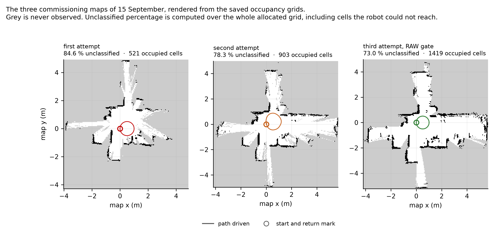
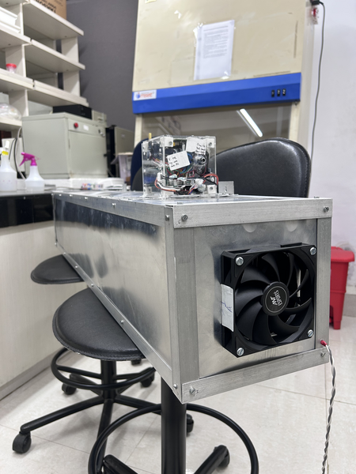
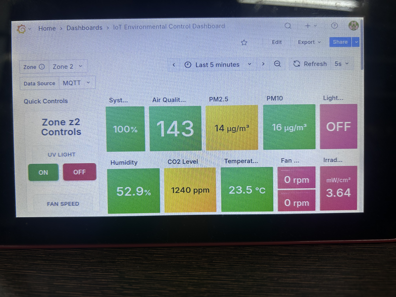

# Annual Progress Report, Year 1

## Instrumenting a Warehouse: an Asymmetric Narrow-Aisle Robot, a Closed-Loop Air-Disinfection Node, and a Contactless Worker-Fatigue Framework

**Aritra Das**
Roll No. 25D0074
Department of Biosciences and Bioengineering
Indian Institute of Technology Bombay

**Research Supervisor:** Prof. Ambarish Kunwar

**Reporting period:** first year of registration
**Draft revision:** 14 September 2026
**Seminar:** 23 September 2026, 14:30 to 15:30

---

> **Status of this document.** A working draft assembled from three
> version-controlled repositories rather than written from memory:
> `NarrowAisleBot` (Objective 1), `IoT-Box` (Objective 2) and
> `Fatigue-Detection-` (Objective 3). Every quantitative claim traces to a
> logged run, a source file, or a paper in §9. Numbers in the results
> sections were recomputed from the raw logs for this report and agree with
> the project journals.
>
> Items marked **[CONFIRM]** need a decision or a piece of information that
> none of the three repositories holds.
>
> **[CONFIRM] Before submission:** the departmental report format and
> expected length; how much of §5 the supervisor wishes included; and the
> IRCC position on disclosing the UV-C subsystem and the disinfection
> chamber, since no patent application has been filed and a circulated
> report is a disclosure.

---

## Contents

1. [Summary](#1-summary)
2. [The problem the three objectives share](#2-the-problem-the-three-objectives-share)
3. [Objectives, and what year one closed](#3-objectives-and-what-year-one-closed)
4. [Objective 1: an asymmetric mecanum platform characterised on hardware](#4-objective-1-an-asymmetric-mecanum-platform-characterised-on-hardware)
5. [Objective 2: instrumentation and closed-loop control for a UVGI air-disinfection unit](#5-objective-2-instrumentation-and-closed-loop-control-for-a-uvgi-air-disinfection-unit)
6. [Objective 3: a contactless multi-modal framework for worker fatigue, formulated and audited against the literature](#6-objective-3-a-contactless-multi-modal-framework-for-worker-fatigue-formulated-and-audited-against-the-literature)
7. [The method common to all three: grading the evidence](#7-the-method-common-to-all-three-grading-the-evidence)
8. [Research gaps and the plan for years 2 to 4](#8-research-gaps-and-the-plan-for-years-2-to-4)
9. [References](#9-references)
10. [Appendices](#10-appendices)

---

## 1. Summary

Year one produced a working 45.54 kg omnidirectional robot with a measured
control stack beneath it, autonomous point-to-point navigation on top of it,
and a five-week measurement campaign that root-caused the one component that
does not work. That campaign is the most substantial research content of the
year, and it is the reason this report is organised the way it is.

The platform is built on a non-collinear mecanum wheelbase. The two diagonal
wheel pairs sit at different longitudinal distances from the body centre,
403 mm and 333 mm, and that 70 mm offset is the geometric premise the machine
exists to test.

**Measured and reproduced.** Closed-loop velocity control tracks commanded
wheel speeds to 1.2 to 1.4 % of peak with the wheels free and 3.4 to 4.0 %
under real chassis weight, with zero saturation samples in either case and
roughly half the actuator range unused. All four motors hold 0.043 to
0.046 rad/s RMS tracking error over 20,940 samples. Wheel odometry closed a
4.582 m route to 3.1 mm, which is 0.07 %, and returned to the mark 0.229 m out
after roughly 18 m of the longest drive in the project's history, which is
1.27 % and exactly the specification the platform claims for itself.
The forward kinematic model reproduces ground-truth twist to 1.7 × 10⁻¹⁶ over
20,000 random twists. The robot completed its first autonomous
forward-and-return round trip on 14 August and by late August was reaching
operator-tapped goals inside a live mapping session in 21 to 26 seconds.

**The fault, and why five sessions of tuning could not reach it.** Every
occupancy map this project has produced grades as folded and unusable for
localisation. The sharpest result of the year is why: cumulative pose
correction measured 2.80, 2.85 and 2.86 m across three different scan-matcher
parameter sets, invariant to within 2 %. A quantity that does not move when
every available lever is pulled is not being set by those levers. Measuring
the sensor input instead, for the first time in the project, found 74.8 to
78 % of LiDAR rays flipping between valid and invalid between consecutive
scans with the robot stationary, and only 47.4 % valid at any instant. The
scan matcher is handed a different point cloud every sweep. The YDLIDAR X4 Pro
is a triangulation scanner and it is performing to its published specification.
The specification is not sufficient for the task. That specification is worth
quoting exactly, because this report previously paraphrased it as "under 2 % of
range" and the vendor datasheet says no such thing: the figure is 2 cm absolute
below 1 m, 3.5 % of range from 1 to 6 m, and **no accuracy specification
whatsoever above 6 m**, despite the sensor being rated to range to 10 m. At the
1.6 m median scan range measured in this laboratory that is 56 mm of expected
error per ray, not the 32 mm the earlier paraphrase implied.

**The front end was then put back and measured, which is the year's cleanest
result.** Restoring scan matching over the reduced 5 m range, with nothing else
changed and against a matching-off run of the same trajectory on the same day,
degraded closure at the start mark from 6.4 mm to 206.7 mm: a factor of 32,
with the map verdict falling from suspect to folded and the occupied wall
length inflating 2.8-fold as the same wall was drawn in more places. The
drive's own wheel odometry closed at 16.2 mm, so the estimator was handed a
healthy prior and returned a worse answer. Underneath the verdict sits the
mechanism: all seventeen corrections fired at a mean interval of 0.183 m of
travelled distance, spread one centimetre across the whole run. They track
pose-graph node creation rather than any disagreement between scan and prior,
which is why no loop closure has ever been observed to fire on this robot, and
why five sessions of parameter search could not have succeeded. §4.6.5 reports
this in full.

The response was to select the better of two measured estimators rather than
continue tuning the worse one. Disabling the sequential scan matcher, so that
the pose comes from the wheels and the scan is stamped down there, removed the
correction mechanism completely: zero events across 698 seconds and 18.5 m of
driving on two structurally different routes, against 48 correction events on
the drive it replaced.

**One finding that moves a load-bearing assumption.** Photogrammetry on the
run video, measured against the floor tile grout and validated each time
against a frame of known rotation, found that heading error this project had
recorded as physical wheel slip is substantially estimator error. Two runs, on
different routes: odometry reported 3.85° and 4.49° of heading drift where the
floor says 0.03° and 0.00°. Physical slip cannot be corrected by better
estimation. Estimator error can.

Two further objectives ran alongside. A complete instrumentation and control
system for a UV-C air-disinfection unit was designed, built and deployed under
a departmental TIH-IoT activity, and is reported in §5 with its own verified
defect register. A contactless multi-modal framework for detecting worker
fatigue in Indian warehouses was formulated and its central claims audited
against 41 retrieved papers, reported in §6; that objective has produced a
specified design and a validated problem statement, and no hardware.

What has not been done is stated as plainly. No accepted commissioning map
exists. The localisation mode that depends on one has never executed. The
inertial sensor has not been procured. Eighty-two distinct defects were
root-caused and fixed across the year, and §7 treats the pattern in them as a
finding rather than as housekeeping.

---

## 2. The problem the three objectives share

A warehouse aisle is a hostile environment for automation, and it is hostile
in three separate ways that map onto the three objectives of this thesis.

The aisle is barely wider than the machine that has to work in it.
Differential-drive and steered platforms handle narrow corridors badly,
because correcting lateral position requires a manoeuvre that consumes
longitudinal space the corridor does not have. Mecanum wheels remove that
constraint by decoupling the three planar degrees of freedom, but a
conventional four-wheel mecanum platform places its wheels at the corners of a
rectangle, so the chassis must be at least as wide as the track plus
clearance. Objective 1 breaks that symmetry.

The air in the aisle is shared, largely unmonitored, and in Indian conditions
frequently outside the range in which either people or stored goods do well.
A UVGI unit can condition it, but a timer-driven UVGI box cannot tell whether
its lamp is emitting, and a gas sensor has no causal relationship to airborne
pathogen load. Objective 2 instruments that unit and closes a control loop
around what is actually measured.

The people in the aisle work eight-hour shifts in conditions that the
occupational-health literature documents as heat-stressed. Venugopal and
co-workers measured WBGT exceedances and their productivity and health impacts
across Indian workplaces [23], and a consistent body of work across steel
[24], construction [25] and multi-sector southern-India settings [26] reports
the same. Wearable fatigue monitoring fails in this setting for well-documented
reasons: discomfort above 40 °C, signal degradation from perspiration, low
compliance, and the daily burden of charging thousands of devices. Objective 3
asks whether the same information can be obtained without touching the worker
at all.

The three are not a single system and this report does not pretend otherwise.
What links them is the environment and, more usefully for a review of research
capability, a method: every claim in all three is graded by the evidence
behind it, and §7 sets out that grading scheme.

### 2.1 The research question for the thesis

> Does non-collinear mecanum wheel placement deliver a usable reduction in
> chassis width without a corresponding loss of trajectory-tracking accuracy
> or disturbance rejection, and can a platform built on that geometry localise
> and navigate reliably in corridors whose clearance is comparable to its own
> inscribed radius?

Three sub-questions follow, and the third emerged from this year's
measurements rather than from the literature.

1. What is the quantitative cost of the asymmetry? The foundational paper
   validates the kinematics in simulation [1]. No controlled comparison of an
   asymmetric platform against a symmetric one of matched capability appears
   to have been published.
2. How does the eccentricity between geometric centre and centre of mass
   affect tracking under a varying cargo load?
3. What sensing is actually required for corridor-width localisation? This
   year establishes that a low-cost triangulation LiDAR, performing to its own
   specification, is not sufficient, and that a substantial part of the
   remaining error is estimator drift rather than physical slip. Both findings
   narrow the question from "add sensors" to a specific, measured deficit.

---

## 3. Objectives, and what year one closed

### 3.1 The three objectives

**Objective 1: build and characterise a physical asymmetric mecanum platform
that localises and navigates at corridor-width clearances.** Deliverable: a
machine whose wheels track commanded velocities to a stated accuracy, loaded
and unloaded; a pose estimate characterised against ground truth with a stated
drift figure over a stated distance; and repeated goal-directed runs with
success rate, clearance statistics and failure modes reported.

**Objective 2: instrument a UVGI air-disinfection chamber and close a control
loop around measured air quality rather than a timer.** Deliverable: continuous
multi-parameter sensing, actuation of lamp and airflow driven by measurement,
optical verification of lamp emission rather than inference from the actuation
command, telemetry over independent channels so that no single failure
interrupts monitoring, and documentation sufficient for a third party to
rebuild the system.

**Objective 3: establish whether worker fatigue in an Indian warehouse can be
detected from four contactless modalities fused together.** Deliverable for
year one: a problem statement grounded in named prior work, an independent
audit of every load-bearing claim against the retrieved literature, and a
design whose highest technical risks have been identified and de-scoped before
any hardware is bought.

### 3.2 Objectives set for year one, and their outcome

| # | Year-one objective | Objective | Outcome |
|---|---|---|---|
| 1.1 | Closed-loop velocity control on real-time hardware | 1 | **Achieved**, validated in air and on the floor |
| 1.2 | Per-motor feedforward calibration from measured data | 1 | **Achieved**; ground-load increase predicted at 10 to 30 %, measured at 24 % |
| 1.3 | Plant identification for the velocity loop | 1 | **Achieved**, 14 Sep 2026. τ ≈ 0.09 s, roughly half the assumed 0.18 s. Two recomputed `Kp` candidates (22, 26) both lost a closed-loop sweep against the shipped 45 on overshoot, 16 of 16 rows. `Kp = 45` confirmed, not changed |
| 1.4 | Live LiDAR perception and a savable occupancy map | 1 | **Achieved** and repeatable |
| 1.5 | Automated post-run analysis of every recorded run | 1 | **Achieved**; grew into twelve analysis tools |
| 1.6 | Inertial measurement and fused state estimation | 1 | **Not started.** Sensor not procured. §4.6.4 now gives a measured case for it |
| 1.7 | Autonomous point-to-point navigation | 1 | **Achieved on a live map**, 14 August. Not achieved on a saved map |
| 1.8 | An accepted commissioning map | 1 | **Not achieved.** One of four acceptance sub-criteria met, once |
| 2.1 | Deployed multi-channel sensing and actuation | 2 | **Achieved**; operational across four zones |
| 2.2 | Closed-loop lamp and fan control from measured air quality | 2 | **Achieved**, with the caveat of §5.3: the driving index is uncalibrated |
| 2.3 | Optical verification of lamp emission | 2 | **Not achieved.** The channel is measured and displayed but appears in no control or alert path |
| 2.4 | Reproducible documentation and a verified defect register | 2 | **Achieved** |
| 3.1 | Problem statement grounded in named prior work | 3 | **Achieved** |
| 3.2 | Independent audit of the proposal's central claims | 3 | **Achieved**; twelve claims audited against 41 retrieved papers |
| 3.3 | Design de-risked before procurement | 3 | **Achieved**; the two over-claims and one weak modality are identified and the scope is cut accordingly |

Five of eight year-one objectives under Objective 1 closed. Objective 1.7 was
reached before 1.6, which the roadmap had listed as its prerequisite. That is
recorded as an out-of-order result rather than tidied away: navigation inside a
live mapping session does not need fused localisation, and it was worth having
a working demonstration in hand while the harder problem was worked.
Navigation on a saved map still requires 1.8, which requires the sensing
question of 1.6 resolved.

### 3.3 The claims this report puts forward, and the evidence behind each

Claims below are graded **measured** (measured on this hardware and reproduced
on a second run or by a second instrument), **single** (measured once) or
**reasoned** (argued from source or from specification, not measured here).
Nothing in this table rests on a single unreplicated observation unless it
says so.

| # | Claim | Grade | The measurement |
|---|---|---|---|
| 1 | Closed-loop velocity control tracks to 1.2 to 1.4 % of peak in air, 3.4 to 4.0 % on the floor, with zero saturation | Measured | Four logged runs, 20,940 samples on the longest |
| 2 | The asymmetric forward kinematic model is exact | Measured | Reproduces ground-truth twist to 1.7 × 10⁻¹⁶ over 20,000 random twists |
| 3 | Odometry integration is exact | Measured | Offline re-integration from raw encoders diverges 0.0054 m peak, 0.0000 m final |
| 4 | Wheel odometry closes to 1.1 to 1.5 % of path | Measured | 3.1 mm over 4.582 m; 2.58 cm on a 38 s square; 0.229 m over ~18 m (1.27 %) and 0.257 m over 18.14 m (1.42 %) |
| 5 | Ground load raises feedforward demand by a mean of 24 % on the first of three floor runs | Measured | Predicted at 10 to 30 % in writing before the run; three of the four motors inside the band and the rear-right 0.3 points above it. The two later runs of 6 Aug give means of 14 % and 3 %, so the size is not settled |
| 6 | The self-occlusion blind sector is a 90° wedge, 107 of 430 beams | Measured | Consistent across five independent headings |
| 7 | Rotation in place adds no pose-graph node and no map cell | Measured | Three runs; 714° over 642 s produced 43 occupied cells, 2.1 m of wall |
| 8 | Turning while translating maps normally | Measured | A 111 s arc gave 18 nodes and 77.2 m of wall, 88 % of a perimeter drive's coverage in 18 % of its time |
| 9 | Cumulative pose correction is invariant across every scan-matcher parameter set available | Measured | 2.80, 2.85, 2.86 m across three sets |
| 10 | The SLAM fault is in the front end, not the pose-graph back end | Measured | Two independent instruments; no node moved across 645 s and 19 loop closures |
| 11 | The LiDAR delivers an unstable point cloud at rest | Measured | 74.8 to 78 % of rays flip valid to invalid between consecutive scans; 47.4 % valid at any instant |
| 12 | Disabling the sequential matcher removes the correction mechanism entirely | Measured | Zero events across 698 s, 18.5 m, two routes, 6,994 pose samples |
| 13 | Heading drift attributed to slip is substantially estimator error | Measured | Two runs, independently validated photogrammetry: 3.85° against 0.03°, 4.49° against 0.00° |
| 14 | Autonomous point-to-point navigation works on a live map | Measured | Two operator-tapped goals reached in 25.9 s and 21.0 s; round trip 14 August with 5.5° and 3.7° direction error, stopping 4.6 cm short |
| 15 | Click-to-goal in the operator dashboard is geometrically exact | Measured | Headless round trip exact to 1 × 10⁻⁶ at device pixel ratios 1, 2 and 3 |
| 16 | The UVGI control law executes as specified | Measured | Dashboard capture at gas index 143 below the 150 threshold with the lamp correspondingly off |
| 17 | The UVGI node reports over three concurrent channels across four zones | Measured | Verified in code and in deployment |
| 18 | The UV channel of the UVGI node is uncalibrated | Measured | The irradiance panel reads 3.64 mW/cm² with the lamp off |
| 19 | Radar vital-sign accuracy in the fatigue literature is established for quasi-static subjects only | Reasoned | A dedicated sub-literature exists whose purpose is cancelling random body motion [12 to 15] |
| 20 | LiDAR gait data are biometric, not anonymous | Reasoned | The benchmark the proposal relies on is a gait *recognition* benchmark [16] |

Claims 1 to 15 belong to Objective 1, 16 to 18 to Objective 2, and 19 to 20 to
Objective 3. The three claims deliberately **not** made anywhere in this report
are that an accepted commissioning map exists, that localisation against a
saved map has ever run, and that any germicidal dose has been delivered or
verified in either UV-C system.

---

## 4. Objective 1: an asymmetric mecanum platform characterised on hardware

### 4.1 The geometry, and the theory it produces for free


**Figure 1.** Dimensioned plan view, rendered from the SolidWorks assembly
rather than reconstructed. The values $l_1 = 403$ mm and $l_2 = 333$ mm are
confirmed twice over: once from the foundational geometry [1], and again
directly from the base-plate DXF, whose wheel-mount hole pattern places the two
pair-midpoints at exactly those distances. The render's over-wheels dimension
of 375.4 mm is nominal design geometry; the 360 mm tape measurement used
elsewhere in this report is the built machine, and where the two disagree the
report treats the tape as authoritative.

The inverse kinematics are

$$
\omega_{FR} = \tfrac{1}{r_w}\left(u + v + r K_{o}\right), \qquad
\omega_{FL} = \tfrac{1}{r_w}\left(u - v - r K_{i}\right),
$$
$$
\omega_{RR} = \tfrac{1}{r_w}\left(u - v + r K_{i}\right), \qquad
\omega_{RL} = \tfrac{1}{r_w}\left(u + v - r K_{o}\right),
$$

with $r_w = 0.0762$ m, $K_{o} = l_1 + d = 0.5607$ m and
$K_{i} = l_2 + d = 0.4907$ m. Each wheel carries its own yaw coefficient.
Substituting a single symmetric value for $K$ anywhere in the software converts
the machine, in that code path only, into an ordinary mecanum platform. This
happened once, and it is in the defect register.

An unexpected consequence of the asymmetry, found by auditing the kinematics in
August, is the best piece of theory the platform has produced. Rows 1 and 4 of
the inverse-kinematics matrix share the translational term $(u+v)$ and rows 2
and 3 share $(u-v)$, so each diagonal pair measures yaw independently, on its
own lever arm:

$$
\hat{\omega}_{\text{outer}} = \frac{r(\omega_{FR} - \omega_{RL})}{2K_{o}},
\qquad
\hat{\omega}_{\text{inner}} = \frac{r(\omega_{RR} - \omega_{FL})}{2K_{i}}
$$

Their mean is the published yaw rate. Their difference, scaled by $2K_{o}/r$,
is exactly the slip residual

$$
s = \omega_{FR} + 1.142656\,\omega_{FL} - 1.142656\,\omega_{RR} - \omega_{RL}
$$

which the wheel-forensics tool uses to detect slip from encoders alone. The
yaw signal and its own error bar come out of the same measurement, and the pair
is non-degenerate only because $l_1 \neq l_2$. The asymmetry that motivates the
chassis also makes the drivetrain self-diagnosing.

### 4.2 The platform as built


**Figure 2.** The physical platform and the measurements taken on it,
11 August 2026. Panel (a) is a top-down view with the axis convention marked by
hand and the LiDAR at mount position 2, on top of the battery. Panel (b) is the
same instant in the visualiser. Panels (c) and (d) are the start and end frames
of the forward-drive test that established the LiDAR angle convention, which is
the recording that later decided which of two conflicting conventions to trust.


**Figure 3.** The deployed-electronics diagram, generated from the
repository's own hardware documentation rather than drawn from a generic
mecanum reference, so every pin, rail and baud rate on it is checked against
the project's hardware records. Three layers: power distribution, compute and
command, drive and odometry feedback, each on its own rail colour. It shows two
facts a generic diagram would get wrong. The front two motors run GTK08
encoders rather than the rear pair's integrated RMCS-2086 units, with different
A/B wire colours between them, a mix-up that has already corrupted a channel
once. And the level-shifter board actually deployed is an 8-channel
discrete-MOSFET design, not the TXS0108E the older reference describes. The
diagram's own deployment note, that powering the ESP32 from Pi USB couples
switching noise into the encoder counts, is not yet applied on the robot and is
carried into Appendix D as an open item.

| Item | Value |
|---|---|
| Footprint, measured | 1.00 × 0.36 m, wheel outer to wheel outer |
| Mass | 45.54 kg |
| Outer and inner wheel distance | $l_1 = 0.403$ m, $l_2 = 0.333$ m |
| Half track width | $d = 0.15769$ m |
| Wheel radius | $r_w = 0.0762$ m |
| Drive motors | 4 × Rhino RMCS-2086, 24 V, 1:47, 60 RPM |
| Encoders | FR and FL: GTK08 at 186,264 CPR; RR and RL: optical at 93,132 CPR |
| Real-time controller | ESP32-WROOM-32, FreeRTOS, 100 Hz loop |
| Host | Raspberry Pi 5, Ubuntu 24.04, ROS 2 Jazzy |
| LiDAR | YDLIDAR X4 Pro, triangulation; 2 cm absolute below 1 m, 3.5 % of range 1 to 6 m, unspecified above 6 m |
| Local controller | MPPI, omnidirectional motion model |
| Power | LiFePO₄ 12.8 V / 30 Ah; boost to 24 V drive, buck to 5 V logic |
| Cargo arm | 2 × NEMA 23 lateral, 1 × NEMA 34 vertical, 3-tube staged UV-C |
| Operating velocity clamp | 0.12 m/s linear, 0.30 rad/s yaw |

The responsibility split between the Arduino Mega and the ESP32 follows from a
hardware constraint rather than a software preference. With the encoders
originally fitted, each motor at rated speed produces about 93,000 counts per
second, and the two replacement units fitted since produce twice that.
Interrupt-driven quadrature counting at those rates consumes the entire
instruction budget of an ATmega2560. The ESP32's pulse-counter peripheral
decodes quadrature in silicon at no processor cost, which is why motor control
moved onto it.

One convention decision is worth stating because it cost more than it saved.
This robot's base frame puts $+X$ to the right and $+Y$ forward, which is not
the ROS convention. The choice was made in August after two independently
validated subsystems were found to disagree about which way the robot faces,
and it was resolved by changing the side with weaker evidence rather than the
side that was more convenient. Five separate stale compensations for it have
been found and removed since, and four of them together hid a real frame fault
for two weeks. The convention is now unified across all three frames, stated
once in the project's axis-convention document, and enforced by a verification
script that fails if it is edited back out. A project starting over would adopt
the standard convention and place the compensation at the sensor.

### 4.3 Closed-loop velocity control, and why open loop was insufficient

The first complete platform was open loop. Forward and backward motion was
adequate; lateral translation stuttered audibly. Characterising all four motors
at a fixed PWM explained it. The rear-left unit was slowest and most variable,
16 % below the fastest wheel, with a coefficient of variation of 4.57 %.

The relevant number is not that 16 % spread across four motors but the 11 to
13 % mismatch within the front-right and rear-left diagonal pair. Under mecanum
kinematics, lateral translation is produced by the two diagonal pairs acting in
concert; when one member does 12 % more work than the other, the difference
appears as a net yaw torque fighting the intended motion. That is the stutter.
The conclusion is stronger than "closed loop is better": open-loop control is
acceptable when motors are well matched or when only one axis is used, and
becomes untenable the moment two actuators must act together. Mecanum geometry
makes that unavoidable.


**Figure 4.** The two-term feedforward fit against three independent in-air
campaigns. A single-slope model cannot fit the data, because the measured
PWM-per-rad/s ratio rises at low speed, which is the signature of static
friction and requires a constant breakaway term alongside the viscous slope.
Every point falls within about 8 % and the two highest-confidence points within
2.3 %. The shaded region above 3 rad/s is extrapolation, where the model will
over-predict as the motor approaches rated speed. Over-prediction is the safe
direction: the output saturates and the integral unwinds it, rather than the
wheel falling short.

An honest limitation belongs with that figure. The split between the viscous
and breakaway terms is poorly determined, because every measurement lies
between 1.8 and 2.8 rad/s and over that span many parameter pairs fit almost
equally well. What is well determined is the value of the whole expression
across the measured range, which is what the controller consumes.

The integral gain follows from the plant gain rather than from tuning by hand.
The feedforward fit hands over the plant DC gain as $K = 1/38 = 0.0263$ rad/s
per PWM count. Direct-synthesis tuning gives $K_i = 1/(K\lambda)$, and with a
conservative closed-loop time constant of 0.15 s that is 253, rounded to 250.
The useful property is that this expression does not contain the plant time
constant, which had not been measured. The previous value of 30 moved the
output 3 PWM per second for a 0.1 rad/s error, so closing a realistic 10-PWM
feedforward gap took over three seconds, which is exactly the 3.79 s worst-case
settling time logged in May. At 250 the same gap closes in 0.4 s.

Anti-windup was also genuinely mis-set. The previous fixed clamp, at the old
integral gain, permitted an integral contribution of about 6000 PWM, some 23
times the output range. The clamp existed but could never engage. The current
implementation clamps against the PWM headroom genuinely remaining after the
other three terms, recomputed every tick.

#### 4.3.1 A fault that produced clean telemetry while the robot drove wrong


**Figure 5.** (a) The failure mechanism. (b) The bench cross-check that
detected it: front and rear raw counts at matched PWM and matched window, on
physically identical gearmotors, differing by exactly the ratio of the two
encoder resolutions.

Two motors carry a different encoder from the other two, following replacement
of two failed units, and the replacements have exactly twice the resolution.
Firmware through v2.0 applied one shared constant to all four.

The mechanism earns its emphasis because of how it fails rather than how it is
fixed. A front wheel completing one revolution emits 186,264 counts; divided by
the shared constant of 93,132 that reports as 2.00 revolutions. The controller
believes the sensor, sees itself overshooting, and reduces PWM until the
*reported* speed matches the target, meaning until the wheel physically turns at
half the commanded velocity. The rear wheels track properly. The result is a
permanent front-to-rear speed split that scales with commanded velocity: the
robot yaws under pure translation, with no error raised and clean tracking in
every telemetry plot, because the loop is tracking. It is tracking a lie.

No test that examines one wheel at a time can find this. It was found by
comparing front against rear on the same command, and it is the strongest early
argument in this year's work for cross-subsystem verification as routine
practice rather than as a debugging measure. A second finding fell out of the
same correction: re-measured on the confirmed-good signal path, all four motors
fall within a 2.9 % band, where the earlier 19 % spread had been treated for
months as a physical property of the motors and used to justify per-motor
compensation.

#### 4.3.2 Results, in the air and on the floor


**Figure 6.** Closed-loop velocity tracking, wheels free, 1816 samples over
90.8 s. (a) The front-right wheel across the full run, with an inset over one
commanded step. (b) Tracking error for all four wheels. Excursions coincide
with commanded step edges and not with steady-state operation, which is the
expected behaviour of a well-conditioned loop.

| Run | Peak commanded | RMS error, % of peak | Peak PWM of 255 | Saturation |
|---|---|---|---|---|
| Bench, 2 Jul, previous firmware | 0.92 rad/s | 3.5 to 4.5 % | 55 | 0 |
| Bench, 4 Aug, v3.0 | 2.78 rad/s | 2.0 to 2.4 % | 131 | 0 |
| Bench, 5 Aug, v3.0 | 2.78 rad/s | 1.2 to 1.4 % | 128 | 0 |
| **Ground, 6 Aug, v3.0** | **1.39 rad/s** | **3.4 to 4.0 %** | **77** | **0** |


**Figure 7.** Steady-state PWM per rad/s, unloaded against loaded, computed
from the two logs for this report. The feedforward calibration carried a
prediction, written down before any floor test existed: ground load would raise
feedforward demand by 10 to 30 %. All four motors land inside the predicted
band, at a mean of 24 %. A prediction registered in advance and then met is
worth more than an explanation offered afterwards, and this is one of two such
results in the year.

These numbers establish a loop that is healthy, consistent across all four
wheels, free of saturation and of direction-sign faults, and exercised under
real chassis weight. They do not establish a step response, because these are
live driving logs rather than isolated-step tests, so rise time and settling
time cannot be fitted from them.

The plant time constant no longer needs to be assumed. A dedicated open-loop
bench run, wheels in the air, six PWM steps per motor, measured τ ≈ 0.09 s
against the 0.18 s this project had assumed, with all four motors agreeing to
within a few milliseconds once one low-confidence step near the static-friction
breakaway threshold is set aside. That value had already been registered in
advance, in `docs/PID_Calibration.md` §5, as the row predicting the shipped
gain would prove over-damped rather than unstable, and the prediction held: the
controller has been running with more margin than it needed rather than less.

A second prediction, registered in the same document, did not hold. `Kp`
recomputes to 22 or 26 depending on which measurement of τ is used, and the
expectation was that either would settle faster than the shipped 45 with
overshoot flat or reduced. A closed-loop sweep of all three against four
setpoints and all four motors found the opposite: `Kp = 45` posted the lowest
overshoot in 16 of 16 rows, by 43 to 54 % on average. The likely reason, stated
as reasoning rather than as a second measurement, is that the two-term
feedforward already supplies most of the step command, so closed-loop `Kp`'s
real function is damping the transient around that jump rather than cancelling
a plant pole the feedforward has already mostly compensated; weakening it
increases overshoot rather than reducing it. `Kp` stays at 45. The measurement
this objective called for is complete, and confirming the shipped value is as
legitimate an outcome as changing it would have been.

### 4.4 Odometry, and the accuracy ceiling it sets

Three results together establish that the pose estimate below the map is sound,
and they are worth separating because they eliminate three different suspects.

The kinematic model is exact. The forward model reproduces ground-truth twist
to 1.7 × 10⁻¹⁶ over 20,000 random twists, which is floating-point noise. Both
the journal's derivation and the running code's form are unbiased; they are two
different weightings of the same two independent measurements, and the running
code's equal weighting carries 0.89 % more yaw-rate noise than the
minimum-variance weighting. That penalty cannot produce the 10.53° of drift
measured over 18 m, which is why the code was left alone.

The integrator is exact. Offline re-integration of a whole run from raw encoder
counts diverges from the live estimate by 0.0054 m at peak and 0.0000 m at the
end.

The physical accuracy is at specification, and it is the ceiling. Wheel
odometry closed 2.58 cm on a 38 s square, 4.3 cm over a 4 m out-and-back, and
0.229 m with 10.53° of heading error over roughly 18 m. That last figure is
1.27 % of path, and the 621 s drive's 0.257 m over 18.14 m is 1.42 %, so the
measured closure band is 1.1 to 1.5 %. (The 21.85 m quoted elsewhere for that
session is the total wheel path of the whole 1047 s drive, not the leg the
closure was measured over. The two must not be divided into one another.) Section 4.6.4 shows that a substantial part of the heading component
is not physical.

### 4.5 Perception: three faults that produced no error message

The algorithm was chosen before any parameter was touched. `slam_toolbox` [5]
was retained on two grounds together: it offers scan-matching-only operation,
which is what made the Stage G selection of §4.6.3 possible at all, and a
Ceres-based pose-graph optimiser behind it. The mathematics the pipeline runs
was derived rather than cited in passing, namely the point-to-line metric that
correlative front ends approximate [6], the nonlinear least-squares pose-graph
formulation [7], and the Bayesian log-odds occupancy update [8]. That last
connection turned out to be practically useful: the three-value convention the
map files use, 0 occupied, 205 unknown, 254 free, is the saturated log-odds
value, so the recurring "unknown cell" fraction of §4.6.6 is not a separate
diagnostic but a direct statement that those cells never accumulated enough
evidence to move off a prior of one half.

One structural property of the chosen implementation had to be established by
reading its source rather than its documentation, and it shaped the
investigation in §4.6. This installed build registers no listener for the
automatic loop-closure candidate events and publishes no topic carrying them,
confirmed against the running node's own topic list. There is no observable
signal, console or topic, for whether an automatic closure was accepted or
rejected. A whole class of instrumentation is therefore unavailable on this
stack, and knowing that saved subsequent sessions from searching for it.

Getting from "the sensor spins" to "the map builds" took considerably longer
than expected, for reasons worth reporting because all three obstacles shared a
diagnostic character.

The quality-of-service incompatibility is the most transferable. The driver
publishes scans as best-effort; the SLAM node subscribes as reliable; in DDS
those endpoints never connect. Both `ros2 topic echo` and `ros2 topic hz` work
perfectly on that topic, because the command-line tools negotiate a compatible
profile at runtime and the SLAM node does not. A topic being demonstrably alive
is not evidence that a given node will receive it. The same fault recurred
later in a different consumer, the navigation costmaps, and was caught in the
audit described in §4.7. A documented workaround is not a fix; only a check
that fails when the workaround is bypassed is.


**Figure 8.** The rear blind cone, re-measured in the corrected frame at five
headings roughly 90° apart. Cross-checking the five sector tables against each
other found exactly one bearing block returning a close reading in all five
independent headings: a 90° wedge centred directly behind the robot. Every
other "always close" flag appeared in exactly one run, which is a real wall the
robot happened to face, correctly not persisting.

The damaging failure mode is not the blind spot itself. If the rear mast sits
beyond the sensor's 0.12 m minimum range it returns a valid hit on every scan,
and the obstacle layer marks those cells occupied. Because they are fixed in
the robot's own frame they translate and rotate with it: a permanent obstacle
welded to the chassis, which the inflation layer expands and the planner reads
as a direction blocked everywhere and always. The mask is implemented. The arc
is blanked to not-a-number in the relay node before the scan reaches SLAM or
the costmap, so those beams neither mark nor clear. A finite value would mark a
phantom obstacle; infinity would clear straight through whatever really sits
behind it. 107 of 430 beams, one quarter of every scan, are now masked.

The discriminator needed no apparatus: rotate in place in a static environment
and compare scans, because real features move in the sensor frame under
rotation and self-occlusion does not. An earlier proposal to establish the same
thing by standing opaque sheets around the chassis would not have worked,
because sheets on all sides block everything and cannot separate self-occlusion
from the sheet.

### 4.6 The SLAM front-end investigation

This section covers 19 August to 3 September and is the most substantial
research content of the year. It is reported as a campaign rather than as a
list of fixes, because the method is the point: each stage carried a prediction
written before the test, several predictions failed, and two conclusions were
retracted in writing when the evidence went against them.

#### 4.6.1 The symptom, and what it was not

Occupancy maps came back folded and unusable. The robot's estimated pose jumped
repeatedly during drives, sometimes by a quarter of a metre in a single 0.1 s
sample, which is six to twenty times anything the chassis can physically do.


**Figure 9.** Three drives: same robot, same deployed configuration, same
operator, same week, replotted for this report from the raw pose logs.
(a) The 6.8× spread in return-to-mark across drives that should have been
equivalent. (b) Two of the three are worse than the pre-fix baseline the tuning
was built to cure. (c) The wheel odometry, on the same three drives, closes
under 3 cm every time.

Three candidate explanations were live and the data separated them. A repeat
test on the identical route was registered in advance with two possible
outcomes: reproduce near 0.577 m, meaning route geometry, or move toward
0.085 m, meaning intermittency. Neither happened. The repeat returned 0.209 m
with a peak correction of 0.857 m, the largest on record. A third distinct
number on one route rules out geometry.

Two things were ruled out by measurement rather than by argument. The back end
is healthy: the pose-graph watcher reported no node moved and no shift across
645 seconds through all 19 loop closures on one drive, and again through 9
closures on another. And wheel odometry registered nothing unusual at the exact
moment the map-frame estimate moved 40 cm, with per-tick deltas of 2.0 to
2.4 mm. The fault is in the front end, between the scan and the pose, and it is
neither the optimiser nor the encoders.

#### 4.6.2 A drive procedure that recorded nothing


**Figure 10.** Rotation in place adds no pose-graph node and no map cell. Two
full turns, 714° over 642 seconds, produced 43 occupied cells: ten and a half
minutes of sweeping a room for two metres of wall.

The commissioning procedure in use since late August was "perimeter, nose
leading, rotating at every corner so the LiDAR sweeps every wall", adopted
specifically to work around the rear blind cone of §4.5. Those corner rotations
contribute nothing. Setting the heading threshold to a quarter of its value and
driving a full 360° in place still produced one pose-graph node in 166 seconds,
the session's first scan and not one more, which falsifies the threshold as the
gate.

Turning while translating instead reached 88 % of the perimeter drive's wall
coverage in 18 % of its time and 18 % of its distance. This is a better
explanation for maps returning 63 to 87 % unknown than anything previously
considered, and it means the map-quality acceptance criterion was never
reachable by that method.

The methodological error is recorded alongside the result. Three sessions of
parameter tuning had been spent against a tight-circle test geometry that
records almost nothing, and which is separately degenerate for scan matching.
At 5 m range, 1° of heading error is indistinguishable from 8.7 cm of
translation, so rotation and translation stop being separable and the matcher
resolves the ambiguity in favour of heading. That predicts the measured
signature exactly: heading right to about 4°, position 27.6 cm out, wheels
closing to 8 mm. Choosing the benchmark badly cost more than any single wrong
parameter.

#### 4.6.3 The result that decided it


**Figure 11.** The same tight arc driven three times on three parameter sets.
Halving the heading threshold halved the largest heading step and pulled the
peak correction under the acceptance gate, exactly as predicted. It changed the
cumulative correction by 2 %.

This is the sharpest result of the year. Cumulative correction came out at
2.80, 2.85 and 2.86 m across every parameter set available. The tuning moves
the distribution of the error and never its amount, which is the signature of
something the search parameters do not reach.

Read against a second measurement, it becomes a diagnosis. Instrumenting the
sensor input for the first time in the project found 74.8 to 78 % of rays
flipping between valid and invalid between consecutive scans with the robot
stationary, and only 47.4 % valid at any instant. The matcher is not searching
badly. It is handed a different point cloud every sweep, and no search
parameter can fix a moving objective function.

The sensor is behaving correctly. The YDLIDAR X4 Pro is a triangulation scanner
whose datasheet specifies 2 cm of absolute error below 1 m and 3.5 % of range
between 1 and 6 m, with no accuracy figure given at all beyond 6 m even though
the sensor is rated to range to 10 m. At the 1.6 m median range measured in this
lab that is 56 mm. The measured 90th-percentile scatter of 22.8 mm is inside
specification, comfortably.

This paragraph previously quoted "under 2 % of range", giving 32 mm at 1.6 m and
200 mm at 10 m. That figure appears nowhere in the vendor document and was
propagated through this project for months; it is corrected here, and the
correction makes the argument stronger rather than weaker, because the real
specification is looser than the one the argument was built on. The absence of
any specification beyond 6 m is also the cleanest justification available for
the 5 m range cap adopted in Stage G: past that distance the vendor declines to
say what the sensor does. The sensor is performing to specification and the
specification is not adequate for what is being asked of it. That is a
conclusion pointing at hardware, and the reason to exhaust the software levers
first was to justify it rather than guess at it.


**Figure 12.** (a) The mechanism removed. (b) Why disabling it is a selection
between two measured estimators rather than a retreat. (c) The phantom-yaw
result of §4.6.4.

Over one 21.85 m drive, wheel odometry alone closed 0.229 m and odometry plus
the SLAM front end closed 0.706 m: the expensive estimator was three times
worse than the cheap one. Disabling the sequential matcher, so that the pose
comes from the wheels and the scan is stamped down there, produced zero
corrections across two structurally different routes, 698 seconds and 18.5 m of
combined driving. Not one millimetre, across 6,994 pose samples. The registered
prediction was "corrections approximately zero"; the measured answer is zero to
six decimal places.

The claim this supports is deliberately narrow. The correction mechanism is
gone. Whether the resulting map is geometrically true over a real route is the
next run's question, and loop closure running on a separate matcher is expected
to survive but is recorded as a hypothesis rather than as a result.

That hypothesis was tested on 15 September and it does not survive in the form
it was written. §4.6.5 reports the test.

#### 4.6.4 Phantom yaw: a measurement that changes the roadmap

Photogrammetry on the run video, using the floor tile grout as a world-static
reference, gives a ground truth independent of every instrument in the
repository. Two runs, on different routes:

| Run | Rotation commanded | Odometry says | The floor says | Validation frame |
|---|---|---|---|---|
| Two circles | 723.8° | −3.85° | −0.03° | −28.0° read as −27.07° |
| 12 m out-and-back | 364.5° | −4.49° | +0.00° | −19.4° read as −18.50° |
| Single circle, 15 Sep | 361.7° | −1.74° | operator's eye only | none |

The robot physically returned to its starting heading every time. The estimator
did not. Phantom yaw rates of 0.60, 0.37 and 0.55 °/m bracket the 0.58°/m this
project measured over 18 m in August and attributed to physical slip.

The third row is weaker evidence than the first two and is marked as such: it
was recorded during the Stage H drive of §4.6.5, which carried no video, so the
physical return heading is the operator's judgement rather than a validated
measurement. It is reported because of what it does to the analysis, not
because of its own quality.

**What the error is proportional to, which is the useful question and was not
asked until an outside review asked it.** Four candidate models, scored across
the three runs by the ratio of their worst to their best fit:

| Model | Spread, worst over best |
|---|---|
| ∝ distance travelled | **1.60×** |
| ∝ elapsed time | 2.27× |
| ∝ rotation commanded | 2.56× |
| constant per run | 2.58× |

Distance is the tightest and rotation is close to the worst, which matters
because rotation is the intuitive candidate and the one a yaw-rate scale error
would produce. The sharpest single comparison is the second and third rows:
**near-identical commanded rotation, 364.5° against 361.7°, and heading error
differing by a factor of 2.6 while distance differs by a factor of 3.8.** Two
drives that turn through the same angle and accumulate very different heading
error is close to a direct refutation of any multiplicative bias on yaw rate.

A distance-proportional heading error points instead at wheel-radius or
encoder-scale error, which is precisely the class the slip-residual instrument
names as invisible to itself. Three points is not enough to settle a mechanism,
and this is reported as a direction for year two rather than as a finding.

The consequence is not small. Physical slip cannot be fixed by better
estimation; estimator error can. A substantial fraction of what has been
treated as a hardware limit is recoverable in software with a gyroscope, and
this converts the inertial sensor from a general roadmap item into a measured
priority.

The method failed twice before it worked, and both failures are more
instructive than the result. The first attempt measured the robot's own wheels
against the video frame and returned "no rotation"; a validation frame of known
−28.3° rotation also returned zero, which is impossible. The camera is mounted
on the robot's own mast, so the robot sits still in frame while the world moves
around it. The second attempt measured a window that extended into the
dashboard's own border, a fixed screen edge that never rotates. Both were
caught only because a frame with a known answer was checked before the result
was believed. A measurement that cannot fail its own check is not a
measurement.

#### 4.6.5 Putting the front end back, and measuring what it does

Disabling the scan matcher on 3 September left an obvious objection open. Every
measurement of the matcher's behaviour in this project had been taken with the
LiDAR admitting returns out to 10 or 12 m, and the same change that disabled the
matcher also cut `max_laser_range` to 5 m. On a triangulation scanner whose
vendor gives no accuracy figure at all beyond 6 m, that cut removes exactly the
long, weak returns most likely to have been poisoning the match. The matcher had
never been scored on the input it would now receive.

On 15 September it was turned back on and nothing else was changed. Predictions
and revert criteria were registered before the drive and are reproduced from the
pre-drive document unedited:

> REVERT on any single-step correction ≥ 0.15 m, a FOLDED map verdict, return to
> mark > 0.15 m, or visible tearing. KEEP only if corrections stay small and
> frequent, at least one loop closure fires, closure at the mark is ≤ 9.9 cm,
> doubled walls are < 1.0 %, and unknown percentage is roughly unchanged.

Three of the four revert triggers fired. One keep criterion was met, and it was
the one predicted to be neutral.

The comparison is unusually clean, because a matching-off run of the same
trajectory existed from the same day, on the same quality gate and the same
configuration, with only `use_scan_matching` differing:

| | Matching off | Matching on | |
|---|---|---|---|
| Path length | 3.163 m | 3.193 m | matched to 1 % |
| Closure at the mark | **6.4 mm** | **206.7 mm** | 32× worse |
| Heading closure | −0.27° | −4.82° | 18× worse |
| `map→odom` corrections | 0 of 885 samples | 17, smallest 107 mm | |
| Map verdict | SUSPECT | **FOLDED** | |
| Doubled walls | 0.8 % | 6.6 % | 8× worse |
| Skeleton junctions per 10 m | 1.92 | 9.93 | 5× worse |
| Occupied wall length | 26.1 m | 72.5 m | 2.8× more |

The wall-length row is the one that explains the others. Same room, same circle,
essentially the same path, and the matched map contains 2.8 times as many
occupied cells. The matcher is not finding more wall; it is drawing the same
wall in more places, which is what the doubled-wall and junction counts measure
from two other directions. It also disposes of the single figure that looks like
an improvement: unknown cells fell from 84.6 % to 72.6 %, but a smeared wall
paints cells that were previously unknown, so part of that apparent coverage
gain is the defect itself.

A within-run control rules out the obvious alternative explanation, that the
matching-on drive simply had worse odometry. It did not. That drive's own wheel
odometry closed at 16.2 mm over 3.193 m, 0.51 % of path, inside this platform's
measured 1.1 to 1.5 % band and the same order as the 6.4 mm of the matching-off
run. The odometry was healthy. The matcher took a 16 mm estimate and returned a
207 mm one.

**The mechanism, which is worth more than the verdict.** Every one of the
seventeen corrections fired at a fixed cadence in odometry distance:

| Statistic | Value |
|---|---|
| Mean gap between corrections | 0.183 m |
| Minimum gap | 0.176 m |
| Maximum gap | 0.186 m |
| `minimum_travel_distance` in configuration | 0.200 m |

A one-centimetre spread across seventeen events. The corrections are not
responses to the scan disagreeing with the odometric prior. They fire once per
pose-graph node, on a distance schedule, whether or not there is anything to
correct. An earlier session had noticed this pattern and named it a metronome;
it has now survived three distinct search-parameter sets and a halving of the
admitted laser range, which is the strongest available evidence that this was
never a tuning problem and that five sessions of parameter search were searching
the wrong space.

It also answers a question this report could not previously answer. **No loop
closure has ever been observed to fire on this robot.** A closure is a step
correction arriving off-cadence, when the graph recognises a place it has seen
before. Not one of these seventeen was off-cadence. The pose graph itself was
confirmed present before the drive, so the earlier suspicion recorded in §4.6.3,
that disabling the matcher suppressed graph construction and left
`do_loop_closing` inert, is no longer needed to explain the absence. Under
matching-on the graph is built, the matcher runs, and closure still does not fire
on a circle that returns to its own start. What remains are the loop-match
response thresholds and a minimum chain length of eight nodes, which a 3.2 m
circle at 0.18 m per node can only just reach.

**What this does not establish, stated because it bears on how much weight the
result can carry.** The trajectory driven was a tight circle, which an earlier
session had already flagged as degenerate for scan matching because it presents
the same walls from continuously rotating vantage points. The planned test was a
12 m out-and-back route with an existing matching-off baseline, and that test
remains unrun. This result therefore establishes that the 5 m cap does not rescue
the matcher, and that the corrections are schedule-driven rather than
evidence-driven, but it does not establish how the matcher behaves on
non-degenerate geometry. The revert criteria were written unconditionally and
fired regardless.

**How the system should therefore be described.** With the front end disabled,
the `map→odom` transform is constant, no loop closure has been observed, and the
pose underlying the map is pure wheel odometry. Describing that as SLAM without
qualification would not survive an examiner asking to see a loop close. The
accurate description is that the system runs a pose-graph SLAM back end with the
front-end scan matcher deliberately disabled, on the evidence above; that the map
is built from LiDAR returns under wheel-odometry pose; and that loop closure is
configured and reachable but has never been observed to fire, for the reason the
cadence measurement gives. That is a narrower claim than a working SLAM stack and
a considerably better supported one.

#### 4.6.6 Why no map has been accepted



**Figure 13.** The three commissioning maps of §4.6.1, each placed in world
coordinates from its own YAML origin and resolution and sharing one window so
that the three are directly comparable. The believed pose during each drive is
drawn over the map and the red dots mark where the robot actually stood. Grey
is cell never observed.

Between 21 % and 30 % of the cells in these maps were ever observed, and the
ground the robot physically covered is a narrow ribbon through a much larger
mapped extent. The LiDAR reaches far further than the chassis travels, so a
long drive can produce a wide, thin map that still fails the commissioning
criteria. The middle panel is the clearest case, a single out-and-back leg
whose observed fraction is the lowest of the three.

The acceptance criterion has four sub-criteria: map not folded, doubled walls
under 1.0 %, unknown cells under 50 %, and return to mark under 0.15 m. One has
been met, once: the 0.085 m return on the 31 August right leg. No map has met
all four, so there is no accepted commissioning map, and everything downstream
of one remains blocked.

### 4.7 Autonomous navigation

The navigation stack [9] contributes behaviour-tree task orchestration over
lifecycle-managed nodes, with collision checking in SE(2) that admits
holonomic platforms rather than assuming a differential-drive motion model, and
its motivating deployments are warehouse and retail floors. One result from
reading it changed the configuration materially: the layered-costmap semantics
[10] make explicit that the inflation band expresses a path *preference*, and
that safety comes from the exact footprint polygon check. That distinction
matters disproportionately here, because an inflation radius set generously
"for safety" makes an aisle the machine physically fits appear impassable. Both
inflation radii were later raised past the circumscribed radius for a separate
reason: an inflation radius below it forces a full polygon check on every
query, and the controller runs on the order of ten thousand of those per cycle.

The stack was reviewed before it was run, and the review found five defects in
configuration that had never been exercised.

| Defect | Consequence had it run |
|---|---|
| Footprint declared 0.90 × 0.40 m against a real 1.00 × 0.36 m machine | Confident collisions along the length |
| Both costmaps subscribed to the best-effort scan topic | The §4.5 fault recurring in a new consumer |
| Unknown space forbidden to the planner | No path findable, since live maps run about 85 % unknown |
| Odometry topic pointed at a filter that has never run | No odometry reaching the behaviour tree |
| Raytrace and obstacle ranges exceeding the sensor's rating | Phantom clearing beyond the sensor's reach |

A further seven surfaced across the first bringups, and the class is consistent
enough to be worth naming: a stack default that is silently wrong here purely
because this robot's base frame is non-standard, or because a node the
configuration predates is now started automatically. Among them, a second
publisher of the same transform the odometry node already owns; a missing
velocity-smoother block whose stock defaults zero the lateral axis, which on
this robot is forward; a service timeout whose unit is milliseconds, set to
five; and two controller critics that assume the nose points along $+X$ and
would reward travelling sideways.

The choice of local controller was settled on source rather than preference,
and then revisited on evidence. DWB was adopted first, on the reasoning that it
is lighter and that the original MPPI experiments run on a GPU this robot does
not have. That choice was reversed in August for a reason the earlier reading
had not anticipated: DWB's rotate-to-goal critic enforces a bit-exact
zero-translation test, and because the sampler builds a full cross-product
grid, only one candidate in fifty survives it. Rotation-only goals failed
structurally rather than intermittently. MPPI's critics are uniformly additive
with no throw-and-eliminate path anywhere in the optimiser, so that failure
class cannot occur by construction, and its omnidirectional motion model
samples the lateral axis genuinely rather than as a coarse discretisation.

The first goal ever sent travelled 0.96 m at 88.4° to the commanded direction
and was stopped after contacting an obstacle. Two individually correct,
individually validated axis conventions met at the velocity topic and nothing
had reconciled them. Because the error was a constant 90° rotation sitting
inside a closed loop, the planner's own cross-track corrections came out
rotated too, so the drive did not fail as a single wrong turn. It failed by
never converging, which is a qualitatively harder failure to read from the
outside. The fix converts between the two conventions explicitly at the one
place they meet, rather than editing either validated file. Two goals after the
fix returned direction errors of 5.5° and 3.7°, the second stopping 4.6 cm
short of target, completing the first autonomous forward-and-return round trip
on this robot on 14 August.


**Figure 14.** Seven acceptance gates, written before the work and scored
against measurement. Two passed on hardware, one is partially met and is the
blocker, two have never executed.

Point-and-go works today inside a live mapping session: two operator-tapped
goals reached in 25.9 s and 21.0 s. Navigation on a saved map does not, and the
reason is not the planner. Every navigation attempt in this project's history
was made inside a live SLAM session, against a map frame that was itself
moving; on one 21.85 m drive that frame moved 11.08 m. A goal captured as a
fixed coordinate in a frame that then slides underneath it is not a planner
problem. Naming that explicitly re-ordered the roadmap: commissioning quality
is a mapping problem, operating quality is a localisation problem, and the
project had been trying to solve the second by tuning the first.

The localisation mode that closes this has never executed, and one reason it
could not was found in September without any hardware. The launch file that
starts the LiDAR also starts the SLAM node, and the localisation launch file
forbids running alongside it while starting no scan source of its own. The only
thing that could bring up the sensor was the one thing localisation forbids. It
would have launched, activated, and waited for a scan forever, reading as a
localisation fault when it was a launch-topology fault. The sensor bringup is
now split into its own file, included by both.

### 4.8 Where Objective 1 stands, layer by layer


**Figure 15.** The layer-by-layer audit. The break is at exactly one component,
and it is not where most of the year's effort went.

Everything below the map is measured and good: the motors track, the encoders
are clean, the odometry integration is exact, the kinematics are exact, the
frame composition is exact to four decimals, the planner plans, the controller
reaches goals, and the dashboard's click-to-goal is exact to 1 × 10⁻⁶. On the
longest drive in the project's history, 21.85 m, wheel odometry came back
0.229 m from the mark, and SLAM took that estimate and made it 0.477 m worse.
The cheapest sensor on the robot is currently its most trustworthy one.

Two components are broken or absent and both sit above the LiDAR: the SLAM
front end, now diagnosed and with a measured remedy in hand, and an accepted
commissioning map, which does not exist. Two have never executed at all: AMCL
localisation and the named-location library. Three work but are starved by CPU:
the global planner at 1.25 Hz against 5 Hz requested, the local controller at
7.5 to 13.7 Hz against 20 Hz requested, and the safety chain, which is confirmed
end to end but issues stale-scan warnings under load.

---

## 5. Objective 2: instrumentation and closed-loop control for a UVGI air-disinfection unit

An instrumentation and control system was designed, built and deployed for a
UV-C air-disinfection unit under departmental TIH-IoT project
TIH-IOT/2023-3/TDP/HA/SL-IAQ-002. The chamber design is by Charudatta Khatua;
the electronics, firmware, server stack and documentation reported here are the
author's contribution, and the pathogen-inactivation work is documented
elsewhere and cited in §5.2 as background rather than as a result of this
objective.

The justification for the objective is capability rather than novelty.
Multi-channel environmental monitoring is well-trodden, and the honest
statement of what is new is narrow: the integration, and the dose-based control
scheme proposed but not implemented. What the work developed transfers directly
to Objective 1: multi-sensor instrumentation and calibration, real-time
acquisition with time-series storage, closed-loop control with safety
interlocks, embedded and wireless protocol work, and a systematic self-audit.
Every one of those appears in §4 applied to the robot.

### 5.1 What was built


**Figure 16.** Edge node, transport and server. Four sensor packages returning
seven measured channels, two actuators, three concurrent wireless channels, two
independent control paths, and four monitored zones across two radio-isolated
deployments sharing one database, with no cloud dependency. The seven measured
channels are three from the SCD40, two from the MPM10-AS and one each from the
MQ-135 and GUVA-S12SD.
Resolved 16 Sep 2026: the generator `figure_src/f_iot.py` draws exactly four
sensor boxes and its caption said "five sensors" in two places. The generator
was corrected on 15 Sep but the committed PNG predated that fix and still read
"five". The figure has now been regenerated from the unmodified generator and
reads "four" throughout.



**Figure 17.** The integrated appliance: the duct with the control box mounted
on top and the 120 mm fan in the end face, photographed in the laboratory. This
is the system as actually built, not a rendering.

| Item | Specification |
|---|---|
| Sensor node | Arduino UNO R4 WiFi (Renesas RA4M1), firmware v10.1 |
| Gateway | Arduino UNO R4 Minima with RYLR998, level-shifted, firmware v4.1 |
| Server | Raspberry Pi 5 (8 GB), containerised stack, Python service v1.2 |
| Sensors | SCD40 (CO₂, temperature, humidity, I²C 0x62); MPM10-AS (PM2.5, PM10, I²C 0x4D); MQ-135 (gas index, A0/D2); GUVA-S12SD (UV, A1) |
| Actuators | Opto-isolated relay for the lamp mains (D9); 120 mm PWM fan with tachometer (D6/D3) |
| Channels | Wi-Fi/MQTT at 5 s; LoRa at 30 s, ≤240 B; cellular SMS on alert and every 30 min |
| LoRa | SF9, BW 125 kHz, CR 4/5, preamble 12; network ID 18 and 19 |
| Server stack | Mosquitto, Node-RED, InfluxDB 2.x, Grafana, Portainer, Flask control API |
| Control law | Hysteresis with a 150/200 dead band; fan scaled 128 to 255 across index 200 to 500 |
| Alert thresholds | 38 °C; 1200 ppm CO₂; gas index 200; 55 µg/m³ PM2.5 |
| Zones | 4, across two radio-isolated models against a shared database |
| Dashboard | 23 panels, per-zone templating, in-panel actuator control |

Three engineering decisions have real justification, and each was a response to
an observed failure rather than anticipatory design, which makes them stronger
evidence than a clean specification would be.

Driving the radio directly from host GPIO was attempted and abandoned. The
command protocol needs deterministic timing and Linux is not a real-time
kernel, so scheduler jitter produced dropped packets and truncated responses
that were hard to distinguish from radio-link failures. Interposing a
microcontroller moved the timing-critical work to where timing is
deterministic: architecturally less elegant, substantially more reliable.

The cellular modem draws about 2 A in transmit bursts, and sharing a rail with
the microcontroller produced brownout resets. Two supplies with a single common
ground point eliminated them.

The three channels run concurrently rather than as a failover chain. A failover
design must detect failure before switching, and detection is exactly what
fails first in a dead network. Running all three continuously costs bandwidth
the system does not need anyway.

### 5.2 Evidence that it works, from a single capture



**Figure 18.** The operator dashboard for Zone 2 over MQTT, captured live. One
frame demonstrates three separate things, and the third is why §5.3 exists.

The gas index of 143 sits below the 150 threshold and the lamp is
correspondingly off, which confirms that the control law executes as specified.
The CO₂ reading of 1240 ppm exceeds the 1200 ppm alert threshold, so the node
was in an alert state and had fired on all three channels. And the irradiance
panel reads 3.64 in units of mW/cm² with the lamp off, which is the clearest
available evidence that the ultraviolet channel is uncalibrated.

Presenting that third reading without being asked is the difference between an
audit and an excuse.

As background rather than as a contribution of this objective, the chamber's
own inactivation performance was characterised against MS2 bacteriophage with
the fan running over seven minutes: a winding path gave approximately
−12 ln(C_t/C₀), a straight path approximately −10, and natural decay
approximately −9. These figures belong to the patent working record and to the
chamber design, and are cited here only to establish that the chamber the
instrumentation serves does what it is built to do.

### 5.3 Self-audit


**Figure 19.** (a) The control law as implemented, with the dashboard capture
of Figure 18 marked on it at index 143. (b) The verified defect register.

| Finding | Consequence |
|---|---|
| Irradiance appears in no control path and no alert path | The two-input loop has one input; a failed lamp raises nothing |
| Off-commands do not clear the automatic mode | An operator's explicit off is reverted within one loop iteration, which is safety-relevant for UV-C |
| Gas-sensor calibration computed, stored, never used | The index driving the loop is a rescaled analogue-to-digital count |
| The fitted UV sensor responds to UV-A and UV-B | A spectral mismatch at 254 nm, not a scale factor |
| Fan speed never divides by elapsed time | Over-reads during loop stalls, correlated with cellular activity |
| The cellular poll busy-waits 5 s of every 10 | Half the loop period, and the root cause of the item above |
| One node and its gateway share a radio address | A second node cannot be added to that deployment |
| Neither deployed LoRa frequency matches the Indian delicensed band | 915 MHz and 868 MHz are shipped; India's delicensed band is 865 to 867 MHz |

The last item is a regulatory finding rather than a software defect and is
listed with the others because it has the same character: it was found by
checking the shipped configuration against an external requirement rather than
against the project's own documentation.

Three reported quantities are repeatable relative signals rather than
calibrated absolute measurements, and are labelled as such wherever they appear
in this report. The gas index is a linear rescale of a raw ADC count and is not
an air quality index. The irradiance figure is volts relabelled, since the
responsivity coefficient is still a placeholder of 1.0. Fan RPM is biased
slightly high by loop latency. All three are adequate for control and
trend-watching, and none is defensible in a publication or a patent
specification without the calibration work listed in §8.

### 5.4 What better would look like

The most defensible item is a conceptual correction rather than an engineering
improvement. The device is triggered by a non-selective gas sensor with no
causal relationship to airborne pathogen load. The established proxy is the
rebreathed-air fraction derived from carbon dioxide concentration, which sits
directly inside the Wells-Riley exposure model, and substituting it would make
the trigger physically meaningful rather than merely correlated with occupancy.

Dose-based control follows. Dose is irradiance multiplied by residence time,
and residence time is irradiated volume divided by airflow. Measuring
irradiance with a detector appropriate to 254 nm, choosing a target
log-reduction and computing the fan speed that delivers it would make the
ultraviolet channel a genuine second feedback input, and would compensate
automatically as the lamp ages. This is the same dose-delivery problem the
robot's own UV-C payload faces, and it is the concrete link between Objectives
1 and 2.

> **[CONFIRM]** Whether this section may be circulated. No patent application
> has been filed, and an APS report circulated to a Research Progress Committee
> is a limited disclosure but a disclosure nonetheless. Consult the supervisor
> and IRCC, and consider marking the section confidential.

---

## 6. Objective 3: a contactless multi-modal framework for worker fatigue, formulated and audited against the literature

This objective has produced a problem statement, a literature audit and a
de-risked design. It has produced no hardware and no data, and nothing in this
section should be read as an experimental result. That is the correct state for
a first-year objective whose purpose was to establish whether the problem is
worth three more years of work, and the audit below is the evidence that the
question was asked seriously rather than answered by assumption.

### 6.1 The problem, and why the existing approaches do not transfer

Worker fatigue in Indian warehouses is well evidenced and poorly instrumented.
Venugopal and co-workers measured occupational heat-stress profiles across
Indian workplaces and documented WBGT exceedances with health and productivity
consequences [23]; Krishnamurthy and co-workers reported the same in a southern
Indian steel plant [24]; and comparable findings hold across construction [25]
and multi-sector settings [26]. This is the firmest ground in the objective and
the problem statement leads with it.

Fatigue monitoring today is either worn or it is about drivers. Wearable
systems built on surface electromyography and inertial units are accurate in
the laboratory [21] but fail on an Indian warehouse floor for reasons that are
documented rather than speculative: discomfort above 40 °C, signal degradation
from perspiration, low worker compliance, and the daily burden of charging
thousands of devices. Driver-drowsiness systems fuse a facial camera with EEG
or a wearable [22] and are built around a seated, stationary, cooperative
subject. Neither class covers a worker walking an aisle under load for eight
hours.

The gap is therefore specific rather than a general shortage of studies. No
retrieved work fuses computer vision, LiDAR, millimetre-wave radar and thermal
imaging for whole-body physical fatigue in an uncontrolled industrial
environment. That wording matters, and §6.2 explains why it was tightened from
a stronger version.

The research question the objective will answer is:

> Does a fused model combining two- and three-dimensional gait, cardiopulmonary
> vitals and thermal data outperform any single modality, and outperform a
> WBGT-plus-hours-worked regression, in estimating physical fatigue on an
> active warehouse floor?

### 6.2 What the literature audit found

Twelve claims in the proposal were audited against 41 papers retrieved and
confirmed indexed. The audit changed the design in four places and is reported
here in full, including the three findings that went against the proposal,
because an audit that only confirms is not an audit.

| Claim audited | Verdict |
|---|---|
| Millimetre-wave FMCW radar gives above 90 % heart-rate and above 95 % respiration-rate accuracy | Supported for quasi-static subjects; materially over-generalised to active workers |
| Radar vitals work on warehouse workers during natural pauses | Optimistic. Random body motion is the field's open problem |
| Radar heart-rate variability as a feature | Research frontier even for still subjects; demoted to a stretch goal |
| LiDAR gait outperforms cameras under occlusion | Supported [16] |
| LiDAR point clouds are inherently non-identifiable | **Contradicted by the cited literature.** Gait is biometric |
| Two-dimensional pose estimation gives under 5° joint-angle error | Supported for sagittal gait in good viewing conditions [17] |
| Thermal facial temperature indexes fatigue and heat stress | Weakest modality. Plausible trend signal, specification-limited and confounded |
| A CNN-LSTM-attention fusion validates the method | Supported [21], but only for contact sEMG and IMU, not for contactless transfer |
| Physical fatigue degrades psychomotor vigilance | Supported but thin: a single cohort, and an indirect bridge |
| Indian warehouses have severe occupational heat stress | Strongly supported [23 to 26] |
| No prior work fuses these four contactless modalities for industrial fatigue | Holds, with the wording tightened as in §6.1 |
| "26,800 incidents across 22 million workers" | **Unverified.** No peer-reviewed source located; requires a primary citation or removal |

Three findings did real work.

The radar over-claim is the largest technical risk in the objective. The cited
accuracy figures come from studies of seated or still subjects. The review
found a dedicated sub-literature whose entire purpose is cancelling random body
motion in radar vital-sign estimation, several papers across 2021 to 2024
[12 to 15]. The existence of that many papers devoted to the problem is the
strongest available evidence that random body motion is the limiting factor
rather than a solved detail.

The privacy framing was self-contradictory, and a reviewer in a
computer-vision centre would have caught it immediately. The proposal called
LiDAR "inherently non-identifiable" while relying on LidarGait [16], which is a
gait *recognition* benchmark, that is to say a biometric identification
benchmark, and the wider literature treats gait as a biometric identifier in
its own right [20]. Re-identifying a worker across an eight-hour shift, which
the design needs for fatigue accumulation and for per-worker baselines, is
itself biometric processing under the Digital Personal Data Protection Act. The
honest reframing is that the system is data-minimising and pseudonymous, with
no raw video leaving the device, rather than non-biometric.

The thermal modality is specification-limited in a way the proposal had not
acknowledged. Supporting work exists, both for exercise-induced fatigue [18]
and for facial-thermal drowsiness detection [19], so the signal is plausible
rather than invented. The engineering is the problem. A FLIR Lepton-class core
has roughly ±5 °C absolute accuracy at 160 × 120 resolution, and the proposal's
±0.5 °C acceptance threshold is tighter than the sensor's own absolute
specification, with a face at 3 m spanning only a handful of pixels.
Separately, in a humid warehouse above 40 °C, evaporative cooling can make the
forehead read cooler as strain rises, a confound that inverts the naive signal.
Thermal is therefore retained as a corroborating trend feature, and no headline
metric is allowed to depend on it.

### 6.3 The design the audit produced

Four changes follow directly from §6.2, and each removes a risk rather than
adding a feature.

The capture geometry becomes a portal rather than an open zone. Monitoring a
doorway or aisle-end that workers cross individually turns each crossing into
one clean single-subject capture, which removes multi-person radar separation
and continuous multi-target tracking at the same time, and converts radar
capture into brief near-static passes, which is the regime in which the cited
accuracy actually holds.

Identity becomes explicitly pseudonymous. Each pass is paired with a badge tap,
which workers already perform, so per-worker baselines are clean, the
wearable-free claim is intact, and the privacy story is accurate.

Ground truth gains a direct physical measure. Psychomotor vigilance and
sleepiness scales are retained, but grip-strength dynamometry and a
thirty-second sit-to-stand are added at each timepoint, so labels are not
hostage to a single indirect proxy.

The metrics are right-sized. Leave-one-subject-out cross-validation, a
gradient-boosted-tree baseline alongside the deep model, which may well win at
the expected scale of roughly 1,000 labels, a WBGT-plus-hours-worked regression
as the sanity-check baseline that any fusion must beat, and a realistic target
correlation of about 0.6 against psychomotor vigilance rather than above 0.9.

The scope for a first phase is a node, laboratory validation, the fusion model
and a small pilot, with radar heart-rate variability descoped. The open-zone,
multi-worker, radar-HRV version is a three-year problem and is not promised in
year one.

No figure accompanies this section because nothing has been built. That is
deliberate, and it is the honest signal of where the objective stands.

---

## 7. The method common to all three: grading the evidence


**Figure 20.** Distribution of the 82 root-caused defects documented across
Objective 1 this year, and the four working rules that came out of them.

The distribution is unremarkable. The shared diagnostic signature is not. The
most costly faults each produced clean-looking telemetry, which is the reason
the four rules below are stated as rules rather than as anecdotes, and why they
are now written into the project's standing documentation.

**A value in the repository is not a value on the robot.** Loop-closure tuning
was committed on 19 August and reached the robot on 22 August. Three journal
entries in between reasoned in detail about parameters that were never active,
and one headline result had to be un-attributed. The check that matters is
querying the live node, not reading a file. A read-only audit script now hashes
every deployed file against the repository and reports the difference.

**Never fix an axis or placement complaint in the display.** Four separate
display-side compensations grew over one real frame fault and hid it for two
weeks. When an operator reports that the picture is wrong, the picture is
usually right.

**An instrument that cannot fail its own check is not an instrument.** Two
photogrammetry measurements returned confident wrong answers and were caught
only by validation frames with known results. Three analysis tools were found
raising false positives on turning drives, because their thresholds were
written for straight-line data; they were scheduled for repair rather than
patched immediately, because changing an instrument mid-campaign destroys the
baseline it is being compared against.

**Isolate before tuning.** Gains were touched only after the actuator, the
sensor and the unit conversion had each been verified independently. The
corollary the year added is that choosing the benchmark is part of the
isolation: three sessions were spent tuning against a test geometry that
records almost nothing.

Two occasions involved two simultaneous faults, and both cost days. A bench
supply current-limiting below peak demand masked a broken encoder line. An
undocumented system service auto-starting the LiDAR masked a missing transform
frame, and killing processes by hand did not converge because the service
restarted them. A symptom that changes character but does not disappear after
the suspected cause is fixed indicates at least one further fault.

### 7.1 Claims retracted in writing during the year

These are listed because the retractions are part of the evidence rather than
in spite of it.

A loop-closure relaxation was believed to have caused the pose jumps; the
parameters were never deployed to the robot. An earlier tuning was credited
with a 50 cm to 2 cm improvement; same cause, so what did produce it is
recorded as an open question rather than invented. Lateral motion was believed
to be the weak axis; a third recording failed on the forward leg at the same
speed on the same day, so the failure is intermittent rather than axis-locked.
One pre-registered check was withdrawn before the experiment it belonged to was
scored, because it differenced displacement from the origin on an out-and-back
route where that quantity shrinks on the return. And within Objective 3, the
"inherently non-identifiable" claim and the uncited incident statistic were both
withdrawn before any submission, on the evidence of §6.2.

### 7.2 The balance between the three objectives


**Figure 21.** Year-one activity, all three objectives on one timeline.
Objective 1 spans are reconstructed from the version-control record across 146
commits; the Objective 2 and Objective 3 spans are dated from their own
repositories and are approximate at the ends.

Objective 1 dominates the year in both calendar span and effort, which is the
correct proportion for a thesis in which it is the primary work. Objective 2
ran from February to July alongside it. Objective 3 occupied roughly five weeks
in July and early August and consumed reading and writing time rather than
bench time.

> **[CONFIRM]** An honest estimate of the fraction of working time each
> objective consumed. The repositories fix the calendar spans but not the
> intensity within them, and this is the first question a committee will ask. A
> defensible number offered voluntarily is a better answer than a range given
> under pressure.

---

## 8. Research gaps and the plan for years 2 to 4

### 8.1 Gaps this thesis can close

**Gap 1: the asymmetry has never been evaluated against a matched baseline.**
The geometry is derived and simulated [1]. Whether the width reduction costs
tracking accuracy, disturbance rejection or yaw authority, and by how much, is
unmeasured. A controlled comparison at matched mass, wheel and controller
parameters would be the first such result.

**Gap 2: what sensing corridor-width localisation actually requires.** This is
the gap the year's work opened and the most defensible item in this section,
because it rests on measurement rather than on a literature shortage. The
low-cost 2D SLAM literature is built on a sensor tier whose specified accuracy,
quantified against a corridor-width error budget, does not close: a
triangulation scanner specified at 3.5 % of range gives 56 mm at 1.6 m, against
a lateral budget of a few centimetres over 10 m, and its vendor specifies no
accuracy at all beyond 6 m. Separately, a substantial fraction of the heading
drift this project attributed to physical slip is estimator error recoverable
with a gyroscope.

The measurement in §4.6.5 sharpens this gap rather than settling it. Scan
matching, the mechanism by which LiDAR precision is supposed to reach pose at
all, was measured on this platform to degrade pose by a factor of 32 against
odometry alone. An error budget that compares LiDAR ray scatter against
odometric drift therefore compares the wrong two quantities, because the ray
scatter only reaches the pose estimate through a front end that does not work
here. The honest form of the gap is that with the front end disabled there is no
closed-loop correction of heading at any range, so the binding constraint is not
sensor precision but the absence of an independent heading reference. The open question is the minimum sensor
complement, and its cost, that closes a stated error budget on a platform of
this class. The field answers that question by convention rather than by
measurement.

**Gap 3: slip and odometry models assume symmetric geometry.** The empirical
drift figures that motivate inertial fusion [2] were measured on symmetric
platforms, and the standard slip formulation assumes symmetry. Whether
per-wheel slip differs systematically between the inner and outer pairs of a
non-collinear layout is open, and this platform's slip residual, derived in
§4.1, is the instrument that would answer it.

**Gap 4: costmap semantics degenerate at narrow clearance.** Inflation-based
planning assumes free space wide enough for the bands from opposing walls not
to meet. In a narrow aisle they do. What replaces or supplements inflation in
that regime, without losing its computational advantage, is not settled.

**Gap 5: self-occlusion from a tall payload is under-treated.** Two-dimensional
SLAM literature generally assumes an unobstructed sweep. A robot carrying a
mast violates that, and the trade-off between sensor placement, sector masking
and accepting reduced coverage has not been characterised quantitatively. This
platform now has the measurement, a 90° wedge covering 107 of 430 beams, and
the mitigation, which is a starting point rather than a result.

**Gap 6: load-dependent dynamics.** Cargo changes mass and the position of the
centre of mass. Fixed-gain control is not adaptive to this, and whether it
needs to be is an empirical question that a loaded trajectory-tracking
experiment answers.

**Gap 7: wheel-fault tolerance is unexamined for an asymmetric platform, and
matters more in a narrow aisle than in the open.** Fault-tolerant schemes for
four-mecanum-wheel platforms exist and are validated on real hardware,
compensating for one or two disabled wheels [11]. Like the adaptive and
fuzzy-tuning literature already read [3, 4], that result assumes a symmetric
wheel layout. Whether the same compensation holds when the two wheel pairs sit
at different radii from the centre of mass is open, and this platform has no
fault detection or degraded-mode capability at all today. The stakes differ
from the open workspace the literature tests in: a four-wheeled platform
stalled in a sub-metre aisle cannot be walked around, and may need to finish its
current manoeuvre or reach a clear egress point on three wheels rather than
simply stop. Nothing about this has been measured here; it is a
literature-motivated candidate rather than a result in progress.

**Gap 8: dose delivery is assumed rather than measured in both UV-C systems.**
Germicidal effect depends on the product of irradiance and exposure time.
Neither the robot's three-tube payload nor the fixed chamber of Objective 2
measures the irradiance it delivers in a way that could close a loop around
that product. Closing it requires a detector appropriate to 254 nm and a
traceable calibration, and it is the same problem in both systems.

**Gap 9: contactless fatigue sensing has not been tested outside controlled
settings.** Stated in full in §6.1, with the specific de-scoping of §6.3.

### 8.2 Plan by year


**Figure 22.** The five-phase roadmap for Objective 1 and its current standing.
Progress is assessed against each phase's own stated deliverable rather than
against a schedule.

**Year 2, Objective 1: close the sensing question, then close the autonomy
chain.** The sequence is short and each step unblocks the next. Procure and
mount an inertial sensor close to the geometric centre, so that tangential
acceleration mixes minimally into the yaw channel, and quantify how much of the
measured phantom yaw it recovers; §4.6.4 gives a specific number to test
against rather than a general expectation. Complete a
commissioning drive under the corrected procedure of §4.6.2 and grade it
against the four existing criteria. Save that map, bring up localisation
against it, and run the point-and-go sequence that currently works only inside
a live session.

Two experiments are worth running whatever the outcome of that sequence. The
first is a sensor comparison: the case against the current LiDAR is now
quantitative, and putting a higher-grade scanner on the same routes with the
same instruments would convert an inference into a controlled result. The
second is the self-occlusion characterisation of Gap 5, which this platform is
unusually well placed to perform because the mask, the measurement method and
the map-grading tools all exist already.

**Year 2, Objectives 2 and 3.** For Objective 2: replace the trigger signal
with the rebreathed-air fraction, fit a 254 nm detector, and close the
dose-based loop of §5.4, which also resolves Gap 8 for the fixed chamber.
Traceable calibration of every channel, and the regulatory correction to the
LoRa band, run alongside. For Objective 3: build the portal node, validate each
modality in the laboratory against the direct physical ground truth of §6.3,
and run the small pilot. The decision point is the baseline comparison, and it
is stated in advance: if the fused model does not beat a
WBGT-plus-hours-worked regression, that is a result and the objective narrows
accordingly.

**Year 3: the geometry question, and control under load.** Build the symmetric
baseline for Gap 1, in simulation first and on hardware if the wheelbase can be
reconfigured without a new chassis, and run matched trajectory-tracking and
disturbance-rejection experiments. Characterise per-wheel slip against the
fused estimate using the residual of §4.1 to address Gap 3. Instrument the
cargo arm's effect on chassis dynamics under load. Only then compare fixed-gain
control against the adaptive and model-based alternatives read this year
[3, 4], with the decision criterion stated in advance: if the fixed-gain
baseline produces visible imperfection in cargo-handling motion, advance; if
not, the simpler controller wins and that is a result.

**Year 4: application, evaluation and writing.** Close the dose-based control
loop for the robot's own UV-C payload. Demonstrate end-to-end application
behaviour in a realistic corridor. Complete whole-system evaluation with
success rates, clearance statistics and failure modes, and write up.

### 8.3 Intended outputs

Three results appear publishable on their own terms, listed in the order in
which the underlying work completes.

The first is a systems and methods paper covering the platform, its calibration
methodology and the fault taxonomy of §7. Its contribution is the verification
practice rather than the robot: a catalogue of failure modes that produce
healthy-looking telemetry, and the cross-subsystem checks that detect each one.
That material exists now.

The second is the sensing result of Gap 2, which is the most novel thing the
year produced and the least anticipated. A quantitative account of why a
standard low-cost 2D SLAM stack fails at corridor-width tolerances, with the
invariance result of §4.6.3 as its central evidence, would be useful to anyone
building on the same sensor tier.

The third is the controlled comparison of Gap 1, which answers the question the
geometry was adopted to settle. It depends on year two's localisation work,
because a tracking comparison without a trustworthy pose estimate measures the
estimator rather than the geometry.

> **[CONFIRM]** Target venues, and whether the supervisor expects a conference
> or a journal route. Also whether any part of either UV-C system is
> patent-restricted, since that changes what can be published and when.

### 8.4 Immediate next steps

| Priority | Action | Blocks |
|---|---|---|
| 1 | Procure and integrate the inertial sensor | Phase 2, and the phantom-yaw recovery of §4.6.4 |
| 2 | Commissioning drive under the corrected procedure, graded | Everything on a saved map |
| 3 | First localisation bringup on that map | Objective 1 on a fixed frame |
| 4 | Plant identification bench run | The last estimated gain |
| 5 | Repair the three analysis tools raising false positives on turning drives | Trusting the instruments in year 2 |
| 6 | Sensor comparison against a higher-grade scanner | Converts Gap 2 from inference to result |
| 7 | Fit a 254 nm detector to the UVGI chamber | Gap 8, and Objective 2.3 |
| 8 | Locate a primary source for the fatigue incident statistic, or remove it | Objective 3 submission |

---

## 9. References

**Platform and control.**

1. *An Omnidirectional Asymmetric Mobile Robot for Narrow-Aisle Spaces.*
   **[CONFIRM]** full bibliographic details required. Archived in the project
   documents; the kinematic basis of this platform.
2. Galati et al. *Adaptive heading correction for mecanum platforms.*
   **[CONFIRM]** full citation required. Source of the 4.56°-over-10 m drift
   figure that motivates inertial fusion.
3. Lin, L.-C., & Shih, H.-Y. (2013). Modeling and adaptive control of an
   omni-Mecanum-wheeled robot. *Intelligent Control and Automation*, 4,
   166–179. https://doi.org/10.4236/ica.2013.42021
4. Cao, G., Zhao, X., Ye, C., Yu, S., Li, B., & Jiang, C. (2022). Fuzzy
   adaptive PID control method for multi-mecanum-wheeled mobile robot.
   *Journal of Mechanical Science and Technology*, 36(4), 2019–2029.
   https://doi.org/10.1007/s12206-022-0337-x

**SLAM and navigation.**

5. Macenski, S., & Jambrečić, I. (2021). SLAM Toolbox: SLAM for the dynamic
   world. *Journal of Open Source Software*, 6(61), 2783.
   https://doi.org/10.21105/joss.02783
6. Censi, A. (2008). An ICP variant using a point-to-line metric. *ICRA 2008*,
   19–25. https://doi.org/10.1109/robot.2008.4543181
7. Grisetti, G., Kümmerle, R., & Stachniss, C. (2010). A tutorial on
   graph-based SLAM. *IEEE Intelligent Transportation Systems Magazine*, 2(4),
   31–43. https://doi.org/10.1109/mits.2010.939925
8. Moravec, H., & Elfes, A. (1985). High resolution maps from wide angle sonar.
   *ICRA 1985*, 116–121. https://doi.org/10.1109/robot.1985.1087316
9. Macenski, S., Martín, F., White, R., & Ginés Clavero, J. (2020). The
   Marathon 2: A navigation system. *IROS 2020*.
   https://doi.org/10.48550/arxiv.2003.00368
10. Lu, D. V., Hershberger, D., & Smart, W. D. (2014). Layered costmaps for
    context-sensitive navigation. *IROS 2014*, 709–715.
    https://doi.org/10.1109/iros.2014.6942636
11. Vlantis, P., Bechlioulis, C. P., Karras, G., Fourlas, G., & Kyriakopoulos,
    K. J. (2016). Fault tolerant control for omni-directional mobile platforms
    with 4 mecanum wheels. *ICRA 2016*, 2395–2400.
    https://doi.org/10.1109/icra.2016.7487389

**Contactless sensing for fatigue.**

12. Alizadeh, M., Shaker, G., et al. (2019). Remote monitoring of human vital
    signs using mm-wave FMCW radar. *IEEE Access*, 7, 54958–54968.
    https://doi.org/10.1109/access.2019.2912956
13. *A new method for vital sign detection using FMCW radar based on random
    body motion cancellation.* https://doi.org/10.1515/bmt-2023-0068
14. *Vital signs detection of moving targets using FMCW radar.*
    https://doi.org/10.1088/1361-6501/ad8470
15. *A survey of mmWave-based human sensing: technology, platforms and
    applications.* https://doi.org/10.1109/comst.2023.3298300
16. Shen, C., Fan, C., Wu, W., et al. (2023). LidarGait: benchmarking 3D gait
    recognition with point clouds. *IEEE/CVF CVPR*, 1054–1063.
    https://doi.org/10.1109/cvpr52729.2023.00108
17. Stenum, J., Rossi, C., & Roemmich, R. T. (2021). Two-dimensional
    video-based analysis of human gait using pose estimation. *PLoS
    Computational Biology*, 17(4), e1008935.
    https://doi.org/10.1371/journal.pcbi.1008935
18. Bordallo López, M., del-Blanco, C. R., & García, N. (2017). Detecting
    exercise-induced fatigue using thermal imaging and deep learning. *IEEE
    IPTA*, 1–6. https://doi.org/10.1109/ipta.2017.8310151
19. *Driver drowsiness detection using facial thermal imaging in a driving
    simulator.* https://doi.org/10.1177/09544119211044232
20. *Biometric recognition through gait analysis.*
    https://doi.org/10.1038/s41598-022-18806-4
21. Hwang, S., Kwon, N., Lee, D., et al. (2025). A multimodal fatigue detection
    system using sEMG and IMU signals with a hybrid CNN-LSTM-Attention model.
    *Sensors*, 25(11), 3309. https://doi.org/10.3390/s25113309
22. *A sensor fusion approach for drowsiness detection in wearable
    ultra-low-power systems.* https://doi.org/10.1016/j.inffus.2017.11.005

**Occupational heat stress in India.**

23. Venugopal, V., Chinnadurai, J., Lucas, R. A. I., & Kjellstrom, T. (2016).
    Occupational heat stress profiles in selected workplaces in India.
    *International Journal of Environmental Research and Public Health*, 13(1),
    89. https://doi.org/10.3390/ijerph13010089
24. Krishnamurthy, M., et al. (2017). Occupational heat stress impacts on health
    and productivity in a steel industry in Southern India. *Safety and Health
    at Work*, 8(1), 99–104. https://doi.org/10.1016/j.shaw.2016.08.005
25. *Perceived heat stress and health effects on construction workers.*
    https://doi.org/10.4103/0019-5278.174002
26. *Case studies on heat stress related perceptions in different industrial
    sectors in southern India.* https://doi.org/10.3402/gha.v3i0.5635

References 3 to 26 were retrieved from the publication record and confirmed
indexed. References 1 and 2 are held in the project's document archive and need
their full bibliographic details recovered before submission. The Objective 3
literature audit of §6.2 rests on 41 retrieved sources in total, of which the
load-bearing ones are cited above; the complete list is maintained in the
`Fatigue-Detection-` repository and should be appended if the committee asks
for the full review.

> **[CONFIRM]** Several numeric figures attributed to sources in the Objective
> 3 audit were reproduced from the proposal's own reading of those papers and
> confirmed topically, rather than re-extracted from full text. Re-check any
> figure that becomes load-bearing before formal submission, and re-run a
> per-DOI retraction sweep.

---

## 10. Appendices

### Appendix A: acceptance gates and their current state

| Gate | Criterion | State |
|---|---|---|
| G1 | Every pending file hashed on arrival; every changed parameter confirmed on the live node | **Passed** |
| G2 | No correction above 0.30 m; largest heading step under 10° | **Passed** at 0.202 m and 4.57° with the front end disabled, on a shorter test than the gate specifies. With the front end enabled (§4.6.5) the same gate **fails**: 0.309 m and 6.22° |
| G3 | Control loop at or above 15 Hz sustained; no transform-extrapolation errors in five minutes | **Open**, measured at 7.5 to 13.7 Hz |
| G4 | Map not folded; doubled walls under 1.0 %; unknown under 50 %; return to mark under 0.15 m | **One of four met, once** (0.085 m return). Unknown % is the sub-criterion that fails hardest and it did not move across seven drives on 15 Sep, three LiDAR quality gates or the front-end A/B (72.6 to 84.6 %) |
| G5 | Localisation reaches active on a saved map; pose covariance converges | **Never executed** |
| G6 | Five consecutive tapped goals, each within 0.15 m and 10° measured on the floor | **Partially met** on a live map |
| G7 | Three taught locations recalled after a full power cycle | **Never executed** |

### Appendix B: derived geometric constants

| Quantity | Symbol | Value |
|---|---|---|
| Outer wheel longitudinal distance | $l_1$ | 0.403 m |
| Inner wheel longitudinal distance | $l_2$ | 0.333 m |
| Half track width | $d$ | 0.15769 m |
| Wheel radius | $r_w$ | 0.0762 m |
| Outer yaw lever arm | $K_{o} = l_1 + d$ | 0.5607 m |
| Inner yaw lever arm | $K_{i} = l_2 + d$ | 0.4907 m |
| Footprint for collision checking | | 1.12 × 0.48 m |
| Inscribed radius | $r_{in}$ | 0.24 m |
| Circumscribed radius | $r_{circ}$ | 0.61 m |
| In-place rotation clearance required | | approximately 0.87 m in every direction |

### Appendix C: controller parameters as compiled

```
ENCODER_CPR = {186264, 186264, 93132, 93132}   // FR FL | RR RL
Kff         = { 37.3,   38.4,   38.3,  38.0}   // PWM per rad/s, air
Kstat       = {  8.0,    8.0,    8.0,   8.0}   // PWM breakaway
Kp = 45      Ki = 250     Kd = 0.5             // 100 Hz loop
max_wheel_speed = 5.20 rad/s                   // AIR value
max_wheel_accel = 12.0 rad/s²
velocity filter alpha = 0.4    minimum output = 5
```

Every gain above is now measured rather than assumed, including `Kp`. It was
the one exception until 14 Sep 2026, assuming an unmeasured plant time constant
of 0.18 s; the constant measures at ≈0.09 s, which recomputes `Kp` to 22 or 26
depending on which motors set the estimate. Both candidates were swept
closed-loop against the shipped 45 and both lost on overshoot in every one of
16 setpoint-motor combinations, 43 to 54 % worse on average, which
`PID_Calibration.md` §5 reasons is because the two-term feedforward already
supplies most of the step command and `Kp`'s closed-loop role is damping that
transient rather than cancelling an uncompensated plant pole. `Kp = 45` is
therefore confirmed rather than changed, and nothing in this table was flashed
differently from what shipped before the measurement. Measured ground-load
feedforward is 24 % above these air values, which is the correction to apply
when the gains are refitted.

### Appendix D: open items carried into year 2

**Sensing.** Procure and integrate the inertial sensor. Quantify how much of
the measured phantom yaw it recovers. Run the sensor comparison that would
convert the Gap 2 inference into a controlled result.

**Control.** Plant identification bench run. Refit the feedforward with the
measured 24 % ground-load correction. Revisit the acceleration limit under
load.

**Perception.** Complete a commissioning drive under the corrected procedure
and grade it. Correct the sensor-to-base translation still at a placeholder.
Establish whether loop closure survives with the sequential matcher disabled.

**Navigation.** First localisation bringup on a saved map. Repeat the
point-and-go sequence against a fixed frame. Address the control-loop rate,
which the gate specifies at 15 Hz and which measures 7.5 to 13.7 Hz.

**Wiring.** The ESP32 currently draws VIN from the Pi's USB port, which couples
switching noise and PWM ground transients into the encoder counts. Cut VBUS in
the Pi-to-ESP32 cable and feed VIN from the 5 V buck rail instead. Not yet
applied on the robot.

**Objective 2.** Fit a 254 nm detector. Wire irradiance into the control and
alert paths. Use the stored gas-sensor calibration. Correct the LoRa band to
865 to 867 MHz. Rotate the credentials exposed in early repository history.

**Objective 3.** Locate a primary source for the incident statistic or remove
it. Re-extract the load-bearing numeric claims from full text. Specify the
portal node's bill of materials.

### Appendix E: instruments built this year

Twelve analysis tools were written for Objective 1. They are listed because
several are the evidence behind claims in §4.6, and because this report's
honesty about what is measured depends on them.

| Tool | What it measures |
|---|---|
| `run_analyzer.py` | correction events, wheel behaviour and map statistics for a whole run |
| `map_integrity.py` | the fold signature as five numbers, of which doubled walls carries the verdict |
| `graph_residuals.py` | whether the pose-graph optimiser moved any node, per loop closure |
| `wheel_forensics.py` | position and slip re-integrated offline from raw encoders alone |
| `scan_quality.py` | geometric conditioning of the scan, and scan-to-scan ray stability |
| `bag_tf_diff.py` | genuine value changes in one transform pair, with republish noise collapsed |
| `trajectory_viz.py` | live pose recording with wall-clock stamps for cross-log correlation |
| `zero_point_scan.py` | automated rotate-and-check mapping from the zero mark |
| `repeatability_test.py` | repeated tape-measured out-and-back trials in all four body directions |
| `verify_axis_chain.py` | proves the frame convention and fails if it is edited out |
| `pi_audit.sh` | hashes every deployed file against the repository, read-only |
| `map_corpus.py` | compares a folder of maps side by side, ranked by occupied fraction |

The doubled-wall detector is worth one sentence of method, because its argument
is falsifiable. Free cells between two near-parallel walls mean the LiDAR
returned through that space, so something observed both faces; but if the gap is
narrower than the robot's own 0.48 m, that something cannot have been this
robot. Two walls whose far faces were both seen across a gap nothing could
occupy is the geometry a false closure leaves behind. The known hole is that a
genuine narrow gap between shelves, viewed end-on, looks identical, which is why
flagged cells are reported in map coordinates rather than only counted.

---

*End of draft.*
